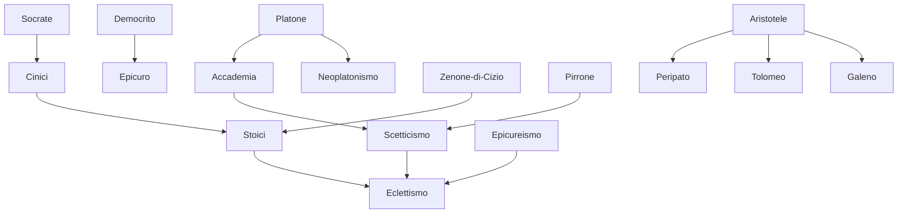

---
cssclasses:
  - Philosophy
  - History
subclasses:
  - Ancient-Greek-and-Roman-Philosophy
  - Epistemology
  - Ethics
related:
  - "[[Stoicism]]"
  - "[[Epicureanism]]"
  - "[[Skepticism]]"
  - "[[Library of Alexandria]]"
  - "[[Hellenistic Kingdoms]]"
  - "[[Ancient Astronomy]]"
  - "[[Ancient Medicine]]"
  - "[[Neoplatonism]]"
  - "[[Roman Philosophy]]"
  - "[[Eclecticism]]"
aliases:
  - hellenistic philosophy
  - alexandria library
  - museum alexandria
  - polis decline
  - philosophy therapy
reference:
  - "Abbagnano, N., & Fornero, G. (2012). La ricerca del pensiero. Vol. 1B. Dall'ellenismo alla scolastica. Paravia."
---

#### Central Problem

The chapter addresses the profound transformation of Greek culture and philosophy following the collapse of the classical polis system after [[Alexander]] the Great's conquests. The central problem concerns how individuals can find meaning, orientation, and inner peace in a radically changed world where traditional political participation has become impossible and the individual feels alienated from the larger social and political structures.

The dissolution of the autonomous city-state created a crisis of identity and purpose. Citizens who once found meaning through active participation in democratic life now found themselves as mere subjects of vast monarchical empires (the Hellenistic kingdoms of the Ptolemies, Seleucids, and Antigonids). This political disempowerment generated a widespread sense of estrangement from public life and a "flight into the private sphere."

Simultaneously, knowledge itself underwent fragmentation. The unified vision of reality that characterized classical Greek thought—where philosophy encompassed mathematics, physics, ethics, and politics—gave way to specialized disciplines cultivated by professional experts. This raised the question: what role remains for philosophy when the sciences have become autonomous, and political engagement seems futile?

#### Main Thesis

The text argues that Hellenistic philosophy emerged as a response to existential crisis, transforming philosophy from a comprehensive inquiry into reality into a form of "spiritual therapy" aimed at achieving individual tranquility (ataraxia). Philosophy became, in the author's striking metaphor, a "pharmacist of anxieties, surgeon of false opinions, herbalist of the intoxications of social living."

The main contentions include:

**The Divorce Between Science and Philosophy:** While the sciences flourished at Alexandria through specialization and institutional support (the Library and Museum), they became separated from philosophical reflection. Scientists no longer philosophized, and philosophers no longer engaged with scientific research. This represents a fundamental break from the classical model of [[Plato]] and [[Aristotle]].

**The Divorce Between Science and Technology:** Despite remarkable theoretical advances (Archimedes' mechanics, astronomical models), ancient science failed to generate technological applications for improving human life. This limitation stemmed from: (1) the slave-based economy that removed incentive for labor-saving devices; (2) aristocratic contempt for manual work; (3) the philosophical privileging of contemplation over practical action.

**Philosophy as Existential Medicine:** The three great Hellenistic schools—Stoicism, Epicureanism, and Skepticism—all pursued the same fundamental goal: guaranteeing spiritual tranquility through the elimination of passions and false beliefs. The philosopher-patient relationship replaced the philosopher-citizen relationship.

**Dogmatism and Sectarianism:** Unlike the classical schools where dialogue and disagreement flourished, Hellenistic schools demanded unconditional adherence to the founder's doctrines, creating closed sects rather than communities of inquiry.

#### Historical Context

The Hellenistic period (conventionally dated from [[Alexander]]'s death in 323 BCE to Rome's conquest of Egypt in 30 BCE) witnessed the transformation of the Greek world from a system of independent city-states to a collection of vast monarchical empires spanning from Greece to India.

Alexander's conquests opened Eastern markets, dramatically expanding slavery and creating a new cosmopolitan elite while impoverishing the traditional middle class of free workers, artisans, and small merchants who had formed the backbone of Athenian democracy. The result was extreme social stratification and the erosion of civic bonds.

The Ptolemaic dynasty in Egypt established Alexandria as the new intellectual capital, founding the famous Library (with its 700,000 papyrus scrolls) and the Museum—a research institute combining observatory, zoo, botanical garden, and anatomical laboratories. This institutional framework enabled unprecedented scientific advances but also created an isolated scholarly elite disconnected from broader society.

Key dates in this cultural history include: the Library's foundation around 300 BCE under [[Ptolemy]] I; its damage in 145 BCE during civil war; its partial burning during Caesar's campaign in 48-47 BCE; and Egypt's incorporation into the Roman Empire in 30 BCE. The final destruction came in 642 CE during the Arab conquest.

#### Philosophical Lineage

#### Key Thinkers

| Thinker | Dates | Movement | Main Work | Core Concept |
|---------|-------|----------|-----------|--------------|
| [[Euclide]] | c. 300 BCE | [[Alexandrian Science]] | *Elements* | Axiomatic-deductive geometry |
| [[Archimede]] | 287-212 BCE | [[Alexandrian Science]] | *On Method* | Mathematical physics, exhaustion method |
| [[Aristarco]] | 310-250 BCE | [[Alexandrian Science]] | — | Heliocentric model |
| [[Ipparco]] | 190-120 BCE | [[Alexandrian Science]] | — | Geocentric refinement, epicycles |
| [[Tolomeo]] | 120-161 CE | [[Alexandrian Science]] | *Almagest* | Definitive geocentric system |
| [[Eratostene]] | 276-192 BCE | [[Alexandrian Science]] | — | Earth's circumference calculation |
| [[Galeno]] | 129-199 CE | [[Ancient Medicine]] | Medical treatises | Three forms of pneuma |

#### Key Concepts

| Concept | Definition | Related to |
|---------|------------|------------|
| Ataraxia | Freedom from disturbance; the tranquility of spirit that constitutes happiness for Hellenistic philosophers | [[Stoicism]], [[Epicureanism]], [[Skepticism]] |
| Cosmopolitanism | The view that one is a "citizen of the world" rather than of a particular city or nation | [[Stoicism]], [[Cynicism]] |
| Eclecticism | The tendency to select and combine doctrines from different schools based on common consent (consensus gentium) | [[Late Hellenism]], [[Roman Philosophy]] |
| Specialization | The division of unified knowledge into autonomous particular disciplines cultivated by experts | [[Alexandrian Science]], [[Hellenistic Culture]] |
| Philosophy as Therapy | Conception of philosophy as medicine for the soul, healing false beliefs and passions | [[Epicureanism]], [[Stoicism]] |
| Exhaustion Method | Archimedes' technique of diminishing magnitudes infinitely, foundation of calculus | [[Archimede]], [[Mathematics]] |
| Epicycles | Secondary circular orbits used to explain planetary motion in geocentric models | [[Ipparco]], [[Tolomeo]] |
| Eccentric Spheres | Celestial spheres with centers displaced from Earth's center | [[Ipparco]], [[Tolomeo]] |
| Consensus Gentium | Common agreement of humanity as criterion for selecting true doctrines | [[Eclecticism]], [[Roman Philosophy]] |
| Pneuma | Vital spirit in three forms (animal, vital, natural) governing bodily functions | [[Galeno]], [[Stoicism]] |

#### Authors Comparison

| Theme | [[Euclide]] | [[Archimede]] | [[Tolomeo]] |
|-------|-------------|---------------|-------------|
| Method | Axiomatic-deductive | Empirical-mathematical | Synthetic-observational |
| Relation to experience | Pure idealization | Experience as foundation | Observation + calculation |
| Philosophical background | Platonic (ideal space) | Empiricist (inherent structures) | Aristotelian (physical realism) |
| Purpose | Systematic synthesis | Theoretical dominion | Predictive accuracy |
| Influence | Foundation of geometry | Precursor of calculus | Astronomical authority until [[Copernicus]] |

#### Influences & Connections

- **Predecessors:** [[Hellenistic Philosophy]] ← influenced by ← [[Plato]], [[Aristotle]], [[Democritus]]
- **Predecessors:** [[Alexandrian Science]] ← influenced by ← [[Pythagoreans]], [[Eudoxus]], [[Aristotle]]
- **Contemporaries:** [[Stoicism]] ↔ rivalry with ↔ [[Epicureanism]], [[Skepticism]]
- **Followers:** [[Tolomeo]] → influenced → [[Medieval Astronomy]], [[Islamic Science]]
- **Followers:** [[Galeno]] → influenced → [[Medieval Medicine]], [[Islamic Medicine]]
- **Opposing views:** [[Aristarco]] ← rejected by ← [[Ipparco]], [[Tolomeo]]

#### Summary Formulas

- **[[Hellenistic Philosophy]]:** In an age of political powerlessness and social fragmentation, philosophy transforms into therapy for the individual soul, seeking tranquility through detachment from passions and false beliefs.
- **[[Alexandrian Science]]:** The institutionalization of research enabled unprecedented scientific progress but created specialization divorced from philosophy and technology divorced from practical application.
- **[[Archimede]]:** Mathematics inheres in the physical world and can be discovered through experience; the method of exhaustion bridges the finite and infinite.
- **[[Tolomeo]]:** Geocentric astronomy, refined through epicycles and eccentrics, provides a mathematical model for predicting celestial positions, regardless of physical reality.

#### Timeline

| Year | Event |
|------|-------|
| 323 BCE | Death of [[Alexander the Great]]; beginning of Hellenistic period |
| c. 300 BCE | [[Euclide]] teaches at Alexandria; foundation of the Library |
| c. 300 BCE | [[Zenone di Cizio]] founds the Stoic school in Athens |
| 287 BCE | Birth of [[Archimede]] in Syracuse |
| 276 BCE | Birth of [[Eratostene]], who calculates Earth's circumference |
| c. 250 BCE | [[Aristarco]] proposes heliocentric model |
| 212 BCE | Death of [[Archimede]] during Roman siege of Syracuse |
| 168 BCE | Roman conquest of Macedonia; Greece becomes Roman province |
| 145 BCE | Damage to the Museum; exodus of scholars from Alexandria |
| c. 130 BCE | [[Ipparco]] refines geocentric model with epicycles |
| 48-47 BCE | Library of Alexandria partially burned during Caesar's campaign |
| 30 BCE | [[Octavian]] conquers Egypt; end of Ptolemaic dynasty |
| c. 150 CE | [[Tolomeo]] completes the *Almagest* |
| 199 CE | Death of [[Galeno]] in Rome |
| 642 CE | Final destruction of the Library by Arab conquest |

#### Notable Quotes

> "The fear took the place of hope; the goal of life was rather to escape misfortune than to achieve a positive good [...]. Philosophy is no longer the pillar of fire that serves as a beacon to the few intrepid seekers of truth: it is rather an ambulance, which comes in the wake of the struggle for existence and picks up the weak and wounded." — [[Russell]], citing C. F. Angus

> "Only he who is able to see 'the whole' is a philosopher." — [[Plato]]

---
> [!warning]-
> This annotation was normalised using a large language model and may contain inaccuracies. These texts serve as preliminary study resources rather than exhaustive references.
