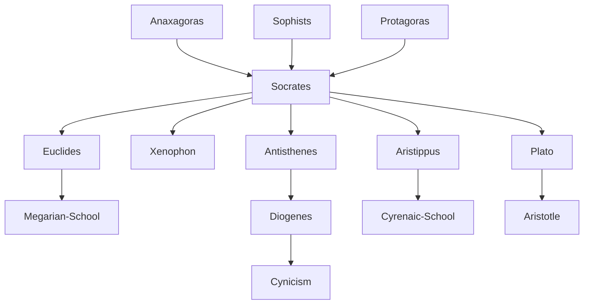

---
cssclasses:
  - Philosophy
subclasses:
  - Ancient-Greek-and-Roman-Philosophy
  - Epistemology
  - Ethics
related:
  - "[[Sophists]]"
  - "[[Plato]]"
  - "[[Aristotle]]"
  - "[[Cynicism]]"
  - "[[Stoicism]]"
  - "[[Virtue Ethics]]"
  - "[[Dialectic]]"
  - "[[Elenchus]]"
  - "[[Apology]]"
  - "[[Phaedo]]"
aliases:
  - socratic method
  - know thyself
  - virtue ethics
  - moral rationalism
  - examined life
  - megarian school
  - cynic school
reference:
  - "Abbagnano, N., & Fornero, G. (2012). La ricerca del pensiero. Vol. 1A. Dalle origini ad Aristotele. Paravia."
---

#### Central Problem

How can we establish a foundation for knowledge and ethics that transcends the relativism of the Sophists while remaining within the human sphere? [[Socrates]] confronts the crisis of values precipitated by sophistic teaching: if "man is the measure of all things" and truth varies by perspective, how can we achieve genuine knowledge and live virtuously? The problem is both epistemological (what can we truly know?) and ethical (how should we live?).

Unlike the Presocratics who sought cosmic principles, [[Socrates]] turns inquiry inward to examine human existence itself. Yet unlike the Sophists who concluded that all opinions are equally valid (or invalid), [[Socrates]] seeks universal definitions—common truths that can unite people beyond their subjective viewpoints. The central tension is between accepting human finitude (we cannot know cosmic truths) and refusing relativistic despair (we can achieve shared understanding about human matters).

#### Main Thesis

[[Socrates]] maintains that philosophy must be an incessant examination of oneself and others, focused on human affairs rather than cosmic speculation. His revolutionary claim is that virtue is knowledge—to know the good is to do the good, and vice stems only from ignorance. This "moral rationalism" holds that reason can and must guide human life.

The Socratic method operates through: (1) **ironic ignorance**—professing not to know in order to expose others' false certainties; (2) **maieutics**—helping others "give birth" to truths already latent within them; (3) **the search for definitions**—asking "what is X?" to arrive at universal concepts beyond mere examples.

[[Socrates]] does not construct a systematic doctrine but practices philosophy as dialogue. His famous "I know that I know nothing" is not skepticism but intellectual humility that opens the path to genuine inquiry. While agnostic about metaphysical questions, [[Socrates]] believes we can achieve practical wisdom about how to live well. Virtue, happiness, and knowledge form an inseparable unity: the examined life is the only life worth living.

#### Historical Context

[[Socrates]] (470-399 BCE) lived during Athens's golden age under [[Pericles]] and its subsequent decline through the Peloponnesian War. Born to Sophroniscus (a sculptor) and Phaenarete (a midwife), he received typical Athenian education and possibly studied with Anaxagoras. He fought courageously at Potidea, Delium, and Amphipolis.

Unlike the itinerant Sophists, [[Socrates]] never left Athens except for military service, never charged fees, and never claimed to teach. His unconventional appearance (resembling a Silenus) and habit of accosting citizens with probing questions made him both famous and controversial.

After Athens's defeat in 404 BCE, the oligarchic regime of the Thirty Tyrants briefly ruled, including [[Socrates]]'s former associate [[Critias]]. When democracy was restored in 403 BCE, residual suspicion fell on [[Socrates]] due to his aristocratic connections and critique of democratic procedures. In 399 BCE, Meletus, Anytus, and Lycon charged him with impiety and corrupting youth. Refusing to flee or compromise his principles, [[Socrates]] was condemned and executed by drinking hemlock—becoming philosophy's first martyr.

#### Philosophical Lineage

#### Key Thinkers

| Thinker | Dates | Movement | Main Work | Core Concept |
|---------|-------|----------|-----------|--------------|
| [[Socrates]] | 470-399 BCE | [[Socratic Philosophy]] | None (oral teaching) | Virtue is knowledge |
| [[Plato]] | 427-347 BCE | [[Platonism]] | *Apology*, *Phaedo* | Socratic dialogues |
| [[Xenophon]] | 430-354 BCE | [[Socratic Philosophy]] | *Memorabilia* | Practical [[Socrates]] |
| [[Euclides]] | 450-375 BCE | [[Megarian School]] | — | Good = Being |
| [[Antisthenes]] | 436-366 BCE | [[Cynicism]] | — | Virtue alone is good |
| [[Aristippus]] | 435-366 BCE | [[Cyrenaic School]] | — | Pleasure is the good |

#### Key Concepts

| Concept | Definition | Related to |
|---------|------------|------------|
| Irony | Feigning ignorance to expose interlocutor's false knowledge | [[Socratic method]], [[Dialectic]] |
| Maieutics | Art of intellectual midwifery—helping others birth their own truths | [[Education]], [[Dialogue]] |
| "Know thyself" | Delphic maxim adopted as philosophy's mission | [[Self-examination]], [[Wisdom]] |
| Virtue as knowledge | Moral excellence is identical with understanding the good | [[Ethics]], [[Intellectualism]] |
| Eudemonism | Doctrine that happiness is the goal of moral action | [[Ethics]], [[Virtue]] |
| Induction | Reasoning from particular cases to universal definition | [[Logic]], [[Definition]] |
| Concept | Universal mental content expressing essence of a thing | [[Epistemology]], [[Definition]] |
| Daimonion | Divine inner voice that warned [[Socrates]] against wrong action | [[Religion]], [[Conscience]] |

#### Authors Comparison

| Theme | [[Socrates]] | [[Euclides]] | [[Antisthenes]] | [[Aristippus]] |
|-------|--------------|--------------|-----------------|----------------|
| The Good | Knowledge/virtue | Parmenidean Being | Virtue alone | Pleasure |
| Epistemology | Seek definitions | Eleatic dialectic | Only identical judgments | Sensation |
| Ethics | Virtue = happiness | Unity of good | Ascetic renunciation | Hedonism |
| Metaphysics | Agnostic | Monist | Materialist | Materialist |
| Way of life | Examined life | Dialectical debate | Poverty, self-sufficiency | Enjoyment with detachment |

#### Influences & Connections

- **Predecessors:** [[Socrates]] ← influenced by ← [[Anaxagoras]] (early interest in nature philosophy), [[Protagoras]] (humanistic turn)
- **Contemporaries:** [[Socrates]] ↔ dialogue with ↔ [[Sophists]], [[Socrates]] ↔ opposed by ↔ [[Aristophanes]]
- **Followers:** [[Socrates]] → influenced → [[Plato]], [[Xenophon]], [[Euclides]], [[Antisthenes]], [[Aristippus]]
- **Opposing views:** [[Socrates]] ← criticized by ← [[Aristophanes]] (*Clouds*), [[Polycrates]] (*Accusation*)

#### Summary Formulas

- **[[Socrates]]:** Virtue is knowledge; the unexamined life is not worth living; I know that I know nothing.
- **[[Euclides]]:** The Good is one, identical with Parmenidean Being; multiplicity is illusion.
- **[[Antisthenes]]:** Only virtue is good, pleasure is evil; the wise man is self-sufficient.
- **[[Aristippus]]:** Pleasure of the present moment is the sole good; possess without being possessed.

#### Timeline

| Year | Event |
|------|-------|
| 470-469 BCE | [[Socrates]] born in Athens |
| 433 BCE | [[Socrates]] fights at Potidea |
| 424 BCE | [[Socrates]] fights at Delium |
| 423 BCE | [[Aristophanes]] satirizes [[Socrates]] in *The Clouds* |
| 404 BCE | Thirty Tyrants rule Athens; [[Critias]] leads |
| 403 BCE | Democracy restored in Athens |
| 399 BCE | [[Socrates]] tried, condemned, and executed |
| 396 BCE | [[Plato]] begins writing Socratic dialogues |

#### Notable Quotes

> "The unexamined life is not worth living." — [[Socrates]] (Plato, *Apology*)

> "I know that I know nothing." — [[Socrates]]

> "No one does evil willingly; whoever does wrong does so through ignorance of the good." — [[Socrates]]

---
> [!warning]-
> This annotation was normalised using a large language model and may contain inaccuracies. These texts serve as preliminary study resources rather than exhaustive references.
