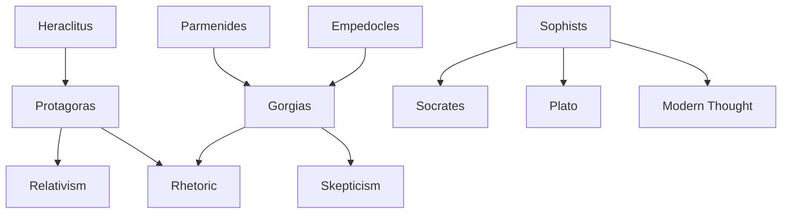

---
cssclasses:
  - Philosophy
subclasses:
  - Ancient-Greek-and-Roman-Philosophy
  - Epistemology
  - Ethics
related:
  - "[[Socrates]]"
aliases:
  - man is
  - greek enlightenment
reference:
  - "[Abbagnano, N., & Fornero, G. (2012). La ricerca del pensiero. Vol. 1A. Dalle origini ad Aristotele. Paravia.](https://archive.org/download/ssp-s01-e05/The%20search%20for%20thought%20-%20Unit%202%20Chapter%201.pdf)"
tags:
  - Podcast
---

#### Podcast

<iframe src="https://archive.org/embed/ssp-s01-e05" width="100%" height="30" frameborder="0" webkitallowfullscreen="true" mozallowfullscreen="true" allowfullscreen></iframe>

---

#### Central Problem

What is the foundation of human knowledge, moral values, and social laws once we abandon the search for cosmic principles and focus philosophical inquiry on human affairs?

#### Main Thesis

The Sophists shift philosophical inquiry from nature (physis) to humanity (anthropos), discovering that truth, values, and laws are relative to human perspectives, cultures, and conventions. Man becomes the "measure of all things," and rhetoric—the art of persuasion—emerges as the essential skill for democratic citizenship. This "Greek Enlightenment" liberates reason from tradition but risks dissolving all objective standards into subjective opinion.

#### Historical Context

The Sophists emerged in 5th century BCE Athens during the height of Periclean democracy, when the city was flourishing after victory over the Persians. The democratic polis required new skills: participation in assemblies, public speaking, legal advocacy, and political debate. Traditional aristocratic education based on birth was inadequate; the Sophists responded by offering professional instruction in rhetoric, grammar, and argumentation for payment. They were itinerant teachers who traveled throughout Greece, exposing them to diverse customs and challenging provincial certainties. While [[Plato]] and [[Aristotle]] "demonized" them as false sages interested only in money and success, contemporary scholarship recognizes their crucial role in developing humanistic education (paideia) and critical rationality.

#### Philosophical Lineage

#### Key Thinkers

| Thinker | Dates | Movement | Main Work | Core Concept |
|---------|-------|----------|-----------|---------------|
| [[Protagoras]] | c. 490-420 BCE | [[Sophism]] | *Antilogies* | Homo mensura (relativism) |
| [[Gorgias]] | c. 485-376 BCE | [[Sophism]] | *On Non-Being* | Radical skepticism |
| [[Prodicus]] | c. 470-400 BCE | [[Sophism]] | *Heracles at the Crossroads* | Religion from utility |
| [[Hippias]] | c. 443-? BCE | [[Sophism]] | Various | Natural vs. human law |
| [[Antiphon]] | 5th century BCE | [[Sophism]] | *On Truth* | Natural equality |
| [[Thrasymachus]] | c. 460-? BCE | [[Sophism]] | — | Justice as power |
| [[Critias]] | c. 460-403 BCE | [[Sophism]] | *Sisyphus* | Religion as politics |

#### Key Concepts

| Concept | Definition | Related to |
|---------|------------|------------|
| Homo mensura | "Man is the measure of all things"—reality is as it appears to human perceivers | [[Protagoras]], [[Relativism]] |
| Relativism | No absolute truth or moral principle; all beliefs relative to perspective | [[Phenomenism]], [[Skepticism]] |
| Phenomenism | We know only appearances (phenomena), not things in themselves | [[Kant]], [[Epistemology]] |
| Paideia | Education as comprehensive formation of the individual | [[Humanism]], [[Rhetoric]] |
| Rhetoric | Art of persuasion through language | [[Democracy]], [[Antilogic]] |
| Antilogic | Method of opposing one argument to another | [[Dialectic]], [[Eristic]] |
| Eristic | Art of verbal combat to defeat opponents | [[Antilogic]], [[Rhetoric]] |
| Physis vs. Nomos | Nature vs. law/convention distinction | [[Natural law]], [[Convention]] |
| Agnosticism | Position that gods cannot be known to exist or not | [[Protagoras]], [[Religion]] |

#### Authors Comparison

| Theme | [[Protagoras]] | [[Gorgias]] | [[Antiphon]] |
|-------|----------------|-------------|---------------|
| Epistemology | All opinions true (for the perceiver) | All opinions false (unknowable) | Nature reveals truth |
| Criterion | Utility (public and private) | None; rhetoric fills the void | Natural law |
| On language | Expresses relative truths | Autonomous from reality | Conventional |
| Political stance | Pro-democratic | Neutral (technique) | Critical of conventions |
| On religion | Agnostic | Implicit skeptic | Natural origin |
| View of law | Human invention, but necessary | Instrument of power | Oppressive of nature |

#### Influences & Connections

- **Heraclitus**: Influence on Protagoras's doctrine of flux and perspectivism
- **Parmenides**: Gorgias's paradoxes invert Eleatic logic
- **Empedocles**: Teacher of Gorgias
- **Athenian Democracy**: Political precondition for sophistic education
- **Socrates**: Shares humanistic turn but opposes relativism
- **Plato**: Develops dialectic against sophistic rhetoric
- **Modern Philosophy**: Sophists anticipate empiricism, pragmatism, linguistic philosophy

#### Summary Formulas

1. **Protagoras's Principle**: Man = Measure of all things → Relativism + Utility as criterion
2. **Gorgias's Three Theses**: Nothing exists; if it exists, it's unknowable; if knowable, incommunicable
3. **Sophistic Turn**: From physis (nature) to anthropos (human) → From cosmology to politics
4. **Democratic Equation**: Democracy requires rhetoric; rhetoric requires education; education is paideia
5. **Nature vs. Law**: Natural law (unwritten, universal) ≠ Human law (written, variable)
6. **Critique of Religion**: Gods = Projections of utility (Prodicus) or inventions of rulers (Critias)
7. **Eristic Degeneration**: Antilogic → Eristic → Pure verbal combat without truth

#### Timeline

| Year | Event |
|------|-------|
| c. 490 BCE | Birth of Protagoras in Abdera |
| c. 485 BCE | Birth of Gorgias in Leontini |
| c. 470-460 BCE | Birth of Prodicus of Ceos |
| c. 460 BCE | Birth of Thrasymachus and [[Critias]] |
| 461 BCE | Beginning of Periclean democracy in Athens |
| c. 450 BCE | Sophists begin teaching in Athens |
| 427 BCE | Gorgias arrives in Athens as ambassador from Leontini |
| c. 420 BCE | Death of Protagoras (charged with impiety, exiled) |
| 404 BCE | Fall of Athenian democracy; rule of Thirty Tyrants (including [[Critias]]) |
| 403 BCE | Death of Critias; restoration of democracy |
| c. 376 BCE | Death of Gorgias (aged 109) |

#### Notable Quotes

> "Man is the measure of all things, of things that are that they are, of things that are not that they are not."
> — [[Protagoras]], Fragment 1

> "Concerning the gods, I am unable to know whether they exist or do not exist, or what form they have: for there are many obstacles to knowledge—the obscurity of the matter and the shortness of human life."
> — [[Protagoras]], Fragment 4

> "Nothing exists. If something exists, it cannot be known. If it can be known, it cannot be communicated."
> — [[Gorgias]], *On Non-Being*

> "Speech is a powerful lord that with the smallest and most invisible body accomplishes most godlike works."
> — [[Gorgias]], *Encomium of Helen*

> "By nature we are all equally made, both barbarians and Greeks."
> — [[Antiphon]], Fragment 44b

> "Justice is nothing other than the advantage of the stronger."
> — [[Thrasymachus]] (in [[Plato]]'s *Republic*)

 - Shares humanistic focus but seeks objective truth
- [[Plato]] - Principal critic and source for sophistic doctrines
- [[Aristotle]] - Develops logic partly against sophistic fallacies
- [[Democritus]] - Shares theory of history as progress
- [[Pericles]] - Political leader who befriended Protagoras
- [[Hume]] - Modern skepticism echoing sophistic themes
- [[Kant]] - Phenomenism and limits of knowledge
---
---
> [!warning]-
> This annotation was normalised using a large language model and may contain inaccuracies. These texts serve as preliminary study resources rather than exhaustive references.
