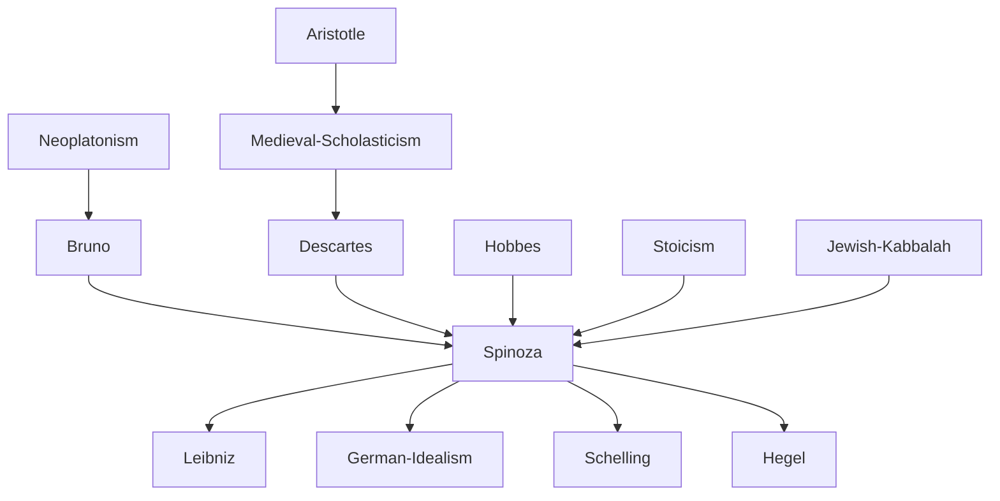

---
cssclasses:
  - Philosophy
subclasses:
  - Metaphysics
  - 17th-18th-Century-Philosophy
  - Ethics
related:
  - "[[Rationalism]]"
  - "[[Pantheism]]"
  - "[[Cartesianism]]"
  - "[[Substance metaphysics]]"
  - "[[Mind-body problem]]"
  - "[[Determinism]]"
  - "[[Ethics]]"
  - "[[Dutch Golden Age]]"
  - "[[Leibniz]]"
  - "[[German Idealism]]"
aliases:
  - god nature
  - intellectual love
  - geometric method
  - attributes modes
reference:
  - "[Abbagnano, N., & Fornero, G. (2012). La ricerca del pensiero. Vol. 2A. Dall'Umanesimo all'empirismo. Paravia.](https://archive.org/download/ssp-s03-e12/The%20search%20for%20thought%20-%20Unit%204%20Chapter%202.pdf)"
tags:
  - Podcast
---

#### Podcast

<iframe src="https://archive.org/embed/ssp-s03-e12" width="100%" height="30" frameborder="0" webkitallowfullscreen="true" mozallowfullscreen="true" allowfullscreen></iframe>

---

#### Central Problem

The central problem addressed by [[Spinoza]] concerns the nature of reality itself: what is substance, and what is the relationship between God, nature, and finite beings? [[Spinoza]] confronts the fundamental tensions left unresolved by Cartesian philosophy—particularly the problematic dualism between mind (res cogitans) and body (res extensa), and the ambiguous status of created substances in relation to divine substance.

Beyond metaphysics, [[Spinoza]] grapples with the existential question of human happiness and salvation: how can human beings achieve authentic well-being and freedom from the tyranny of passions? This problem emerges from his early recognition that conventional goods—wealth, honor, and sensory pleasures—are "vain and futile," incapable of providing lasting satisfaction. The challenge is to discover a "true good" capable of communicating itself to us and filling the soul with genuine, stable joy.

[[Spinoza]] also addresses the problem of human freedom within a deterministic universe: if everything follows necessarily from the divine nature, what room remains for human liberty? His solution transforms the very concept of freedom from arbitrary choice to rational self-determination through adequate knowledge.

#### Main Thesis

Spinoza's central thesis is the radical identification of God with Nature (Deus sive Natura)—a pantheistic monism holding that there exists only one infinite, eternal, and necessary Substance, which can be conceived under infinite attributes, of which we know only two: thought and extension.

**The Concept of Substance:** [[Spinoza]] defines substance as "that which is in itself and is conceived through itself"—something ontologically and conceptually self-sufficient. From this definition, he derives that substance must be uncreated (causa sui), eternal, infinite, and unique. Since only God fits this description, God is the sole substance, and what [[Descartes]] called separate substances (mind and matter) are merely attributes of the one divine Substance.

**Attributes and Modes:** The attributes are the essential qualities constituting the Substance's essence—infinite in number, though humans perceive only thought and extension. The modes are modifications or particular manifestations of these attributes: individual bodies are modes of extension, individual minds are modes of thought. The distinction between Natura naturans (Nature as cause—God and his attributes) and Natura naturata (Nature as effect—the totality of modes) expresses God's immanent causality.

**Ethical Salvation through Knowledge:** Human beatitude consists in the "intellectual love of God" (amor Dei intellectualis)—a joyful recognition of oneself and all things as necessary expressions of the divine order. Through adequate knowledge (the second and third kinds), humans can transform passive affects into active ones, achieving freedom not from necessity but through understanding necessity.

**Parallelism:** Mind and body, though heterogeneous and incapable of mutual influence, correspond perfectly because they are two expressions of the same underlying reality—"the order and connection of ideas is the same as the order and connection of things."

#### Historical Context

[[Spinoza]] lived during the Dutch Golden Age (1632-1677), when the Netherlands served as Europe's haven of religious tolerance and commercial prosperity. Born in Amsterdam to a Sephardic Jewish family that had fled Spanish religious persecution, [[Spinoza]] was educated in the Jewish community's school but was excommunicated and expelled in 1656 for "heresies practiced and taught." The dramatic cherem (excommunication) pronounced against him reveals the radical nature of his thought even before his major works appeared.

The intellectual context includes the aftermath of the Scientific Revolution—Galileo's mechanical physics, [[Descartes]]' rationalist philosophy, and [[Hobbes]]' materialist political theory had transformed European thought. [[Spinoza]] synthesizes these influences while transcending them: he accepts mechanism but embeds it in a metaphysical framework; he adopts Cartesian method but rejects Cartesian dualism; he shares [[Hobbes]]' naturalism but develops a more sophisticated psychology and ethics.

[[Spinoza]] lived modestly in Rijnsburg and later The Hague, supporting himself by grinding lenses for optical instruments—a craft that gave him fame as an optician before his philosophical reputation grew. He published only the Principles of Cartesian Philosophy (1663) under his name; the Theological-Political Treatise (1670) appeared anonymously and was immediately condemned. His masterwork, the Ethics Demonstrated in Geometric Order, circulated in manuscript among friends but was published only posthumously in 1677.

The Dutch context is essential: the tolerant bourgeois commercial society, with its pragmatic mentality and distrust of religious dogmatism, shaped [[Spinoza]]'s rationalistic ethics and utilitarian political theory.

#### Philosophical Lineage

#### Key Thinkers

| Thinker | Dates | Movement | Main Work | Core Concept |
|---------|-------|----------|-----------|--------------|
| [[Spinoza]] | 1632-1677 | [[Rationalism]] | *Ethics* | Deus sive Natura, conatus |
| [[Descartes]] | 1596-1650 | [[Rationalism]] | *Meditations* | Substance dualism, method |
| [[Bruno]] | 1548-1600 | [[Renaissance Naturalism]] | *On the Infinite* | Infinite universe, immanent God |
| [[Hobbes]] | 1588-1679 | [[Materialism]] | *Leviathan* | Mechanical philosophy, state of nature |
| [[Euclid]] | c. 300 BCE | [[Mathematics]] | *Elements* | Geometric demonstration |

#### Key Concepts

| Concept | Definition | Related to |
|---------|------------|------------|
| Substance | That which is in itself and is conceived through itself; ontologically and conceptually self-sufficient | [[Spinoza]], [[Metaphysics]] |
| Causa sui | Cause of itself; that whose essence implies existence | [[Spinoza]], [[Necessity]] |
| Attribute | What intellect perceives as constituting substance's essence; essential quality of substance | [[Spinoza]], [[Extension]], [[Thought]] |
| Mode | Affection of substance; that which exists in another through which it is conceived | [[Spinoza]], [[Finite beings]] |
| Conatus | Striving for self-preservation; fundamental drive constituting each thing's actual essence | [[Spinoza]], [[Self-preservation]] |
| Parallelism | Correspondence between order of ideas and order of things without causal interaction | [[Spinoza]], [[Mind-body problem]] |
| Amor Dei intellectualis | Intellectual love of God; beatitude arising from third kind of knowledge | [[Spinoza]], [[Ethics]] |
| Natura naturans | Nature naturing; God and attributes as cause | [[Spinoza]], [[Pantheism]] |
| Natura naturata | Nature natured; totality of modes as effect | [[Spinoza]], [[Immanence]] |
| Adequate knowledge | Clear and distinct ideas reproducing reality's objective order | [[Spinoza]], [[Epistemology]] |

#### Authors Comparison

| Theme | [[Spinoza]] | [[Descartes]] | [[Hobbes]] |
|-------|-------------|---------------|------------|
| Substance | One infinite substance (God=Nature) | Three substances (God, mind, matter) | Material substance only |
| Method | Geometric demonstration from definitions | Analytic-synthetic doubt and certainty | Mechanical explanation |
| Mind-body relation | Parallelism (two attributes, one substance) | Interaction via pineal gland | Mind as brain motion |
| God | Immanent, identical with Nature | Transcendent creator | First cause, minimal role |
| Freedom | Understanding necessity | Free will of the soul | Liberty as unimpeded motion |
| Ethics | Rational pursuit of self-preservation and joy | Mastery of passions through will | Utilitarian self-interest |
| Politics | State for collective utility and freedom | Supports established authority | Social contract, absolute sovereign |

#### Influences & Connections

- **Predecessors:** [[Spinoza]] ← influenced by ← [[Descartes]] (method, substance concept), [[Hobbes]] (naturalism, political theory), [[Bruno]] (pantheistic tendency), [[Stoics]] (ethics of reason)
- **Contemporaries:** [[Spinoza]] ↔ dialogue with ↔ [[Leibniz]] (correspondence, critique), [[Oldenburg]] (Royal Society contact)
- **Followers:** [[Spinoza]] → influenced → [[Schelling]], [[Hegel]], [[German Idealism]], [[Lessing]], [[Goethe]]
- **Opposing views:** [[Spinoza]] ← criticized by ← [[Leibniz]] (rejected pantheism), [[Traditional theology]] (condemned as atheist), [[Jewish community]] (excommunicated)

#### Summary Formulas

- **[[Spinoza]]:** God is the one infinite Substance identical with Nature; everything follows necessarily from the divine essence; human freedom and beatitude consist in understanding this necessity through the intellectual love of God.
- **[[Descartes]]:** Reality consists of three substances—God, thinking substance, and extended substance—whose interaction remains problematic but whose clear and distinct ideas guarantee truth.
- **[[Hobbes]]:** All reality is material and mechanical; the state arises from the social contract to escape the war of all against all in the state of nature.

#### Timeline

| Year | Event |
|------|-------|
| 1632 | [[Spinoza]] born in Amsterdam to Sephardic Jewish family |
| 1639 | Begins studies at the Jewish-Portuguese community school |
| 1654 | Death of [[Spinoza]]'s father |
| 1656 | Excommunicated from Jewish community |
| 1658-1659 | Composes *Treatise on the Emendation of the Intellect* |
| 1660 | Moves to Rijnsburg near Leiden |
| 1663 | Publishes *Principles of Cartesian Philosophy* with *Metaphysical Thoughts* |
| 1670 | *Theological-Political Treatise* published anonymously |
| 1674 | Completes the *Ethics* |
| 1676 | Composes *Political Treatise* |
| 1677 | [[Spinoza]] dies in The Hague; *Opera Posthuma* published including *Ethics* |

#### Notable Quotes

> "By substance I understand that which is in itself and is conceived through itself; that is, that the concept of which does not need the concept of another thing from which it must be formed." — [[Spinoza]]

> "God, or substance consisting of infinite attributes, each of which expresses eternal and infinite essence, necessarily exists." — [[Spinoza]]

> "The human mind cannot be absolutely destroyed with the body, but something of it remains which is eternal." — [[Spinoza]]

---
> [!warning]-
> This annotation was normalised using a large language model and may contain inaccuracies. These texts serve as preliminary study resources rather than exhaustive references.
