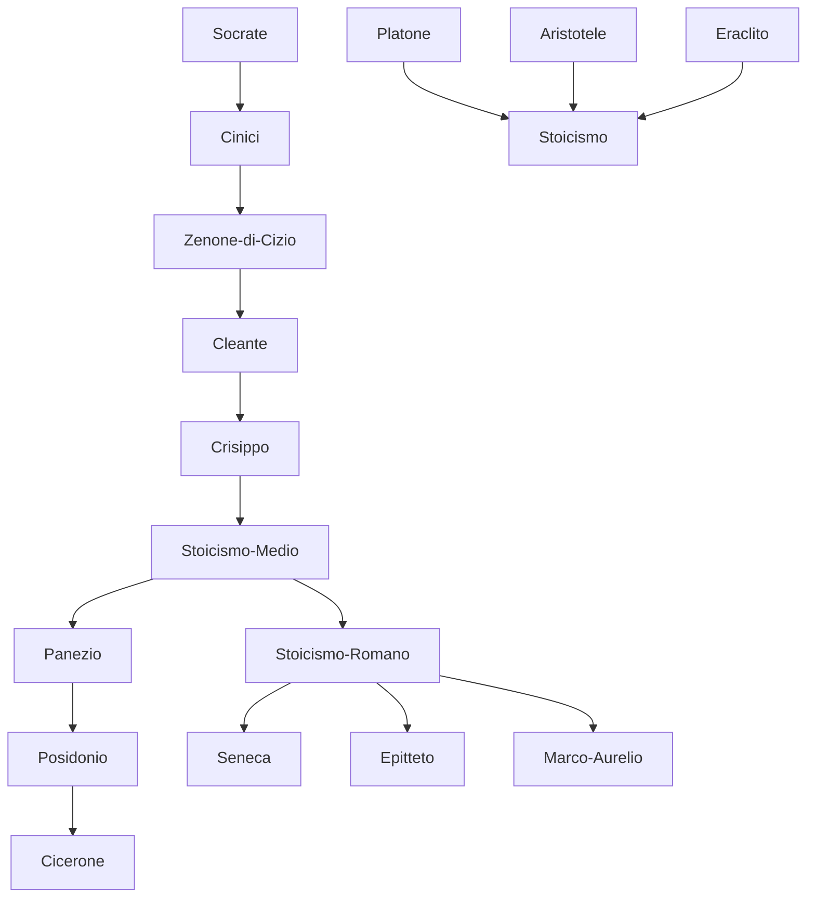

---
cssclasses:
  - Philosophy
subclasses:
  - Ancient-Greek-and-Roman-Philosophy
  - Ethics
  - Logic-and-Philosophy-of-Logic
aliases:
  - stoic philosophy
  - zeno citium
  - cataleptic representation
  - living nature
  - natural law
contributions:
  - Conceptual
authors:
  - "[[Cizio]]"
  - "[[Cleante]]"
  - "[[Crisippo]]"
  - "[[Seneca]]"
  - "[[Epitteto]]"
  - "[[Aurelio]]"
  - "[[Cicero]]"
reference: "Abbagnano, N., & Fornero, G. (2012). La ricerca del pensiero. Vol. 1B. Dall'ellenismo alla scolastica. Paravia."
related:
  - "[[Hellenistic Philosophy]]"
  - "[[Cynicism]]"
  - "[[Epicureanism]]"
  - "[[Skepticism]]"
  - "[[Natural Law]]"
  - "[[Roman Philosophy]]"
  - "[[Propositional Logic]]"
  - "[[Determinism]]"
  - "[[Virtue Ethics]]"
  - "[[Cosmopolitanism]]"
---

#### Central Problem

Stoicism addresses the fundamental question of how human beings can achieve happiness and live well in a world governed by fate and necessity. The central problem is both epistemological and ethical: How can we know truth with certainty? And how should we conduct our lives given that the cosmos operates according to a rational, necessary, and perfect order that we cannot change?

The Stoics inherited from the Cynics the conviction that philosophy must serve practical life, but they believed—unlike the Cynics—that theoretical knowledge (physics and logic) is indispensable for achieving virtue and happiness. The challenge they faced was to reconcile human freedom and moral responsibility with their deterministic worldview, in which everything happens according to fate (heimarméne) and divine providence.

The problem extends to social and political life: if there is a universal rational law governing all things, what are its implications for human community? How should individuals relate to one another across the boundaries of city-states and nations?

#### Main Thesis

The Stoics maintain that philosophy is the "exercise of virtue" and that virtue is both necessary and sufficient for happiness. Their fundamental ethical maxim is "live according to nature"—meaning according to both universal nature (the rational cosmic order) and human nature (which is essentially rational).

**Logic and Epistemology:** The criterion of truth is the "cataleptic representation" (phantasía kataleptiké)—a representation so clear and evident that it compels our assent. All knowledge derives from sense experience; the soul is like a blank slate (tabula rasa) upon which representations are inscribed. From accumulated representations, general concepts (prolépseis) naturally form. The Stoics developed propositional logic (distinct from [[Aristotle]]'s term logic), analyzing five basic forms of valid inference (anapodeictic syllogisms) and studying logical connectives.

**Physics and Theology:** The cosmos is governed by two principles: the active principle (God, reason, lógos) and the passive principle (matter). Both are corporeal—only bodies exist. God is identified with the "seminal reason" (lógos spermatikós) containing the seeds of all things. The universe undergoes eternal cycles, ending in conflagration (ekpýrosis) and regenerating identically (palingenesis). Everything happens according to fate, which is identical with providence and divine reason. This entails metaphysical optimism: the world, being rational, is perfect.

**Ethics:** What is "according to nature" constitutes duty (kathékon). Virtue—the consistent disposition to act according to reason—is the only true good; vice the only evil. All other things (wealth, health, pleasure, life itself) are "indifferent" (adiáphora), though some are "preferable" and have "value." The sage achieves apátheia—freedom from irrational emotions—and recognizes that all humans share in universal reason, making them citizens of a single world-city (cosmopolitanism).

#### Historical Context

Stoicism was founded around 300 BCE by [[Zeno]] of Citium (336-264 BCE), who arrived in Athens and was initially influenced by the Cynic Crates of Thebes. [[Zeno]] established his school in the "Painted Porch" (Stoá Poikíle), from which the school took its name.

The school developed through several phases: the Early Stoa (Zeno, Cleanthes, Chrysippus), the Middle Stoa (Panaetius, Posidonius, who introduced Stoicism to Rome), and the Late or Roman Stoa (Seneca, Epictetus, Marcus Aurelius). Chrysippus (281-205 BCE) was considered the "second founder" of Stoicism, systematizing its doctrines with prodigious literary output.

The political context shifted dramatically from the Greek city-states to the vast Hellenistic kingdoms and eventually the Roman Empire. Stoicism's cosmopolitanism and emphasis on individual virtue made it adaptable to these new political realities. In Rome, Stoicism became the philosophy of choice for educated elites and even emperors, influencing law (the concept of natural law) and political thought.

The Roman Stoics increasingly emphasized religious interiority and the theme of conscience. [[Seneca]] (4-65 CE), tutor and advisor to Nero, wrote extensively on practical ethics and the brotherhood of humanity. Epictetus (50-135 CE), a former slave, taught that freedom lies in controlling our judgments and desires. Marcus Aurelius (121-180 CE), the philosopher-emperor, composed his *Meditations* as private spiritual exercises.

#### Philosophical Lineage

#### Key Thinkers

| Thinker | Dates | Movement | Main Work | Core Concept |
|---------|-------|----------|-----------|--------------|
| [[Zenone di Cizio]] | 336-264 BCE | [[Stoicism]] | *Republic*, *On Nature* | Cataleptic representation, living according to nature |
| [[Cleante]] | 304-231 BCE | [[Stoicism]] | *Hymn to Zeus* | Fate as providence |
| [[Crisippo]] | 281-205 BCE | [[Stoicism]] | Logical treatises | Propositional logic, theory of meaning |
| [[Cicero]] | 106-43 BCE | [[Eclecticism]] | *On Duties*, *On Laws* | Natural law, consensus gentium |
| [[Seneca]] | 4-65 CE | [[Roman Stoicism]] | *Letters to Lucilius* | Interiority, brotherhood of humanity |
| [[Epitteto]] | 50-135 CE | [[Roman Stoicism]] | *Discourses*, *Manual* | Distinction between what is/isn't in our power |
| [[Marco Aurelio]] | 121-180 CE | [[Roman Stoicism]] | *Meditations* | Inner meditation, flux of things |

#### Key Concepts

| Concept | Definition | Related to |
|---------|------------|------------|
| Cataleptic representation | A representation so evident that it compels assent and serves as criterion of truth | [[Zenone di Cizio]], [[Stoic Epistemology]] |
| Lógos | Universal reason governing the cosmos, identified with God, fate, and providence | [[Stoicism]], [[Heraclitus]] |
| Lógos spermatikós | "Seminal reason" containing the rational seeds of all particular things | [[Stoicism]], [[Stoic Physics]] |
| Oikéiosis | Natural tendency of every being to preserve itself in harmony with cosmic order | [[Stoicism]], [[Stoic Ethics]] |
| Kathékon | Duty; action conforming to reason and nature | [[Stoicism]], [[Stoic Ethics]] |
| Adiáphora | "Indifferent things" that are neither good nor evil (wealth, health, life) | [[Stoicism]], [[Stoic Ethics]] |
| Apátheia | Freedom from irrational emotions; the condition of the sage | [[Stoicism]], [[Seneca]], [[Epitteto]] |
| Ekpýrosis | Cosmic conflagration ending each world-cycle | [[Stoicism]], [[Stoic Physics]] |
| Natural law | Universal rational law governing all humanity, basis of justice | [[Stoicism]], [[Cicero]] |
| Cosmopolitanism | Doctrine that the sage is citizen of the world, not of a particular state | [[Stoicism]], [[Cynicism]] |

#### Authors Comparison

| Theme | [[Zenone di Cizio]] | [[Crisippo]] | [[Seneca]] | [[Marco Aurelio]] |
|-------|---------------------|--------------|------------|-------------------|
| Primary focus | Ethics via physics | Logic, systematic doctrine | Practical ethics, interiority | Inner meditation |
| Freedom | Conformity to fate | Distinction: principal vs. auxiliary causes | Inner freedom from externals | Acceptance of flux |
| The sage | Lives according to nature | Possesses perfect reason | Educator of humanity | Participates in divine intellect |
| Death | Voluntary death justified | Part of cosmic order | Liberation of soul | Absorption into the Whole |
| God | Immanent lógos | Seminal reason | Within the soul | Father of men, daimon |
| Emotion | To be eliminated | Disease of the soul | Overcome through reason | Transcended through meditation |

#### Influences & Connections

- **Predecessors:** [[Stoicism]] ← influenced by ← [[Heraclitus]], [[Socrates]], [[Cynics]], [[Plato]], [[Aristotle]]
- **Contemporaries:** [[Stoicism]] ↔ rivalry with ↔ [[Epicureanism]], [[Skepticism]]
- **Followers:** [[Stoicism]] → influenced → [[Natural Law Theory]], [[Christian Ethics]], [[Spinoza]]
- **Followers:** [[Seneca]] → influenced → [[Patristic Philosophy]], [[Renaissance Humanism]]
- **Opposing views:** [[Stoicism]] ← criticized by ← [[Skeptics]], [[Epicureans]]

#### Summary Formulas

- **[[Zenone di Cizio]]:** Virtue is knowledge; the criterion of truth is the cataleptic representation; happiness consists in living according to nature, which is living according to reason.
- **[[Crisippo]]:** Everything happens by necessity, yet human assent remains in our power; good and evil are necessarily connected as contraries; propositional logic reveals the formal structure of valid inference.
- **[[Seneca]]:** God dwells within us; all humans are members of one body; the wise person lives as long as they should, not as long as they can.
- **[[Epitteto]]:** Freedom lies in distinguishing what is in our power (judgments, desires) from what is not (body, reputation, externals); "bear and forbear."
- **[[Marco Aurelio]]:** Look within yourself, for there is the source of good; all things flow like a river; humans must love one another as kin.

#### Timeline

| Year | Event |
|------|-------|
| 336 BCE | Birth of [[Zenone di Cizio]] in Cyprus |
| c. 300 BCE | [[Zenone di Cizio]] founds the Stoic school in the Painted Porch at Athens |
| 281 BCE | Birth of [[Crisippo]], "second founder" of Stoicism |
| 156-155 BCE | Stoic [[Diogenes of Babylon]] visits Rome as ambassador |
| 106 BCE | Birth of [[Cicero]], who transmits Stoicism to Rome |
| 4 CE | Birth of [[Seneca]] in Cordova |
| c. 50 CE | Birth of [[Epitteto]] as slave in Phrygia |
| 65 CE | Death of [[Seneca]] by order of Nero |
| 121 CE | Birth of [[Marco Aurelio]] |
| 161 CE | [[Marco Aurelio]] becomes Roman Emperor |
| 180 CE | Death of [[Marco Aurelio]] |

#### Notable Quotes

> "Lead me, O Zeus, and thou Destiny, whithersoever I am appointed to go, and I will follow without hesitation; even though I become a fool and refuse, I shall follow nonetheless." — [[Cleante]]

> "The divinity is near you, is with you, is within you." — [[Seneca]]

> "Look within: within is the fountain of good, always ready to spring forth if you will always dig." — [[Marco Aurelio]]

---
> [!NOTE]
> *This summary has been created to present the key points from the source text, which was automatically extracted using LLM. Please note that the summary may contain errors. It serves as an essential starting point for study and reference purposes.*
