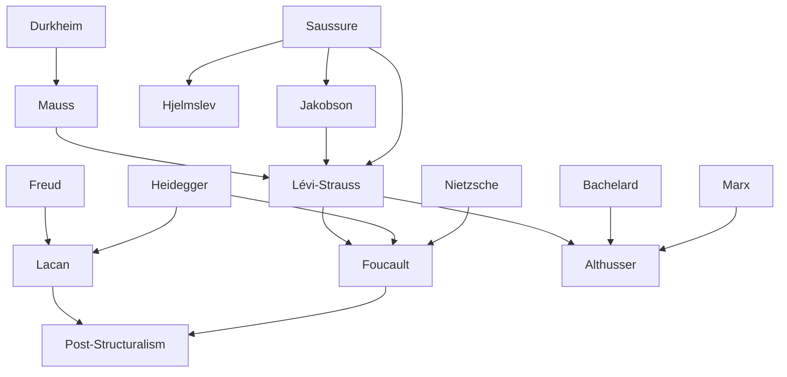

---
cssclasses:
  - Philosophy
  - Sociology
subclasses:
  - 20th-Century-Philosophy
  - Continental-Philosophy
  - Philosophy-of-Language
aliases:
  - structuralism
  - langue parole
  - signifier signified
  - synchronic diacronic
  - death of
  - episteme
  - antihumanism
  - unconscious structures
  - semiology
contributions:
  - Conceptual
authors:
  - "[[Saussure]]"
  - "[[Lévi-Strauss]]"
  - "[[Foucault]]"
  - "[[Lacan]]"
  - "[[Althusser]]"
  - "[[Piaget]]"
  - "[[Jakobson]]"
reference: "[[07 The search for thought - Unit 15 Chapter 1.pdf]]"
---

#### Central Problem

Structuralism confronts the fundamental methodological question of how to study human phenomena (language, culture, society, mind) scientifically without recourse to the traditional notions of conscious subjects, historical progress, and empirical particulars. The movement emerged as a radical challenge to the dominant philosophical currents of the early twentieth century—idealism, phenomenology, existentialism, and humanistic Marxism—all of which privileged consciousness, individual agency, and historical becoming.

The central tension lies between the apparent chaos and diversity of human cultural phenomena and the underlying order that structuralists claim governs them. How can the multiplicity of languages, kinship systems, myths, and social practices be understood through invariant structures? Can we achieve genuine scientific knowledge of human beings by abandoning the subjective standpoint and treating humans "from the outside"—as if observed by a visitor from another planet, as Lévi-Strauss put it? And what becomes of the human subject when consciousness is revealed to be determined by unconscious structures it neither creates nor controls?

The "death of man" thesis—structuralism's most provocative philosophical claim—emerges from these questions: if structures determine human thought and action, then the modern conception of man as autonomous subject, source of meaning and master of history, must be abandoned as an ideological illusion.

#### Main Thesis

Structuralism maintains that reality constitutes a system of relations in which terms do not exist independently but only through their connections with one another. Against atomism and substantialism, structuralists affirm the primacy of relations over elements; against humanism and "consciencialism," they assert the primacy of structure over the individual subject; against historicism, they privilege synchronic (simultaneous) over diachronic (developmental) analysis; against empiricism and subjectivism, they seek objective knowledge beyond lived experience.

**The Structure Concept:** Following Lévi-Strauss and Piaget, structure is not merely a system or arrangement of parts but specifically designates the internal order of a system and the group of possible transformations that characterize it. Piaget's definition captures the essential features: "A structure is a system of transformations that has laws as a system (as opposed to properties of elements) and that maintains or enriches itself through the very play of its transformations, without these leading beyond its boundaries or requiring appeal to external elements." Three characteristics define structure: totality, transformations, and self-regulation.

**Saussure's Linguistic Revolution:** The founder of structural linguistics established key dichotomies that became foundational for structuralism:
- **Langue/Parole:** Langue is the social aspect of language—the code of rules assimilated from the community; parole is the individual, creative use of that code
- **Signifier/Signified:** The linguistic sign unites not a thing and a name but a concept (signified) and an acoustic image (signifier); their relation is arbitrary
- **Synchrony/Diachrony:** Synchronic linguistics studies language as a simultaneous system; diachronic linguistics studies its evolution. Saussure privileges synchrony

**The Death of Man:** Foucault's archaeological investigations reveal that "man" as object-subject of knowledge is a recent historical invention, emerging only at the end of the eighteenth century. But this epistemic "birth" paradoxically entails man's simultaneous "death": when human sciences become genuinely scientific (through psychoanalysis, ethnology, linguistics), they discover that what makes man possible is a set of structures "of which he is not the subject, the sovereign consciousness."

**The Unconscious as Language:** Lacan radicalizes Freud through structuralist linguistics, declaring that "the unconscious is structured like a language." The center of the human being lies not in consciousness or cogito but in the Other—the unconscious that dominates conscious life and speaks through the subject.

#### Historical Context

Structuralism emerged in France during the 1960s and 1970s as a specific "cultural atmosphere" that crystallized diverse intellectual currents into a movement united more by what it opposed than by shared positive doctrines. The historical success of structuralism derived largely from its attempt to sweep away the dominant philosophical traditions of the first half of the twentieth century in favor of a new, more scientific worldview.

The movement's roots lie in Saussure's *Course in General Linguistics* (1916), which revolutionized the study of language by treating it as a self-contained system of signs. The Prague Linguistic Circle (founded 1926) and the Copenhagen School developed these insights, particularly in phonology and glossematics. The influence of Bachelard's philosophy of science, along with selective readings of Nietzsche, Heidegger, Marx, and Freud, also shaped the structuralist synthesis.

The post-World War II period saw disillusionment with existentialist humanism and its emphasis on freedom, engagement, and the individual subject. The political failures of humanist Marxism, the perceived inadequacies of phenomenology, and the rise of new human sciences created receptive conditions for a movement promising rigorous, scientific analysis of human phenomena. The "Four Musketeers" of structuralism—Lévi-Strauss, Foucault, Lacan, and Althusser—each contributed distinctive versions of the structuralist critique of subjectivity.

The movement's decline began in the late 1960s, with figures like Foucault and others moving toward "post-structuralism," though structuralist methodologies continued to influence anthropology, linguistics, and literary theory.

#### Philosophical Lineage

#### Key Thinkers

| Thinker | Dates | Movement | Main Work | Core Concept |
|---------|-------|----------|-----------|--------------|
| [[Saussure]] | 1857-1913 | [[Structural Linguistics]] | *Course in General Linguistics* | Langue/parole, signifier/signified |
| [[Lévi-Strauss]] | 1908-2009 | [[Structuralism]] | *Structural Anthropology* | Unconscious structures, transformation |
| [[Foucault]] | 1926-1984 | [[Structuralism]] | *The Order of Things* | Episteme, death of man |
| [[Lacan]] | 1901-1981 | [[Structuralism]] | *Écrits* | Unconscious as language |
| [[Althusser]] | 1918-1990 | [[Structural Marxism]] | *For Marx* | Ideology/science, overdetermination |
| [[Jakobson]] | 1896-1982 | [[Prague Circle]] | *Fundamentals of Language* | Phonology, linguistic functions |
| [[Piaget]] | 1896-1980 | [[Genetic Epistemology]] | *Structuralism* | Structure as transformation system |

#### Key Concepts

| Concept | Definition | Related to |
|---------|------------|------------|
| Structure | Internal order of a system and group of possible transformations; characterized by totality, transformations, self-regulation | [[Lévi-Strauss]], [[Piaget]] |
| Langue/Parole | Social code of language (langue) vs. individual speech act (parole) | [[Saussure]], [[Structural Linguistics]] |
| Signifier/Signified | Acoustic image (signifier) and concept (signified) united arbitrarily in the sign | [[Saussure]], [[Semiology]] |
| Synchrony/Diachrony | Simultaneous/static analysis vs. successive/evolutionary analysis | [[Saussure]], [[Structuralism]] |
| Episteme | Deep mental infrastructure making knowledge and theories possible in an era | [[Foucault]], [[Archaeology of Knowledge]] |
| Death of Man | Dissolution of the modern subject-object of human sciences | [[Foucault]], [[Antihumanism]] |
| The Other | The unconscious as locus dominating conscious life, structured as language | [[Lacan]], [[Psychoanalysis]] |
| Overdetermination | Economic contradiction as both determining and determined by other instances | [[Althusser]], [[Structural Marxism]] |
| Cold/Hot Societies | Primitive societies resistant to change vs. developed societies founded on transformation | [[Lévi-Strauss]], [[Anthropology]] |
| Phoneme | Elementary unit differentiating signifiers from one another | [[Jakobson]], [[Phonology]] |

#### Authors Comparison

| Theme | [[Saussure]] | [[Lévi-Strauss]] | [[Foucault]] | [[Lacan]] | [[Althusser]] |
|-------|--------------|------------------|--------------|-----------|---------------|
| Object of study | Language as system | Kinship, myths | Knowledge formations | Unconscious | Ideology, social formation |
| Method | Structural linguistics | Structural anthropology | Archaeology of knowledge | Structural psychoanalysis | Epistemological break |
| Structure location | Social code (langue) | Collective unconscious | Historical episteme | Unconscious (Other) | Mode of production |
| Subject status | Subordinate to langue | Product of structures | Historical invention | Divided, decentered | Ideological effect |
| Synchrony emphasis | Primary over diachrony | Primary over history | Discontinuous epistemes | Timeless unconscious | Scientific analysis |
| Key opposition | Langue/parole | Nature/culture | Words/things | Imaginary/symbolic | Ideology/science |

#### Influences & Connections

- **Predecessors:** [[Lévi-Strauss]] ← influenced by ← [[Saussure]], [[Jakobson]], [[Mauss]]
- **Predecessors:** [[Foucault]] ← influenced by ← [[Nietzsche]], [[Heidegger]], [[Bachelard]]
- **Predecessors:** [[Lacan]] ← influenced by ← [[Freud]], [[Saussure]], [[Heidegger]]
- **Contemporaries:** [[Lévi-Strauss]] ↔ dialogue with ↔ [[Sartre]], [[Ricoeur]]
- **Contemporaries:** [[Foucault]] ↔ debate with ↔ [[Sartre]], [[Derrida]]
- **Followers:** [[Structuralism]] → influenced → [[Post-Structuralism]], [[Deconstruction]]
- **Opposing views:** [[Structuralism]] ← criticized by ← [[Sartre]], [[Ricoeur]], [[Phenomenology]]

#### Summary Formulas

- **[[Saussure]]:** Language is a system of signs where terms acquire value only through their differential relations; the code (langue) precedes and enables individual speech (parole).
- **[[Lévi-Strauss]]:** Human cultures are governed by invariant unconscious structures—a "Kantianism without transcendental subject"—that transform endlessly while remaining fundamentally constant.
- **[[Foucault]]:** "Man" is a recent epistemic invention destined to disappear; what speaks is not the individual but the Word itself through impersonal structures.
- **[[Lacan]]:** The unconscious is structured like a language; the ego is not master in its own house but is spoken by the Other.
- **[[Althusser]]:** Genuine Marxist science requires breaking with humanist ideology to study the objective structures of social formations.

#### Timeline

| Year | Event |
|------|-------|
| 1916 | [[Saussure]]'s *Course in General Linguistics* published posthumously |
| 1926 | Prague Linguistic Circle founded by [[Jakobson]] and Trubeckoj |
| 1929 | Prague Circle publishes its collective *Theses* |
| 1949 | [[Lévi-Strauss]] publishes *The Elementary Structures of Kinship* |
| 1955 | [[Lévi-Strauss]] publishes *Tristes Tropiques* |
| 1958 | [[Lévi-Strauss]] publishes *Structural Anthropology* |
| 1961 | [[Foucault]] publishes *History of Madness* |
| 1962 | [[Lévi-Strauss]] publishes *The Savage Mind* |
| 1965 | [[Althusser]] publishes *For Marx* and *Reading Capital* |
| 1966 | [[Foucault]] publishes *The Order of Things*; [[Lacan]] publishes *Écrits* |
| 1969 | [[Foucault]] publishes *The Archaeology of Knowledge* |
| 1975 | [[Foucault]] publishes *Discipline and Punish* |

#### Notable Quotes

> "A structure is a system of transformations that has laws as a system and that maintains or enriches itself through the very play of its transformations, without these leading beyond its boundaries or requiring appeal to external elements." — [[Piaget]]

> "The human sciences can become sciences only by ceasing to be human—that is, by placing, in place of the conscious project of individuals, the collective unconscious and its categorical networks." — [[Lévi-Strauss]]

> "One discovers that what makes man possible is a set of structures—structures that he can certainly think and describe, but of which he is not the subject, the sovereign consciousness." — [[Foucault]]

#### See Also

- [[Semiology]]
- [[Post-Structuralism]]
- [[Deconstruction]]
- [[Psychoanalysis]]
- [[Linguistic Turn]]
- [[French Philosophy]]
- [[Antihumanism]]
- [[Archaeology of Knowledge]]
- [[Panopticon]]
- [[Ideology]]

> [!NOTE]
> *This summary has been created to present the key points from the source text, which was automatically extracted using LLM. Please note that the summary may contain errors. It serves as an essential starting point for study and reference purposes.*
