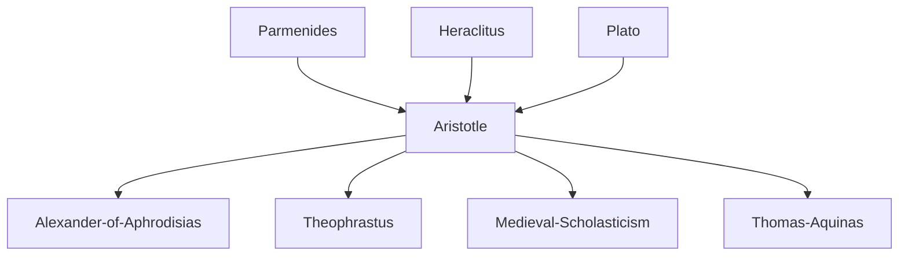

---
cssclasses:
  - Philosophy
subclasses:
  - Metaphysics
  - Logic-and-Philosophy-of-Logic
  - Ancient-Greek-and-Roman-Philosophy
related:
  - "[[Metaphysics]]"
  - "[[Ontology]]"
  - "[[Substance]]"
  - "[[Categories]]"
  - "[[Syllogism]]"
  - "[[Logic]]"
  - "[[Hylomorphism]]"
  - "[[Potency and Act]]"
  - "[[Unmoved Mover]]"
  - "[[Principle of Non-Contradiction]]"
  - "[[First Philosophy]]"
  - "[[Peripatetic School]]"
aliases:
  - aristotelian logic
  - first philosophy
  - potency act
  - prime mover
  - non contradiction
  - form matter
reference:
  - "[Abbagnano, N., & Fornero, G. (2012). La ricerca del pensiero. Vol. 1A. Dalle origini ad Aristotele. Paravia.](https://archive.org/download/ssp-s01-e11/The%20search%20for%20thought%20-%20Unit%204%20Chapter%202.pdf)"
tags:
  - Podcast
---

#### Podcast

<iframe src="https://archive.org/embed/ssp-s01-e11" width="100%" height="30" frameborder="0" webkitallowfullscreen="true" mozallowfullscreen="true" allowfullscreen></iframe>

---

#### Central Problem

This chapter addresses two fundamental interconnected questions in [[Aristotle]]'s philosophy: What is the ultimate nature of reality, and how can we reason correctly about it? The first question concerns metaphysics—the study of being as such—while the second concerns logic—the study of valid reasoning. [[Aristotle]] must solve several problems inherited from his predecessors: How can we speak meaningfully about being without falling into [[Parmenides]]' monism (where only "being" exists and all distinctions are illusory) or into relativism (where words have no stable meaning)? What is the fundamental structure of reality that underlies all particular things? How does change occur if being cannot come from non-being? And finally, how can we construct scientific demonstrations that yield necessary and universal knowledge?

The chapter explores how [[Aristotle]] develops a sophisticated framework where being is neither univocal (one meaning) nor equivocal (infinitely different meanings), but "polyvocal"—having multiple meanings unified by reference to substance. This leads to the central question: What is substance (ousia), and how does it serve as the foundation for all other categories of being?

#### Main Thesis

Aristotle argues that metaphysics is the "first philosophy" (philosophia prote) that studies being as being—not particular aspects of reality like physics or mathematics, but the fundamental structures common to all that exists. He provides four definitions of metaphysics: (1) the study of first causes and principles, (2) the study of being as being, (3) the study of substance, and (4) the study of God and immobile substance. These definitions converge because substance is the primary meaning of being, and God represents the highest substance.

**The Doctrine of Categories:** Being is expressed through categories—the fundamental ways reality presents itself. These include: substance, quality, quantity, relation, action, passion, place, and time. Substance is primary because all other categories presuppose it: quality is always quality of something, quantity is quantity of something.

**The Theory of Substance:** Substance (ousia) has two meanings: (1) the concrete individual (synholon or "this here"—tode ti), which is the union of form and matter, and (2) form (eidos) or essence, which makes a thing what it is. Form is the active, determining element; matter is the passive, determinable element. The individual substance is autonomous—it exists independently and serves as the subject of predication.

**The Four Causes:** Every complete explanation requires four causes: material (what something is made of), formal (the structure or essence), efficient (what initiates change), and final (the purpose or goal). In natural processes, formal, efficient, and final causes often coincide.

**Potency and Act:** Becoming is not passage from non-being to being (which is impossible), but from potential being to actual being. The acorn is potentially an oak; the oak is the acorn in act. Act has priority over potency: ontologically, chronologically, and epistemologically.

**Theology:** At the summit of metaphysics stands theology—the study of the unmoved mover. God is pure act without potency, incorporeal substance, eternal, and the final cause that moves all things as an object of love and desire. God is "thought thinking itself" (noesis noeseos)—pure self-contemplation.

**Logic:** Logic (the Organon) provides the tools for scientific reasoning. The syllogism is the fundamental form of demonstration, consisting of two premises and a conclusion connected by a middle term. Scientific knowledge requires syllogisms based on true, primary, immediate premises that express the essence of things. The principle of non-contradiction is the most fundamental axiom, demonstrated indirectly through refutation (elenchos).

#### Historical Context

Aristotle develops his metaphysics and logic in the context of ongoing debates about the nature of being and knowledge. The Pre-Socratics had proposed various material principles (water, air, fire, atoms), while the Eleatics denied the reality of change and plurality. [[Heraclitus]] emphasized flux, and the Sophists had undermined confidence in stable meaning and truth.

Plato's Theory of Forms offered a solution by positing transcendent Ideas as the true reality, but [[Aristotle]] finds this problematic—how can Forms separated from things explain those things? The concept of "participation" remains a mere metaphor. [[Aristotle]] thus seeks to preserve the insights of his predecessors while avoiding their errors, developing an immanent conception where forms exist within individual substances.

The classification of sciences into theoretical (metaphysics, physics, mathematics), practical (ethics, politics), and productive (arts, techniques) reflects the organization of knowledge in the Academy and Lyceum. The development of formal logic represents an unprecedented achievement—Aristotle essentially creates the discipline single-handedly, providing tools that will dominate Western reasoning for over two millennia.

#### Philosophical Lineage

#### Key Thinkers

| Thinker | Dates | Movement | Main Work | Core Concept |
|---------|-------|----------|-----------|--------------|
| [[Aristotle]] | 384-322 BCE | [[Peripatetic School]] | *Metaphysics* | Being as being, substance, categories |
| [[Plato]] | 428-348 BCE | [[Platonism]] | *Sophist* | Theory of Forms, supreme genera |
| [[Parmenides]] | 515-450 BCE | [[Eleatic School]] | *On Nature* | Being as univocal, denial of change |
| [[Andronicus of Rhodes]] | 1st c. BCE | [[Peripatetic School]] | Edition of [[Aristotle]] | Coined term "metaphysics" |
| [[Alexander of Aphrodisias]] | fl. 200 CE | [[Peripatetic School]] | Commentaries | Logic as "organon" |

#### Key Concepts

| Concept | Definition | Related to |
|---------|------------|------------|
| Metaphysics | The study of being as being and its first causes; "first philosophy" that precedes and grounds all other sciences | [[Aristotle]], [[First Philosophy]] |
| Substance (ousia) | The primary category of being; that which exists independently as subject of predication, either as concrete individual (synholon) or as form/essence | [[Aristotle]], [[Categories]] |
| Categories | The supreme genera of being: substance, quality, quantity, relation, action, passion, place, time | [[Aristotle]], [[Predication]] |
| Synholon | The composite or "whole together" of form and matter constituting individual substances | [[Aristotle]], [[Hylomorphism]] |
| Form (eidos) | The active, determining element of substance; the essence or "what it was to be" (to ti en einai) of a thing | [[Aristotle]], [[Essence]] |
| Matter (hyle) | The passive, determinable element; the substrate that receives form; pure matter (prime matter) is mere potentiality | [[Aristotle]], [[Potentiality]] |
| Potency and Act | The two modes of being that explain change: potency is capacity to become, act is realized being | [[Aristotle]], [[Becoming]] |
| Principle of Non-Contradiction | The most fundamental axiom: the same attribute cannot belong and not belong to the same subject in the same respect | [[Aristotle]], [[Logic]] |
| Syllogism | A discourse in which, certain things being posited, something else follows necessarily | [[Aristotle]], [[Demonstration]] |
| Unmoved Mover | God as pure act, final cause of all motion, thought thinking itself | [[Aristotle]], [[Theology]] |

#### Authors Comparison

| Theme | [[Aristotle]] | [[Plato]] | [[Parmenides]] |
|-------|---------------|-----------|----------------|
| Nature of being | Polyvocal, unified by reference to substance | Hierarchical, Forms as true being | Univocal, only "is" can be said |
| Forms/essences | Immanent in individual substances | Transcendent, separate from things | Being is one, undifferentiated |
| Change | Real, explained by potency and act | Apparent, realm of becoming vs being | Illusory, logically impossible |
| Knowledge | Demonstration from essences via syllogism | Dialectic ascending to the Good | Logos grasping unchanging being |
| First principle | Unmoved mover as final cause | Form of the Good | Being itself |
| Individuals | Primary substances, fully real | Copies of Forms, less real | Mere appearance |

#### Influences & Connections

- **Predecessors:** [[Aristotle]] ← influenced by ← [[Plato]], [[Parmenides]], [[Heraclitus]], [[Pythagoreans]]
- **Contemporaries:** [[Aristotle]] ↔ dialogue with ↔ [[Speusippus]], [[Xenocrates]], [[Eudoxus]]
- **Followers:** [[Aristotle]] → influenced → [[Theophrastus]], [[Alexander of Aphrodisias]], [[Medieval Scholasticism]]
- **Opposing views:** [[Aristotle]] ← criticized by ← [[Stoics]], [[Epicureans]], [[Modern Empiricists]]

#### Summary Formulas

- **[[Aristotle]]:** Being is said in many ways but all refer to substance; substance is the autonomous individual (synholon of form and matter) whose essence (form) is grasped through definition and demonstration.
- **[[Aristotle]] on change:** Becoming is not passage from non-being to being but from potential to actual being; the acorn becomes the oak because it already potentially is the oak.
- **[[Aristotle]] on God:** The unmoved mover is pure act without potency, moving all things as final cause—as the beloved moves the lover—and is eternal self-thinking thought.
- **[[Aristotle]] on logic:** Scientific knowledge consists in demonstrating necessary truths through syllogisms whose premises express the essential definitions of things, ultimately grounded in intellectual intuition.

#### Timeline

| Year | Event |
|------|-------|
| 515 BCE | [[Parmenides]] born; will develop doctrine of unchanging being |
| 428 BCE | [[Plato]] born; will develop Theory of Forms |
| 384 BCE | [[Aristotle]] born in Stagira |
| 367 BCE | [[Aristotle]] enters [[Plato]]'s Academy |
| 335 BCE | [[Aristotle]] founds the Lyceum in Athens |
| 322 BCE | [[Aristotle]] dies in Chalcis |
| 1st c. BCE | [[Andronicus of Rhodes]] edits [[Aristotle]]'s works, coins "metaphysics" |
| 2nd-3rd c. CE | [[Alexander of Aphrodisias]] writes definitive commentaries |

#### Notable Quotes

> "There is a science that studies being as being and the properties that belong to it by virtue of its own nature."
> — [[Aristotle]]

> "It is impossible for the same attribute to belong and not belong to the same subject at the same time and in the same respect."
> — [[Aristotle]]

> "A syllogism is a discourse in which, certain things being posited, something else follows necessarily by the very fact that these things are so."
> — [[Aristotle]]

---
---
> [!warning]-
> This annotation was normalised using a large language model and may contain inaccuracies. These texts serve as preliminary study resources rather than exhaustive references.
