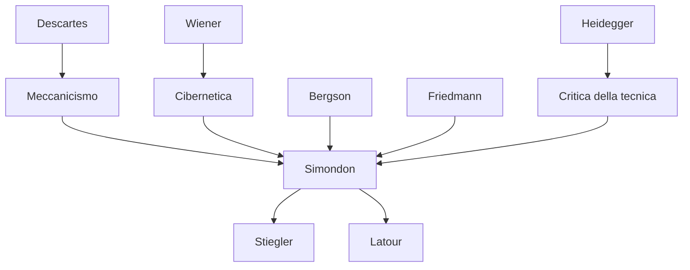

---
cssclasses:
  - Philosophy
subclasses:
  - Phenomenology
  - Philosophy-of-Science
  - 20th-Century-Philosophy
related:
  - "[[Philosophy of Technology]]"
  - "[[Cybernetics]]"
  - "[[Individuation]]"
  - "[[Technical Object]]"
  - "[[Networks]]"
  - "[[Phenomenology]]"
aliases:
  - technical mentality
  - mentalité technique
  - simondon technology
  - simondon 1968
  - artisanal industrial
  - technical networks
  - postindustrial society
  - concretization theory
  - reticular structure
  - technophany concept
reference:
  - Simondon, G., & De Boever, A. (2013). Technical Mentality (A. De Boever, S. Murray, & J. Roffe, Eds.; pp. 1–14). University of Edinburgh Press. https://doi.org/10.3366/edinburgh/9780748677214.003.0001
---

#### Central Problem

[[Simondon]] addresses an axiological question, not an ontological one: there exists a **technical mentality** in the process of development, incomplete and at risk of being prematurely judged "monstrous". This mentality requires an attitude of "generosity" toward the order of reality it seeks to manifest.

The central problem is the **split** between artisanal and industrial modes, which generates conflict in affective categories. In the artisanal mode, energy and information come from the human being; in the industrial mode, they separate. This split fragments the human-nature-technology relationship. The solution lies in the development of **post-industrial technical networks** that reconcile what industry has separated.

The technical mentality is coherent and productive in the cognitive domain, but incomplete and in conflict with itself in the affective domain, and almost entirely to be constructed in the domain of will.

#### Main Thesis

[[Simondon]] argues that the **technical mentality** offers *sui generis* schemas of intelligibility based on **analogical transfer** and **paradigm**. It discovers common modes of functioning in otherwise different orders of reality — living or inert, human or non-human.

**Cognitive Schemas:** Two movements have already produced universal schemas: *Cartesian mechanism* (lossless transfer, chain of reasons as chain of forces) and *cybernetics* (feedback, automatic regulation, finality). This knowledge is **transcategorical**: it does not respect the boundaries between domains of reality, it crosses traditional categories.

**Two Fundamental Postulates:**
1. **Relative separability of subsets**: The technical object is not an indivisible organism. It can be repaired, completed, modified. The holistic postulate is perhaps merely a "lazy way out".
2. **Levels and regimes**: To understand a being one must study it in its *entelechy*, not in stasis. Technical realities have thresholds of functioning; below the threshold they are absurd, above they become self-stable.

**Artisanal/Industrial Conflict:**
- *Artisanal*: energy and information come from the human operator; continuity between production and use; immediate relationship with nature.
- *Industrial*: energy from nature, information fragmented among inventor, builder, regulator, operator. Alienation of both operator and inventor.

**Post-Industrial Solution:** **Technical networks** (information, energy, transport) reconcile energy and information. The network is available at every point; its meshes interweave with those of the world. The technical object becomes **open**, with permanent parts and replaceable parts, maintained in "perpetual actuality" through standardization.

#### Historical Context

The text dates from 1968, a crucial period for reflection on technology. [[Simondon]] writes after his main work *Du mode d'existence des objets techniques* (1958), deepening the distinction between artisanal and industrial modes and anticipating themes that would become central only decades later: information networks, post-industrial society, planned obsolescence.

The context includes [[Wiener]]'s cybernetics, Cartesian mechanism, and [[Friedmann]]'s critique of industrial alienation (*Le travail en miettes*). Simondon also implicitly responds to [[Heidegger]] on the question of technology, proposing not a condemnation but an understanding of technical mentality.

Arne De Boever's English translation (2013) in *Parrhesia* made this text accessible for the first time to an Anglophone audience, with critical notes by Jean-Hugues Barthélémy.

#### Philosophical Lineage

#### Key Thinkers

| Thinker | Dates | Movement | Main Work | Core Concept |
|---------|-------|----------|-----------|--------------|
| [[Simondon]] | 1924-1989 | [[Philosophy of Technology]] | *Du mode d'existence des objets techniques* | Individuation, concretization |
| [[Descartes]] | 1596-1650 | [[Rationalism]] | *Discourse on Method* | Mechanism, lossless transfer |
| [[Wiener]] | 1894-1964 | [[Cybernetics]] | *Cybernetics* | Feedback, automatic regulation |
| [[Heidegger]] | 1889-1976 | [[Phenomenology]] | *The Question Concerning Technology* | Gestell, unconcealment |
| [[Friedmann]] | 1902-1977 | [[Sociology of Work]] | *Le travail en miettes* | Industrial alienation |

#### Key Concepts

| Concept | Definition | Related to |
|---------|------------|------------|
| Technical Mentality | *Sui generis* mode of knowledge based on analogical transfer and paradigm | [[Simondon]], [[Epistemology]] |
| Transcategorical Knowledge | Knowledge that crosses the boundaries between domains of reality | [[Simondon]], [[Cybernetics]] |
| Artisanal Mode | Production where energy and information come from the human operator | [[Simondon]], [[Labor]] |
| Industrial Mode | Production where energy comes from nature, information is fragmented | [[Simondon]], [[Alienation]] |
| Threshold of Functioning | Level beyond which a system becomes self-stable | [[Simondon]], [[Cybernetics]] |
| Concretization | Process by which the technical object reduces its elements to the optimal minimum | [[Simondon]], [[Technology]] |
| Obsolescence | Disuse linked to changes in social conventions, not to wear | [[Simondon]], [[Design]] |
| Technophany | Non-dissimulation of technical means, refusal of obsolescence | [[Simondon]], [[Architecture]] |

#### Authors Comparison

| Theme | [[Simondon]] | [[Heidegger]] | [[Wiener]] |
|-------|--------------|---------------|------------|
| Attitude toward technology | Generosity, understanding | Critique of Gestell | Cybernetic optimism |
| Alienation | Energy/information split | Forgetting of Being | Not central |
| Solution | Post-industrial networks, open objects | Return to meditative thinking | Automatic regulation |
| Human-nature relationship | Reconciliation through networks | Modern rupture | Feedback control |

#### Influences & Connections

- **Predecessors:** [[Simondon]] ← influenced by ← [[Descartes]] (mechanism), [[Wiener]] (cybernetics), [[Bergson]] (duration), [[Friedmann]] (alienation)
- **Contemporaries:** [[Simondon]] ↔ implicit critique of ↔ [[Heidegger]] (question of technology)
- **Followers:** [[Simondon]] → influences → [[Stiegler]] (technology and time), [[Latour]] (networks), [[Deleuze]] (individuation)
- **Opposing views:** [[Simondon]] ← critiques ← technophobia, artisanal nostalgia, holistic postulate

#### Summary Formulas

- **[[Simondon]]:** Technical mentality offers transcategorical cognitive schemas; suffers from an affective conflict between artisanal and industrial modes; finds its resolution in post-industrial networks that reconcile energy and information.
- **Artisanal Mode:** Energy + information = human operator; continuity of production-use; immediate relationship with nature and material.
- **Industrial Mode:** Energy from nature, fragmented information (inventor/builder/operator); discontinuity; mutual alienation.
- **Reticular Solution:** The open technical object, with permanent parts and replaceable parts, maintained in perpetual actuality through standardization and networks.

#### Timeline

| Year | Event |
|------|-------|
| 1637 | [[Descartes]] pubblica *Discorso sul metodo* (meccanicismo) |
| 1948 | [[Wiener]] pubblica *Cybernetics* |
| 1954 | [[Heidegger]] tiene conferenza "La questione della tecnica" |
| 1956 | [[Friedmann]] pubblica *Le travail en miettes* |
| 1958 | [[Simondon]] pubblica *Du mode d'existence des objets techniques* |
| 1968 | [[Simondon]] scrive "La mentalité technique" (pubblicato postumo 2006) |
| 2013 | Traduzione inglese in *Parrhesia* (De Boever) |

#### Notable Quotes

> "The technical mentality is coherent, positive, productive in the domain of the cognitive schemas, but incomplete and in conflict with itself in the domain of the affective categories because it has not yet properly emerged." — [[Simondon]]

> "The machine is different from the tool in that it is a relay: it has two different entry points, that of energy and that of information." — [[Simondon]]

> "Technical reality lends itself remarkably well to being continued, completed, perfected, extended. [...] The non-dissimulation of means, this politeness of architecture towards its materials which translates itself by a constant technophany, amounts to a refusal of obsolescence." — [[Simondon]]

---
> [!warning]-
> This annotation was normalised using a large language model and may contain inaccuracies. These texts serve as preliminary study resources rather than exhaustive references.
