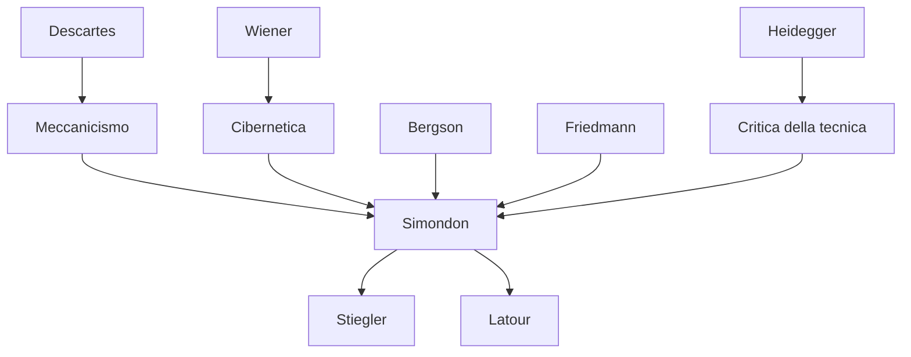

---
cssclasses:
  - Philosophy
subclasses:
  - Phenomenology
  - Philosophy-of-Science
  - 20th-Century-Philosophy
related:
  - "[[Philosophy of Technology]]"
  - "[[Cybernetics]]"
  - "[[Individuation]]"
  - "[[Technical Object]]"
  - "[[Networks]]"
  - "[[Phenomenology]]"
aliases:
  - technical mentality
  - mentalit technique
  - simondon technology
  - simondon 1968
  - artisanal industrial
  - technical networks
  - postindustrial society
  - concretization theory
  - reticular structure
  - technophany concept
reference:
  - Simondon, G., & De Boever, A. (2013). Technical Mentality (A. De Boever, S. Murray, & J. Roffe, Eds.; pp. 1–14). University of Edinburgh Press. https://doi.org/10.3366/edinburgh/9780748677214.003.0001
---

#### Central Problem

[[Simondon]] affronta una questione assiologica, non ontologica: esiste una **mentalità tecnica** in via di sviluppo, incompleta e a rischio di essere prematuramente giudicata "mostruosa". Questa mentalità richiede un atteggiamento di "generosità" verso l'ordine di realtà che cerca di manifestare.

Il problema centrale è la **scissione** tra modalità artigianale e industriale, che genera conflitto nelle categorie affettive. Nella modalità artigianale, energia e informazione provengono dall'essere umano; nella modalità industriale, si separano. Questa scissione frammenta il rapporto umano-natura-tecnica. La soluzione risiede nello sviluppo di **reti tecniche post-industriali** che riconciliano ciò che l'industria ha separato.

La mentalità tecnica è coerente e produttiva nel dominio cognitivo, ma incompleta e in conflitto con se stessa nel dominio affettivo, e quasi interamente da costruire nel dominio della volontà.

#### Main Thesis

[[Simondon]] sostiene che la **mentalità tecnica** offre schemi di intelligibilità *sui generis* basati sul **trasferimento analogico** e sul **paradigma**. Essa scopre modi comuni di funzionamento in ordini di realtà altrimenti differenti — vivente o inerte, umano o non-umano.

**Schemi Cognitivi:** Due movimenti hanno già prodotto schemi universali: il *meccanicismo cartesiano* (trasferimento senza perdite, catena di ragioni come catena di forze) e la *cibernetica* (feedback, regolazione automatica, finalità). Questa conoscenza è **transcategoriale**: non rispetta i limiti tra domini di realtà, attraversa le categorie tradizionali.

**Due Postulati Fondamentali:**
1. **Separabilità relativa dei sottoinsiemi**: L'oggetto tecnico non è un organismo indivisibile. Può essere riparato, completato, modificato. Il postulato olistico è forse solo una "pigra via d'uscita".
2. **Livelli e regimi**: Per comprendere un essere bisogna studiarlo nella sua *entelechia*, non nella staticità. Le realtà tecniche hanno soglie di funzionamento; sotto la soglia sono assurde, sopra diventano auto-stabili.

**Conflitto Artigianale/Industriale:**
- *Artigianale*: energia e informazione provengono dall'operatore umano; continuità tra produzione e uso; relazione immediata con la natura.
- *Industriale*: energia dalla natura, informazione frammentata tra inventore, costruttore, regolatore, operatore. Alienazione sia dell'operatore che dell'inventore.

**Soluzione Post-Industriale:** Le **reti tecniche** (informazione, energia, trasporto) riconciliano energia e informazione. La rete è disponibile in ogni suo punto; le sue maglie si intrecciano con quelle del mondo. L'oggetto tecnico diventa **aperto**, con parti permanenti e parti sostituibili, mantenuto in "attualità perpetua" attraverso la standardizzazione.

#### Historical Context

Il testo risale al 1968, periodo cruciale per la riflessione sulla tecnica. [[Simondon]] scrive dopo la sua opera principale *Du mode d'existence des objets techniques* (1958), approfondendo la distinzione tra modalità artigianale e industriale e anticipando temi che diverranno centrali solo decenni dopo: le reti informative, la società post-industriale, l'obsolescenza programmata.

Il contesto include la cibernetica di [[Wiener]], il meccanicismo cartesiano, e la critica dell'alienazione industriale di [[Friedmann]] (*Le travail en miettes*). Simondon risponde implicitamente anche a [[Heidegger]] sulla questione della tecnica, proponendo non una condanna ma una comprensione della mentalità tecnica.

La traduzione inglese di Arne De Boever (2013) in *Parrhesia* ha reso questo testo accessibile per la prima volta a un pubblico anglofono, con note critiche di Jean-Hugues Barthélémy.

#### Philosophical Lineage

#### Key Thinkers

| Thinker | Dates | Movement | Main Work | Core Concept |
|---------|-------|----------|-----------|--------------|
| [[Simondon]] | 1924-1989 | [[Filosofia della Tecnica]] | *Du mode d'existence des objets techniques* | Individuazione, concretizzazione |
| [[Descartes]] | 1596-1650 | [[Razionalismo]] | *Discorso sul metodo* | Meccanicismo, trasferimento senza perdite |
| [[Wiener]] | 1894-1964 | [[Cibernetica]] | *Cybernetics* | Feedback, regolazione automatica |
| [[Heidegger]] | 1889-1976 | [[Fenomenologia]] | *La questione della tecnica* | Gestell, svelamento |
| [[Friedmann]] | 1902-1977 | [[Sociologia del lavoro]] | *Le travail en miettes* | Alienazione industriale |

#### Key Concepts

| Concept | Definition | Related to |
|---------|------------|------------|
| Mentalità Tecnica | Modo di conoscenza *sui generis* basato su trasferimento analogico e paradigma | [[Simondon]], [[Epistemologia]] |
| Conoscenza Transcategoriale | Conoscenza che attraversa i limiti tra domini di realtà | [[Simondon]], [[Cibernetica]] |
| Modalità Artigianale | Produzione dove energia e informazione provengono dall'operatore umano | [[Simondon]], [[Lavoro]] |
| Modalità Industriale | Produzione dove energia viene dalla natura, informazione frammentata | [[Simondon]], [[Alienazione]] |
| Soglia di Funzionamento | Livello oltre il quale un sistema diventa auto-stabile | [[Simondon]], [[Cibernetica]] |
| Concretizzazione | Processo per cui l'oggetto tecnico riduce i suoi elementi al minimo-ottimo | [[Simondon]], [[Tecnica]] |
| Obsolescenza | Disuso legato al cambiamento di convenzioni sociali, non all'usura | [[Simondon]], [[Design]] |
| Tecnofania | Non-dissimulazione dei mezzi tecnici, rifiuto dell'obsolescenza | [[Simondon]], [[Architettura]] |

#### Authors Comparison

| Theme | [[Simondon]] | [[Heidegger]] | [[Wiener]] |
|-------|--------------|---------------|------------|
| Atteggiamento verso tecnica | Generosità, comprensione | Critica del Gestell | Ottimismo cibernetico |
| Alienazione | Scissione energia/informazione | Oblio dell'Essere | Non centrale |
| Soluzione | Reti post-industriali, oggetti aperti | Ritorno al pensiero meditante | Regolazione automatica |
| Rapporto umano-natura | Riconciliazione attraverso reti | Rottura moderna | Controllo feedback |

#### Influences & Connections

- **Predecessors:** [[Simondon]] ← influenzato da ← [[Descartes]] (meccanicismo), [[Wiener]] (cibernetica), [[Bergson]] (durata), [[Friedmann]] (alienazione)
- **Contemporaries:** [[Simondon]] ↔ critica implicita a ↔ [[Heidegger]] (questione della tecnica)
- **Followers:** [[Simondon]] → influenza → [[Stiegler]] (tecnica e tempo), [[Latour]] (reti), [[Deleuze]] (individuazione)
- **Opposing views:** [[Simondon]] ← critica ← tecnofobia, nostalgia artigianale, postulato olistico

#### Summary Formulas

- **[[Simondon]]:** La mentalità tecnica offre schemi cognitivi transcategoriali; soffre di un conflitto affettivo tra modalità artigianale e industriale; trova la sua risoluzione nelle reti post-industriali che riconciliano energia e informazione.
- **Modalità Artigianale:** Energia + informazione = operatore umano; continuità produzione-uso; relazione immediata con natura e materiale.
- **Modalità Industriale:** Energia dalla natura, informazione frammentata (inventore/costruttore/operatore); discontinuità; alienazione reciproca.
- **Soluzione Reticolare:** L'oggetto tecnico aperto, con parti permanenti e parti sostituibili, mantenuto in attualità perpetua attraverso standardizzazione e reti.

#### Timeline

| Year | Event |
|------|-------|
| 1637 | [[Descartes]] pubblica *Discorso sul metodo* (meccanicismo) |
| 1948 | [[Wiener]] pubblica *Cybernetics* |
| 1954 | [[Heidegger]] tiene conferenza "La questione della tecnica" |
| 1956 | [[Friedmann]] pubblica *Le travail en miettes* |
| 1958 | [[Simondon]] pubblica *Du mode d'existence des objets techniques* |
| 1968 | [[Simondon]] scrive "La mentalité technique" (pubblicato postumo 2006) |
| 2013 | Traduzione inglese in *Parrhesia* (De Boever) |

#### Notable Quotes

> "The technical mentality is coherent, positive, productive in the domain of the cognitive schemas, but incomplete and in conflict with itself in the domain of the affective categories because it has not yet properly emerged." — [[Simondon]]

> "The machine is different from the tool in that it is a relay: it has two different entry points, that of energy and that of information." — [[Simondon]]

> "Technical reality lends itself remarkably well to being continued, completed, perfected, extended. [...] The non-dissimulation of means, this politeness of architecture towards its materials which translates itself by a constant technophany, amounts to a refusal of obsolescence." — [[Simondon]]

---
> [!warning]-
> This annotation was normalised using a large language model and may contain inaccuracies. These texts serve as preliminary study resources rather than exhaustive references.
