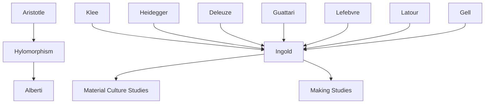

---
cssclasses:
  - Philosophy
  - Arts
  - Sociology
subclasses:
  - Aesthetics
  - Philosophy-of-Action
  - Design-Theory
related:
  - "[[Hylomorphism]]"
  - "[[Material Culture]]"
  - "[[Phenomenology]]"
  - "[[Craftsmanship]]"
  - "[[Actor-Network Theory]]"
aliases:
  - hylomorphism critique
  - making things
  - textility materials
  - materials agency
  - form giving
  - creativity making
  - itineration craft
  - improvisation making
  - thing theory
  - carpentry craft
  - drawing lines
  - weaving textile
reference:
  - Ingold, T. (2010). The textility of making. Cambridge Journal of Economics, 34(1), 91–102. https://doi.org/10.1093/cje/bep042
---

#### Central Problem

[[Ingold]] confronts a deeply entrenched assumption in Western thought about making and creativity: the hylomorphic model inherited from [[Aristotle]]. According to this model, creation involves the imposition of pre-conceived form (morphe) upon passive, inert matter (hyle) by an agent with a design in mind. This view has dominated discussions of art, technology, and craftsmanship for over two millennia, becoming progressively unbalanced as form was increasingly seen as mentally imposed while matter was rendered wholly passive.

The problem is particularly acute in contemporary discourse where theorists attempt to "rebalance" this model by attributing agency to objects—suggesting that objects can "act back" on persons. [[Ingold]] argues this approach remains trapped within the same causal grammar, merely shuttling between subjects and objects, quasi-subjects and quasi-objects, without escaping the fundamental error. The reduction of things to objects, and of life to agency, produces an impoverished understanding of how making actually occurs in practice.

Furthermore, the historical separation of design from making—epitomized by [[Alberti]]'s fifteenth-century architectural writings—elevated abstract geometrical form while debasing the tactile, sensuous knowledge of practitioners. What [[Ingold]] calls "textility" (the textilic quality of making) was progressively devalued as "mere craft" while technology was elevated as rational, rule-governed transposition of preconceived form onto inert substance.

#### Main Thesis

[[Ingold]] argues that we must overthrow the hylomorphic model entirely and replace it with an ontology that assigns primacy to processes of formation over final products, and to flows and transformations of materials over states of matter. Drawing on [[Klee]]'s insight that "form is the end, death; form-giving is life," [[Ingold]] contends that skilled practice is not about imposing preconceived forms on inert matter but about intervening in fields of force and currents of material wherein forms are generated.

**Materials over Matter:** Following [[Deleuze]] and [[Guattari]], [[Ingold]] insists that the essential relation in a world of life is not between matter and form but between materials and forces. Materials are not passive substances but are always "in movement, in flux, in variation." The practitioner's rule of thumb must be "to follow the materials"—to intervene in a world that is continually "on the boil."

**Things over Objects:** Objects are rendered lifeless by the analytical gaze; things, by contrast, are "goings on"—gatherings where several becomings become entwined. [[Heidegger]]'s enigmatic phrase captures this: the thing presents itself "in its thinging from out of the worlding world." A kite lying on a table appears as an object; caught in the wind, it reveals itself as a thing, gathering currents of air into its fabric.

**Itineration over Iteration:** Making is itinerant, not iterative. Practitioners are wayfarers who find the grain of the world's becoming and follow its course while bending it to their evolving purpose. Every stroke of the saw, like every step of a walk, is a development of what came before and a preparation for what follows—never mere repetition but continuous variation.

**Textility of Making:** Making is fundamentally a practice of weaving—not the imposition of form on pliant substance but the slicing and binding of fibrous material. The carpenter, etymologically "one who fashions," was as much a weaver as a maker. His making was itself textilic: following the grain, surrendering to the wood.

#### Historical Context

[[Ingold]]'s argument emerges from a confluence of late twentieth-century theoretical developments challenging modernist assumptions about subjects, objects, and agency. The "material turn" in anthropology, archaeology, and cultural studies had sought to overcome the passive view of matter, but often by attributing agency to objects—a move [[Ingold]] finds inadequate.

The historical pivot point [[Ingold]] identifies is [[Alberti]]'s architectural writings of the mid-fifteenth century. Before [[Alberti]], architects like those who built Chartres Cathedral were master-builders working on site, coordinating masons who cut stones following wooden templates and laid blocks along lines marked with string. There was no master plan; the outcome resembled "a patchwork quilt." [[Alberti]] transformed architecture into "a concern of the mind," projecting whole forms mentally without recourse to material, through abstract "lineaments"—precise specifications conceived independently of construction.

This shift marked the divergence of the technical from the textilic. The former was elevated into "technology"—an ontological claim that things are constituted in rule-governed transposition of preconceived form onto inert substance. The latter was debased as "mere craft," revealing only residual "feel" in a world engineered by reason.

[[Ingold]] also situates his argument within debates about agency sparked by Actor-Network Theory ([[Latour]]) and anthropological approaches to art ([[Gell]]). While these approaches sought to overcome subject-object dualism, [[Ingold]] argues they remained trapped in causal language that conceives action only as effect initiated by agent.

#### Philosophical Lineage

#### Key Thinkers

| Thinker | Dates | Movement | Main Work | Core Concept |
|---------|-------|----------|-----------|--------------|
| [[Aristotle]] | 384-322 BCE | [[Ancient Greek Philosophy]] | *Metaphysics* | Hylomorphism (form/matter) |
| [[Klee]] | 1879-1940 | [[Expressionism]] | *The Thinking Eye* | Form-giving is life |
| [[Heidegger]] | 1889-1976 | [[Phenomenology]] | *Poetry, Language, Thought* | Thinging of things |
| [[Deleuze]] | 1925-1995 | [[Post-Structuralism]] | *A Thousand Plateaus* | Matter-flow, lines of flight |
| [[Guattari]] | 1930-1992 | [[Post-Structuralism]] | *A Thousand Plateaus* | Itineration, becoming |
| [[Alberti]] | 1404-1472 | [[Renaissance]] | *On the Art of Building* | Lineaments, architectural design |
| [[Lefebvre]] | 1901-1991 | [[Critical Theory]] | *Rhythmanalysis* | Rhythm as difference in repetition |
| [[Gell]] | 1945-1997 | [[Anthropology of Art]] | *Art and Agency* | Abduction of agency |
| [[Latour]] | 1947-2022 | [[Actor-Network Theory]] | *Pandora's Hope* | Quasi-objects, networks |

#### Key Concepts

| Concept | Definition | Related to |
|---------|------------|------------|
| Hylomorphism | Aristotelian model: creation as imposition of form (morphe) on matter (hyle) by agent with design | [[Aristotle]], [[Metaphysics]] |
| Textility | The textilic quality of making as weaving—binding, slicing, following fibrous materials | [[Ingold]], [[Craftsmanship]] |
| Matter-flow | Materials always in movement, flux, variation; must be followed rather than formed | [[Deleuze]], [[Guattari]] |
| Itineration | Forward movement of making as wayfaring, unlike backward-tracing iteration | [[Deleuze]], [[Guattari]] |
| Thinging | The way things present themselves from out of the worlding world; gatherings of becoming | [[Heidegger]], [[Phenomenology]] |
| Lines of flight | Trajectories of becoming that pass between points rather than connecting them | [[Deleuze]], [[Guattari]] |
| Abduction of agency | Tracing causal connections from object to agent; reading creativity backwards | [[Gell]], [[Anthropology]] |
| Taskscape | The ensemble of tasks interlocking through their relatedness; temporal landscape of activity | [[Ingold]], [[Phenomenology]] |
| Lineaments | Abstract geometrical specifications for form, conceived mentally prior to construction | [[Alberti]], [[Architecture]] |
| Rhythmicity | Differences within repetition; felt movement requiring continuous correction | [[Lefebvre]], [[Phenomenology]] |

#### Authors Comparison

| Theme | [[Ingold]] | [[Gell]] |
|-------|-----------|----------|
| Central question | How do forms arise in making? | How does art exert agency? |
| View of objects | Things: gatherings of becoming | Objects: indexes of agency |
| Creativity | Forward: improvisation, itineration | Backward: abduction from effect to cause |
| Agency | Dissolved in flows of material | Distributed from primary to secondary agents |
| The maker | Wayfarer following materials | Agent imposing intentions |
| Causation | Orthogonal trajectories in counterpoint | Linear chains from intention to effect |

#### Influences & Connections

- **Predecessors:** [[Ingold]] ← influenced by ← [[Heidegger]], [[Deleuze]], [[Guattari]], [[Klee]], [[Lefebvre]]
- **Contemporaries:** [[Ingold]] ↔ critique of ↔ [[Gell]], [[Latour]], [[Miller]]
- **Followers:** [[Ingold]] → influenced → [[Making Studies]], [[Craft Theory]], [[New Materialism]]
- **Opposing views:** [[Ingold]] ← critiqued by ← [[Material Culture Studies]] (object-focused approaches), [[Actor-Network Theory]] (agency distribution)

#### Summary Formulas

- **[[Aristotle]]:** Creation is the imposition of form (morphe) upon matter (hyle) by an agent with a design in mind.
- **[[Klee]]:** Form is the end, death; form-giving is life. Art does not reproduce the visible but makes visible.
- **[[Deleuze]] and [[Guattari]]:** The essential relation is between materials and forces; matter-flow can only be followed; lines of flight pass between points rather than connecting them.
- **[[Ingold]]:** Making is not imposition of preconceived form but intervention in fields of force and currents of material—a practice of weaving where practitioners are itinerant wayfarers who follow the grain of the world's becoming.

#### Timeline

| Year | Event |
|------|-------|
| c. 350 BCE | [[Aristotle]] develops hylomorphic model in *Metaphysics* |
| 1452 | [[Alberti]] publishes *De re aedificatoria*, separating design from making |
| 1920 | [[Klee]] writes *Creative Credo*: "Art makes visible" |
| 1927 | [[Heidegger]] publishes *Being and Time* |
| 1980 | [[Deleuze]] and [[Guattari]] publish *A Thousand Plateaus* |
| 1998 | [[Gell]] publishes *Art and Agency* |
| 2004 | [[Lefebvre]]'s *Rhythmanalysis* published in English |
| 2010 | [[Ingold]] publishes "The Textility of Making" |

#### Notable Quotes

> "Form is the end, death. Form-giving is life." — [[Klee]]

> "It is a question of surrendering to the wood, and following where it leads." — [[Deleuze]] and [[Guattari]]

> "The world we inhabit is not made up of subjects and objects, or even of quasi-subjects and quasi-objects. The problem lies not so much in the sub- or the ob-, or in the dichotomy between them, as in the -ject." — [[Ingold]]

---
> [!warning]-
> This annotation was normalised using a large language model and may contain inaccuracies. These texts serve as preliminary study resources rather than exhaustive references.
