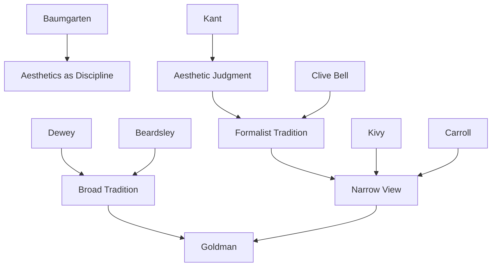

---
cssclasses:
  - Philosophy
  - Arts
  - Psychology
subclasses:
  - Aesthetics
  - Philosophy-of-Mind
  - 20th-Century-Philosophy
related:
  - "[[Aesthetics]]"
  - "[[Aesthetic Experience]]"
  - "[[Form]]"
  - "[[Art Criticism]]"
  - "[[Cognition]]"
aliases:
  - aesthetic experience
  - broad view
  - narrow view
  - kivy
  - carroll
  - dewey
  - beardsley
  - formalism
  - cognition aesthetics
  - emotional engagement
reference:
  - Goldman, A. (2013). The Broad View of Aesthetic Experience. The Journal of Aesthetics and Art Criticism, 71(4), 323–333.
---

#### Central Problem

The paper confronts a fundamental question in aesthetics: what is the proper scope of aesthetic experience? [[Goldman]] challenges the currently dominant "narrow view" defended by [[Kivy]] and [[Carroll]], which restricts aesthetic experience primarily to attention to formal properties of artworks. The central tension lies between formalist accounts that exclude cognitive and moral engagement from aesthetic experience and broader accounts that include the full range of mental faculties engaged in appreciating art.

#### Main Thesis

Aesthetic experience should be understood broadly to include cognitive engagement, emotional response, and imaginative involvement alongside perception of formal properties. [[Goldman]] argues against the narrow view on multiple grounds: first, cognition and emotion are inseparable in experience from grasp of form; second, the narrow view requires extending "form" beyond ordinary usage to accommodate acknowledged aesthetic experience; third, the broad view has a more impressive philosophical lineage; and fourth, aesthetic experience is appreciation of aesthetic value, which is more plausibly analyzed broadly.

The thesis draws on [[Dewey]]'s claim that aesthetic experience engages "the entire live creature," uniting perception, emotion, cognition, and imagination in an indissoluble whole. For [[Goldman]], reading a novel or viewing a painting involves grasping themes, responding emotionally to characters, and exercising moral judgment—all as inseparable aspects of aesthetic appreciation, not as separate "artistic" (non-aesthetic) responses.

#### Historical Context

The paper engages with contemporary debates in analytic aesthetics, particularly the positions developed by [[Peter Kivy]] and [[Noël Carroll]]. Both defend versions of the narrow view that emphasize formal properties while excluding or downplaying cognitive and moral dimensions of aesthetic experience.

[[Goldman]] traces the concept of aesthetic experience through its historical development: from [[Baumgarten]]'s founding of aesthetics as a discipline, through [[Kant]]'s analysis of beauty and the engagement of cognitive faculties, to [[Dewey]]'s pragmatist account of experience as engaging the whole person, and [[Beardsley]]'s influential analysis of aesthetic experience as unified, pleasurable attention to form and qualities.

The formalist tradition, represented by [[Clive Bell]]'s concept of "significant form," provides the historical roots of the narrow view. [[Goldman]] challenges the claim that formalism represents the dominant philosophical tradition, pointing to the broader tradition running through [[Dewey]] and [[Beardsley]].

#### Philosophical Lineage

#### Key Thinkers

| Thinker | Dates | Movement | Main Work | Core Concept |
|---------|-------|----------|-----------|--------------|
| [[Kivy]] | 1934-2021 | [[Analytic Aesthetics]] | *Once Told Tales* | Narrow view, music philosophy |
| [[Carroll]] | 1947- | [[Analytic Aesthetics]] | Various essays | Aesthetic experience, horror |
| [[Dewey]] | 1859-1952 | [[Pragmatism]] | *Art as Experience* | Engaged whole creature |
| [[Beardsley]] | 1915-1985 | [[Analytic Aesthetics]] | *Aesthetics* | Unified aesthetic experience |
| [[Clive Bell]] | 1881-1964 | [[Formalism]] | *Art* | Significant form |
| [[Kant]] | 1724-1804 | [[German Idealism]] | *Critique of Judgment* | Disinterested pleasure |

#### Key Concepts

| Concept | Definition | Related to |
|---------|------------|------------|
| Narrow view | Position that aesthetic experience consists primarily in attention to formal properties | [[Kivy]], [[Carroll]], [[Formalism]] |
| Broad view | Position that aesthetic experience includes cognitive, emotional, and imaginative engagement | [[Goldman]], [[Dewey]], [[Beardsley]] |
| Formal properties | Structural, organizational features of artworks (unity, balance, rhythm, etc.) | [[Formalism]], [[Aesthetics]] |
| Expressive properties | Properties conveying emotional character (melancholy, strident, serene, etc.) | [[Aesthetics]], [[Expression]] |
| Aesthetic value | Value appreciated in aesthetic experience; distinct from but related to artistic value | [[Aesthetics]], [[Value Theory]] |

#### Authors Comparison

| Theme | [[Kivy]] | [[Carroll]] | [[Goldman]] |
|-------|---------|-------------|-------------|
| Scope of aesthetic experience | Very narrow (formal only) | Narrow (formal + expressive) | Broad (all engaged faculties) |
| Cognitive engagement | Excluded | Partially included | Fully included |
| Emotional response | Excluded from music | Included | Fully included |
| Moral insight | Excluded | Excluded | Included |
| Artistic vs. aesthetic value | Sharply distinguished | Distinguished | Reduced/integrated |

#### Influences & Connections

- **Predecessors:** [[Goldman]] ← influenced by ← [[Dewey]], [[Beardsley]], [[Kant]]
- **Contemporaries:** [[Goldman]] ↔ debate with ↔ [[Kivy]], [[Carroll]]
- **Philosophical tradition:** Pragmatist aesthetics → provides foundation for → broad view
- **Opposing views:** Formalism ← challenged by ← [[Goldman]]'s broad view

#### Summary Formulas

- **Inseparability thesis:** Cognition, emotion, imagination, and formal perception are inseparable in actual aesthetic experience—they can only be distinguished analytically, not experientially.
- **Form extended:** The narrow view requires extending "form" beyond ordinary usage (to include content choices like Hitler as tragic hero) to accommodate acknowledged aesthetic experience—undermining its restrictive intent.
- **Historical lineage:** The broad view through [[Dewey]] and [[Beardsley]] has a more philosophically impressive heritage than the formalism dating mainly from post-Romantic modernism.
- **Detachment through engagement:** Aesthetic experience detaches us from practical affairs not through distance from artworks but through full absorption in them.

#### Timeline

| Year | Event |
|------|-------|
| 1750 | [[Baumgarten]] founds aesthetics as discipline |
| 1790 | [[Kant]] publishes *Critique of Judgment* |
| 1914 | [[Clive Bell]] publishes *Art*, articulating formalism |
| 1934 | [[Dewey]] publishes *Art as Experience* |
| 1958 | [[Beardsley]] publishes *Aesthetics* |
| 2011 | [[Kivy]] publishes *Once Told Tales* |
| 2012 | [[Carroll]] publishes "Recent Approaches to Aesthetic Experience" |
| 2013 | [[Goldman]] publishes "The Broad View of Aesthetic Experience" |

#### Notable Quotes

> "Sensuous perception, informed by cognition, enlarged by imagination, and prompting emotional response—such intense and meaningful experience—is what we seek and find in such works."

> "The simultaneous and harmonious interaction and engagement of all these mental capacities is matched on the objective side by the interaction of formal, expressive, and representational aspects of the works appreciated."

> "Anyone who has seen and heard the closing scene of Richard Wagner's Götterdämmerung, has read the final chapter of Herman Melville's Moby Dick, or stared up at the ceiling of the Sistine Chapel must recognize how impoverished the narrow account of such paradigm aesthetic experiences is."
