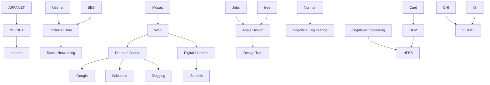

---
cssclasses:
  - Computer-Science
  - History
  - Sociology
subclasses:
  - Human-Computer-Interaction
  - CSCW
  - Information-Retrieval
related:
  - "[[Norman]]"
  - "[[Jobs]]"
  - "[[Suchman]]"
  - "[[Card]]"
  - "[[Shneiderman]]"
  - "[[Ives]]"
aliases:
  - internet era
  - dotcom bubble
  - web browsers
  - digital libraries
  - social networking
  - recommender systems
  - information schools
  - ischool movement
  - design turn
  - cognitive engineering
  - discretionary use
  - mobile messaging
reference:
  - "Grudin, J. (2017). From tool to partner: the evolution of human-computer interaction. Morgan & Claypool Publishers. (pp. 69-80)"
---

#### Central Problem

This section of Grudin's historical account addresses the period 1995–2005, when the internet and web transformed from research infrastructure to global phenomenon. The central problem concerns how this transformation affected the four HCI fields differently, disrupting some while leaving others relatively unchanged, and how the dot-com bubble's rise and collapse shaped research priorities and professional identities.

The decade posed fundamental questions about discretionary use in networked contexts. When employees download instant messaging, when executives become hands-on users, when organizations must create web interfaces for external customers—who are now discretionary users—how do the fields that had developed around different user populations adapt? Information Systems, focused on mandatory organizational use, suddenly confronted the discretionary consumer behaviors that CHI had addressed for 20 years. Library and Information Science faced existential transformation as digital libraries emerged and hundreds of millions accessed online information.

The bubble's collapse revealed that neither IT professionals nor IS researchers understood web phenomena well, yet it left behind hundreds of millions of newly skilled computer users and seeded technologies—Google's search advertising, Wikipedia, blogging platforms, social networking—that would dominate the following decade.

#### Main Thesis

Grudin argues that the internet era differentially disrupted the four HCI fields: Human Factors remained least affected, CHI adapted smoothly to new application domains, while Information Systems and Information Science experienced fundamental transformations that reshaped their disciplinary identities and research priorities.

The thesis develops across several institutional trajectories:

**Internet infrastructure transition:** The 1995 shift from NSFNET to the Commercial Internet Exchange opened the network for business. Proprietary services (CompuServe, AOL, Prodigy) predicted curated content would outcompete the "wild west" internet; they were wrong. By decade's end, only AOL remained significant, and the "endless September" of 1993—when AOL connected to Usenet—had permanently changed online culture.

**Bubble dynamics:** Entrepreneurs sensed gold accurately but misjudged timing and location. Amazon and Netflix established successful "trading posts" (1995, 1997), but myriad ventures with unrealistic plans attracted investors. AOL's 2000 acquisition of Time Warner epitomized speculation; the NASDAQ crashed from 5,000 to 1,000. Yet the collapse left seeds that germinated: Google's 2000 advertising model, Wikipedia (2001), blogging platforms, social networking (Friendster 2002, MySpace 2003, LinkedIn 2003, YouTube 2005, Facebook 2006).

**IS transformation:** AIS established SIGHCI in 2001, explicitly citing CHI research and declaring bridge-building a priority. Web-facing organizations confronted discretionary users—the issues CHI had addressed since 1983. Early SIGHCI research emphasized e-commerce, online shopping, web behavior effects on attitudes and perceptions.

**Information science transformation:** Digital library funding (~$200M, 1994–1999) from NSF, DARPA, NASA, NIH, and others galvanized a field rooted in humanities. Stanford's Larry Page developed Google's page-ranking algorithm under a digital library grant (1997). Schools added "information" to names; the iSchool movement formalized in 2004 with 12 participating universities.

**CHI's design turn:** Jobs's 1997 return to Apple and partnership with Jonathan Ives—firing HCI professionals—produced the iMac (1998) and iPod (2001), demonstrating aesthetics' commercial power. DIS (1995) and DUX (2003) conferences emerged; "funology" studies of enjoyment appeared, and NSF briefly launched a Science of Design program (2003).

#### Historical Context

The transition from NSFNET to commercial internet (1995) marked more than name change. NSFNET's "acceptable use policy" had prohibited commercial activity; clarity was needed as the web stirred. Mosaic and Netscape browsers (1993–1994) and HTTP protocol (1996) enabled the web frontier into which speculators poured "like homesteaders in the Oklahoma Land Rush."

Pre-internet platforms shaped expectations: Usenet established large informal exchanges of geographically distributed people who never met; FidoNet connected community bulletin boards (60,000 BBSs by mid-1990s); CSNET provided low-cost university dial-in. Universities negotiated bulk telecommunications rates, resisting per-byte charges.

The period saw dramatic shifts in cultural representation. In 1993, four blockbuster films (The Fugitive, The Firm, Sleepless in Seattle, Jurassic Park) featured non-nerdy computer use resolving crises—"skilled use by doctor Harrison Ford and attorney Tom Cruise, and by small girls booking an airline ticket and stopping velociraptors."

Human Factors underwent surprising reversals. Cognitive Engineering and Decision Making (1996) became HFES's largest technical group—ironic given CHI's 1983 formation partly due to HF opposition to cognitive approaches. Human Performance Modeling (1995), led by Gray and Pew, found its natural home in HF&E despite Card et al.'s explicit positioning to reform the discipline from outside.

#### Philosophical Lineage

#### Key Thinkers

| Thinker | Dates | Movement | Main Work | Core Concept |
|---------|-------|----------|-----------|--------------|
| [[Jobs]] | 1955–2011 | [[Design]] | iMac (1998), iPod (2001) | Aesthetics-driven product design |
| [[Ives]] | 1967– | [[Industrial Design]] | Apple product design | Form-function integration |
| [[Page]] | 1973– | [[Information Retrieval]] | PageRank algorithm (1997) | Web page ranking |
| [[Norman]] | 1935– | [[Cognitive Engineering]] | Term "cognitive engineering" (1982) | Design of everyday things |
| [[Card]] | 1945– | [[Cognitive Science]] | Human Performance Modeling | GOMS, cognitive architecture |
| [[Meister]] | 1924–2013 | [[Human Factors]] | *History of Human Factors* (1999) | HF&E continuity thesis |
| [[Cronin]] | – | [[Information Science]] | LIS critique (1995) | Information access framework |

#### Key Concepts

| Concept | Definition | Related to |
|---------|------------|------------|
| Dot-com bubble | Speculative technology-driven economic bubble 1995–2000, NASDAQ 5000→1000 | [[Internet]], [[Speculation]] |
| Digital libraries | Federally funded ($200M) digitization and retrieval research 1994–1999 | [[NSF]], [[Information Science]] |
| Recommender systems | Collaborative and content filtering to suggest items; most-cited CSCW paper (1994) | [[CSCW]], [[Machine Learning]] |
| iSchools | Information schools movement formalizing 2004, severing or maintaining library ties | [[Library Science]], [[Information Science]] |
| Endless September | 1993 AOL-Usenet connection permanently increasing low-quality traffic | [[Usenet]], [[Online Culture]] |
| SIGHCI | AIS Special Interest Group in HCI (2001), IS researchers addressing discretionary use | [[Information Systems]], [[E-commerce]] |
| Design turn | CHI shift from engineering to aesthetic concerns, catalyzed by Jobs/Ives Apple success | [[Apple]], [[Visual Design]] |
| Cognitive Engineering | HF&E technical group (1996), reversing earlier opposition to cognitive approaches | [[Human Factors]], [[HFES]] |
| Web 2.0 | User-generated content, social networking, blogs—term from O'Reilly 2004 conference | [[Social Media]], [[Participation]] |
| Collaboratories | NSF/NIH-funded distributed scientific collaboration platforms | [[CSCW]], [[E-Science]] |

#### Authors Comparison

| Theme | [[Grudin]] | [[Meister]] | [[Cronin]] |
|-------|-----------|-------------|------------|
| Disciplinary change | Documents field transformations | "No seminal occurrences... no sharp discontinuities" | Advocates severing librarianship ties |
| Continuity/disruption | Internet disrupted IS, LIS; less so HF&E, CHI | HF&E has only intellectual history without paradigm changes | LIS in "deep professional malaise" |
| Technology view | Shapes disciplinary identities | Aviation psychology roots ensure stability | Information access central, technology transformative |
| Methodology | Historical sociology, archival | Practitioner reflection | Policy/institutional analysis |
| Discretionary focus | Central organizing concept | Not primary concern (military/government focus) | Information professionals as primary users |

#### Influences & Connections

- **Predecessors:** [[Google]] ← PageRank developed under ← Digital Library grant; [[SIGHCI]] ← cited ← [[CHI]] research
- **Contemporaries:** [[Jobs]] ↔ partnered with ↔ [[Ives]]; [[Card]] ↔ HPM in ↔ [[HFES]]
- **Institutional formations:** [[iSchools]] ← emerged from ← Library and Information Science; [[SIGHCI]] ← formed by ← [[AIS]]
- **Technology cascades:** [[Bubble]] → seeded → [[Google]], [[Wikipedia]], [[Social Networking]]
- **Opposing views:** [[Marketing]] ← tension with ← [[CHI]] (time-on-page vs. user efficiency)

#### Summary Formulas

- **[[Grudin]]:** The 1995–2005 internet era differentially disrupted HCI fields—transforming IS and LIS fundamentally while CHI adapted to new domains and HF&E remained relatively stable—with the bubble's collapse leaving skilled users and technology seeds for future growth.

- **[[Meister]]:** Human Factors and Ergonomics exhibits continuity without paradigm changes; its roots in aviation psychology and government systems ensure stability in the face of technology change.

- **[[Cronin]]:** Information science centers on information access spanning intellectual, physical, social, economic, and temporal factors; librarianship should be cut loose as schools establish ties to cognitive and computer sciences.

- **[[Jobs]]/[[Ives]]:** Aesthetic design drives commercial success; HCI professionals can be replaced by designers who understand form-function integration at the product level.

#### Timeline

| Year | Event |
|------|-------|
| 1993 | Mosaic browser; "endless September" (AOL-Usenet); blockbuster films normalize computer use |
| 1994 | Netscape browser; digital library funding begins (~$200M through 1999) |
| 1995 | NSFNET → Commercial Internet; Amazon, Classmates.com; DIS conference; wiki coined |
| 1996 | HTTP protocol; AOL shifts to monthly fees; ICQ launched; HFES Cognitive Engineering group |
| 1997 | Netflix; Larry Page develops PageRank; Jobs returns to Apple; "weblog" coined |
| 1998 | iMac; Digital Millennium Copyright Act; AOL Instant Messenger |
| 1999 | Napster; LiveJournal; Blogger; QQ (China); MSN Messenger |
| 2000 | AOL buys Time Warner (January); bubble peaks (March); NASDAQ crashes; Google ad model; ASIS→ASIS&T |
| 2001 | Wikipedia; AIS SIGHCI formed; iPod |
| 2002 | Friendster; Plaxo; Reunion.com |
| 2003 | Skype; MySpace; LinkedIn; DUX conference; NSF Science of Design |
| 2004 | Google IPO; iSchool deans group (12 universities); Web 2.0 conference; Flickr; Orkut |
| 2005 | YouTube; Bebo; internet reaches 1 billion users |

#### Notable Quotes

> "Outside of a few significant events... there are no seminal occurrences... no sharp discontinuities that are memorable. A scientific discipline like HF has only an intellectual history." — [[Meister]]

> "I have seen generals come out of using, trying to use one of the speech-enabled systems looking really whipped. One really sad puppy, he said 'OK, what's your system like, do I have to use speech?' He looked at me plaintively. And when I said 'No,' his face lit up, and he got so happy." — [[Forbus]]

> "Discretion evaporates when a technology becomes mission-critical, as word processing and email did in many contexts in the 1990s." — [[Grudin]]

---
> [!warning]-
> This annotation was normalised using a large language model and may contain inaccuracies. These texts serve as preliminary study resources rather than exhaustive references.
