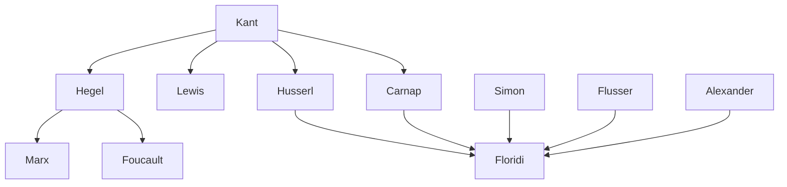

---
cssclasses:
  - Philosophy
  - Computer-Science
subclasses:
  - Logic-and-Philosophy-of-Logic
  - Philosophy-of-Science
  - Design-Theory
related:
  - "[[Floridi]]"
  - "[[Kant]]"
  - "[[Hegel]]"
  - "[[Carnap]]"
  - "[[Simon]]"
  - "[[Flusser]]"
aliases:
  - logic design
  - conceptual logic
  - transcendental logic
  - dialectical logic
  - logic requirements
  - sufficientization relation
  - poietic knowledge
  - blueprint model
  - conditions feasibility
  - design philosophy
reference:
  - "Floridi, L. (2019). The logic of information: A theory of philosophy as conceptual design (First edition). Oxford University Press. (pp. 149-187)"
---

#### Central Problem

What is the proper conceptual logic for design? Modernity has bequeathed two main conceptual logics of information—Kant's transcendental logic (conditions of possibility) and Hegel's dialectical logic (conditions of in/stability)—but neither is genuinely a logic of design. Both analyze given systems, moving from system to model. Design, however, moves in the opposite direction: from model (blueprint) to system.

The chapter confronts a fundamental gap: the maker's knowledge (defended in Chapter 9) requires a logic of "making," yet no such logic has been properly articulated. Transcendental logic has been stretched to serve design purposes, but this strains its nature—the conditions of possibility of a system are not identical to the requirements of feasibility for constructing it. The Kantian equation [conditions of possibility = requirements of feasibility] ↔ [designed system] is untenable in most cases because the same set of requirements can lead to multiple systems.

#### Main Thesis

[[Floridi]] argues that a third conceptual logic of information is needed: a **logic of design** understood as a **logic of requirements**, distinct from both transcendental and dialectical logic.

**Core claims:**

1. **Three Conceptual Logics:** (i) Transcendental logic models past conditions of possibility (Kant); (ii) Dialectical logic models present conditions of in/stability (Hegel); (iii) Design logic models future conditions of feasibility. Only the third is genuinely poietic.

2. **Sufficientization (⊧̸→):** Design logic introduces a new inferential relation—"sufficientization"—whereby requirements "conduce to" (make sufficient) systems that implement them. This is neither deduction, induction, nor abduction, but "conduction": {R₁,..,Rₙ} ⊧̸→ S.

3. **Non-Univocity:** Unlike transcendental logic's pretense to univocity (one cake from one recipe), design admits multiple systems satisfying the same requirements: {seat, one-person} ⊧̸→ Chair / Stool / Pouf.

4. **Consistency as Pragmatic Virtue:** Dialetheism (contradictions in systems/models) is metaphysically possible but normatively valueless. Consistency serves both epistemic and pragmatic masters—blueprints must be consistent or the resulting artifacts malfunction.

5. **Five Phases of Design:** Originate (needing) → Focus (vision/requirements) → Design (shaping) → Build (making) → Use (testing). The inferential step from Phase 2 to Phase 3—from requirements to system specification—is where the logic of design operates.

6. **From Mimesis to Poiesis:** Contemporary knowledge is increasingly constructionist. Architecture, computer science, economics, engineering, and law do not merely describe their objects but construct them. Philosophy itself is conceptual design requiring its own logic.

#### Historical Context

German idealism provides the roots for constructionist approaches in philosophy. Kant's transcendental logic sought to guarantee the objectivity of knowledge when knowledge is no longer representational. Hegel's dialectics extended this to dynamic, process-oriented analysis. Both have been repurposed for design thinking—most notably by Marx (dialectics for social construction) and Husserl (transcendental method)—but neither was originally intended as a logic of construction.

The chapter engages with the American pragmatist tradition, especially C.I. Lewis's "conceptualistic pragmatism," which socializes and historicizes the transcendental. Levels of abstraction become historically contingent, admitting alternatives and preferential choice based on pragmatic considerations.

Carnap's program of "rational reconstruction" and conceptual engineering represents another attempt to articulate design logic, but remained focused on unveiling structures rather than building them. The German tradition from Kant through Wittgenstein's *Tractatus* expected philosophy to unearth deep conceptual structures—but forgot that structures are also built.

#### Philosophical Lineage

#### Key Thinkers

| Thinker | Dates | Movement | Main Work | Core Concept |
|---------|-------|----------|-----------|--------------|
| [[Kant]] | 1724-1804 | [[German Idealism]] | *Critique of Pure Reason* | Transcendental logic, conditions of possibility |
| [[Hegel]] | 1770-1831 | [[German Idealism]] | *Science of Logic* | Dialectical logic, conditions of in/stability |
| [[Carnap]] | 1891-1970 | [[Logical Positivism]] | *Aufbau* | Rational reconstruction, conceptual engineering |
| [[Simon]] | 1916-2001 | [[Cognitive Science]] | *Sciences of the Artificial* | Design as heuristics, bounded rationality |
| [[Flusser]] | 1920-1991 | [[Media Philosophy]] | *Shape of Things* | Homo faber, information manufacturing |
| [[Alexander]] | 1936-2022 | [[Architecture]] | *Pattern Language* | Design patterns, form-tendency relation |

#### Key Concepts

| Concept | Definition | Related to |
|---------|------------|------------|
| Sufficientization | Inferential relation (⊧̸→) whereby requirements "conduce to" systems that implement them; makes whatever is on the left sufficient as an implementation of what is on the right | [[Floridi]], [[Logic]] |
| Transcendental logic | Conceptual logic modeling past conditions of possibility of a system; asks what must have been the case | [[Kant]], [[Epistemology]] |
| Dialectical logic | Conceptual logic modeling present conditions of in/stability of a system; identifies contrasts and their resolutions | [[Hegel]], [[Process Philosophy]] |
| Design logic | Conceptual logic modeling future conditions of feasibility; moves from blueprint to implemented system | [[Floridi]], [[Design Theory]] |
| Degenerate design | Limit case where requirements completely constrain the system, yielding only one possible solution (double sufficientization) | [[Floridi]], [[Logic]] |
| Functional requirements | What a system is supposed to do (behavior); distinct from non-functional requirements (what system is supposed to be) | [[Systems Engineering]], [[Design]] |
| Non-functional requirements | What a system is supposed to be (architecture); defines system structure rather than behavior | [[Systems Engineering]], [[Design]] |
| Semantic dialetheism | Contradictions occurring in models/blueprints rather than in systems themselves; probable norm given difficulty of spotting inconsistencies | [[Floridi]], [[Logic]] |
| Metaphysical dialetheism | Contradictions occurring in the world-system itself; conceivable from gods'-eye perspective | [[Floridi]], [[Metaphysics]] |
| Conduction | Name for the inferential move in design logic; neither deduction, induction, nor abduction | [[Floridi]], [[Logic]] |

#### Authors Comparison

| Theme | [[Floridi]] | [[Kant]] | [[Hegel]] |
|-------|-------------|----------|-----------|
| Central logic | Logic of requirements (sufficientization) | Transcendental logic (conditions of possibility) | Dialectical logic (conditions of in/stability) |
| Temporal orientation | Future-oriented (feasibility) | Past-oriented (genesis) | Present-oriented (dynamics) |
| Relation type | Non-univocal (many systems per requirements) | Univocal (one system ↔ one set of conditions) | Necessary (what must be given what is) |
| Model direction | Blueprint → System (poietic) | System → Model (mimetic) | System → Model (mimetic) |
| Role of consistency | Pragmatic virtue, overriding normatively | Logical necessity | Contradictions productive |
| Knowledge type | Ab anteriori (maker's knowledge) | A priori (transcendental conditions) | A posteriori/dialectical synthesis |

#### Influences & Connections

- **Predecessors:** [[Floridi]] ← influenced by ← [[Kant]], [[Hegel]], [[Carnap]], [[C.I. Lewis]]
- **Contemporaries:** [[Floridi]] ↔ dialogue with ↔ [[Simon]] (logic of design as heuristics)
- **Design traditions:** [[Floridi]] ← draws on ← [[Alexander]] (pattern language), [[AIA]] (five phases), [[Munari]], [[Norman]]
- **Opposing views:** [[Floridi]] ← contrasts with ← deductive interpretations of design logic, abductive interpretations ([[March]], [[Peirce]])

#### Summary Formulas

- **[[Floridi]]:** The logic of design is a logic of requirements: {R₁,..,Rₙ} ⊧̸→ S, where sufficientization conduces from requirements to systems without necessitating any particular solution—neither deduction nor abduction but conduction.
- **[[Kant]]:** Transcendental logic uncovers conditions of possibility, but its univocity equation [conditions = requirements] ↔ [system] is untenable for genuine design where multiple solutions satisfy the same requirements.
- **[[Hegel]]:** Dialectical logic models conditions of in/stability through polarized reasoning and contradiction resolution, but remains a logic of necessity unsuited to design's logic of sufficiency.
- **[[Carnap]]:** Rational reconstruction and conceptual engineering unveil deep structures of knowledge, but forget that structures are not only analyzed—they are also built.

#### Timeline

| Year | Event |
|------|-------|
| 1781 | [[Kant]] publishes *Critique of Pure Reason*, establishes transcendental logic |
| 1812 | [[Hegel]] publishes *Science of Logic*, develops dialectical logic |
| 1928 | [[Carnap]] publishes *Aufbau*, articulates rational reconstruction |
| 1929 | [[C.I. Lewis]] publishes *Mind and the World Order*, develops conceptualistic pragmatism |
| 1964 | [[Alexander]] publishes *Notes on the Synthesis of Form* |
| 1969 | [[Simon]] publishes *Sciences of the Artificial*, discusses logic of design as heuristics |
| 1999 | [[Flusser]]'s *Shape of Things* published posthumously |
| 2019 | [[Floridi]] introduces sufficientization in *The Logic of Information* |

#### Notable Quotes

> "The logic of design turns out to be the (conceptual) logic of requirements." — [[Floridi]]

> "The factory of the future will have to be the place where homo faber becomes homo sapiens sapiens because he has realised that manufacturing means the same thing as learning—i.e. acquiring, producing, and passing on information." — [[Flusser]]

> "There is no Leibnizian 'calculemus' in the logic of design." — [[Floridi]]

---
> [!warning]-
> This annotation was normalised using a large language model and may contain inaccuracies. These texts serve as preliminary study resources rather than exhaustive references.
