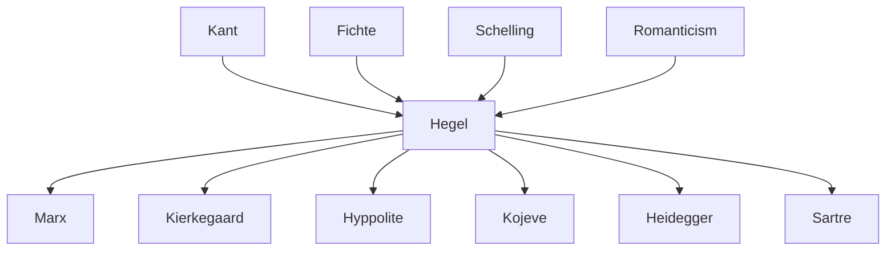

---
cssclasses:
  - Philosophy
subclasses:
  - 19th-Century-Philosophy
  - Epistemology
  - Phenomenology
aliases:
  - phenomenology spirit
  - consciousness
  - selfconsciousness
  - master slave
  - unhappy consciousness
  - sensible certainty
  - figures consciousness
  - reason
  - absolute knowing
  - bildung
  - recognition
  - lordship bondage
contributions:
  - Conceptual
authors:
  - "[[Hegel]]"
  - "[[Kant]]"
  - "[[Fichte]]"
  - "[[Schelling]]"
  - "[[Marx]]"
  - "[[Hyppolite]]"
reference: "[[04 The search for thought - Unit 9 Chapter 2.pdf]]"
---

#### Central Problem

Hegel's *Phenomenology of Spirit* (1807) confronts the fundamental question: how does consciousness come to recognize itself as the totality of reality? The work traces the "romanticized history of consciousness" as it moves through successive stages of self-understanding, from the most basic sensory awareness to absolute knowing.

The central problem emerges from the splits (*Entzweiung*) that characterize modern consciousness: between subject and object, knower and known, finite and infinite, individual and universal, being and ought-to-be. Consciousness finds itself "unhappy" precisely because it does not yet know itself to be all of reality, and thus experiences itself as internally divided, torn by oppositions and conflicts.

Against Kant's dualism between reality and reason (where ideas remain merely regulative and the will never coincides with reason), and against Romantic appeals to immediate feeling, art, or faith, Hegel argues that the Absolute must be grasped through speculative reason. The path to philosophical science requires showing its becoming—the phenomenology as "introduction to philosophy" traces how the individual retraverses the stages of universal spirit's formation.

#### Main Thesis

The *Phenomenology of Spirit* presents consciousness's progressive journey toward absolute knowing, structured through a series of "figures" (*Gestalten*)—ideal stages that have found typical exemplification in history. Each figure represents a particular attitude or worldview that reveals its internal contradictions and dialectically passes into the next.

**Structure of the Work:**

The first part comprises three moments:
1. **Consciousness** (thesis): attention directed toward the object
2. **Self-consciousness** (antithesis): attention directed toward the subject  
3. **Reason** (synthesis): recognition of the profound unity of subject and object

The second part comprises:
1. **Spirit**: the individual in relation to ethical community
2. **Religion**: consciousness of self as spirit through religious representation
3. **Absolute Knowing**: philosophy as complete self-transparency

**Key Arguments:**

The figures are neither purely ideal nor purely historical but "ideal-and-historical" simultaneously—expressing ideal stages of spirit that found typical historical exemplification. Hegel delineates both a transcendental philosophy of consciousness and a comprehensive history of humanity's cultural development.

The entire cycle can be summarized in the figure of the **unhappy consciousness** (*unglückliches Bewußtsein*): consciousness that does not know itself to be all reality, finding itself split by differences, oppositions, and conflicts from which it emerges only by arriving at the certainty of being everything.

**Pedagogical Function:**

The individual must retrace the stages of universal spirit's formation—what once occupied adults' minds in earlier ages has now descended to children's knowledge and exercises. The phenomenology prepares the individual for philosophy by showing how to recognize oneself in universal spirit.

#### Historical Context

The *Phenomenology of Spirit* was published in 1807, completed as Napoleon's armies approached Jena. Hegel famously saw Napoleon as the "world-soul on horseback." The work emerges from the cultural ferment of German Idealism and Romanticism, representing both a continuation and critique of these movements.

Hegel had been influenced by the Romantic circle during his Frankfurt period (1797-1800) but developed sharp criticisms of Romantic positions. Against Romantic primacy of sentiment, art, or faith, Hegel insisted the Absolute must be mediated through rational philosophical discourse. Against Romantic individualism, he emphasized integration into socio-political institutions rather than narcissistic self-absorption.

The historical references in the *Phenomenology* span from Greek antiquity (the polis as ethical substance, master-slave relations) through medieval Christianity (unhappy consciousness, devotion, monasticism, the Crusades' empty tomb) to the Enlightenment and French Revolution (the Terror as dialectical outcome of abstract freedom).

#### Philosophical Lineage

#### Key Thinkers

| Thinker | Dates | Movement | Main Work | Core Concept |
|---------|-------|----------|-----------|--------------|
| [[Hegel]] | 1770-1831 | [[German Idealism]] | *Phenomenology of Spirit* | Figures of consciousness, dialectical development |
| [[Kant]] | 1724-1804 | [[Critical Philosophy]] | *Critique of Pure Reason* | Dualism of being and ought-to-be (criticized by Hegel) |
| [[Fichte]] | 1762-1814 | [[German Idealism]] | *Doctrine of Science* | Self-positing I (transformed by Hegel) |
| [[Marx]] | 1818-1883 | [[Historical Materialism]] | *Capital* | Appropriated master-slave dialectic materially |
| [[Hyppolite]] | 1907-1968 | [[French Hegelianism]] | *Genesis and Structure* | Interpreted unhappy consciousness and labor |
| [[Kojève]] | 1902-1968 | [[French Hegelianism]] | *Introduction to Reading Hegel* | Anthropological reading of master-slave |

#### Key Concepts

| Concept | Definition | Related to |
|---------|------------|------------|
| Phenomenology of Spirit | The "romanticized history" of consciousness progressing from immediate sensory awareness to absolute knowing | [[Hegel]], [[German Idealism]] |
| Figure (*Gestalt*) | Ideal-historical stage of spirit's development, expressing both transcendental form and cultural manifestation | [[Hegel]], [[Bildung]] |
| Sensible Certainty | First figure; apparently richest knowledge that reveals itself as poorest and most abstract (generic "this") | [[Hegel]], [[Epistemology]] |
| Perception | Second figure; consciousness distinguishes subject/object; thing as substrate of unified properties | [[Hegel]], [[Epistemology]] |
| Understanding (*Verstand*) | Third figure; grasps objects as phenomena of underlying force and law; resolves object into subject | [[Hegel]], [[Kant]] |
| Master-Slave (*Herrschaft/Knechtschaft*) | Dialectic of mutual recognition through struggle; apparent master becomes dependent, servant gains independence through labor | [[Hegel]], [[Marx]] |
| Unhappy Consciousness | Consciousness divided between finite/infinite, human/divine; key to entire phenomenology; historically exemplified in Judaism and medieval Christianity | [[Hegel]], [[Religion]] |
| Recognition (*Anerkennung*) | Self-consciousness requires recognition by another free self-consciousness to become certain of itself | [[Hegel]], [[Social Philosophy]] |
| Stoicism | Abstract inner freedom claiming independence from circumstances; leaves external world intact | [[Hegel]], [[Ancient Philosophy]] |
| Skepticism | Attempts to negate external world completely; reveals contradiction in claiming nothing is true | [[Hegel]], [[Epistemology]] |
| Spirit (*Geist*) | Individual in relation to ethical community; reason realized in socio-political institutions | [[Hegel]], [[Ethical Life]] |
| Absolute Knowing | Final stage where consciousness recognizes itself as totality of reality; philosophy as self-transparent thought | [[Hegel]], [[Metaphysics]] |

#### Authors Comparison

| Theme | [[Kant]] | [[Hegel]] | [[Marx]] |
|-------|----------|-----------|----------|
| Being vs. Ought | Permanent dualism; ideal never attained | Overcome in speculative unity | Material conditions determine consciousness |
| Subject-object relation | Transcendental synthesis; thing-in-itself unknowable | Dialectically unified in absolute knowing | Practical-material transformation |
| Freedom | Moral autonomy; inner freedom | Realized through ethical institutions | Overcoming class alienation |
| Knowledge | Critique before knowing (swimming before water) | Knowing develops through experience itself | Praxis transforms theory |
| History | Progress toward perpetual peace | Spirit's self-realization | Class struggle toward communism |

#### Influences & Connections

- **Predecessors:** [[Hegel]] ← influenced by ← [[Kant]] (criticized), [[Fichte]] (Tathandlung), [[Schelling]] (identity philosophy)
- **Contemporaries:** [[Hegel]] ↔ dialogue with ↔ [[Romantic Circle]] (critique), [[Schelling]] (departure)
- **Followers:** [[Hegel]] → influenced → [[Marx]] (master-slave, labor), [[Kierkegaard]] (unhappy consciousness)
- **Followers:** [[Hegel]] → influenced → [[Hyppolite]], [[Kojève]] (French reception), [[Sartre]] (conflictual recognition)
- **Opposing views:** [[Hegel]] ← criticized by ← [[Kierkegaard]] (system over existence), [[Marx]] (idealism inverted)

#### Summary Formulas

- **[[Hegel]] (Phenomenology):** Consciousness is the "romanticized history" of spirit progressively appearing to itself through dialectical figures, from sensible certainty through unhappy consciousness to absolute knowing where finite recognizes itself as infinite.

- **[[Hegel]] (Master-Slave):** The servant, through the formative discipline of labor and the experience of death-anxiety, achieves genuine independence while the master, passively enjoying products, becomes dependent on servile work.

- **[[Hegel]] (Unhappy Consciousness):** The consciousness that does not know itself to be all reality finds itself torn by oppositions between finite and infinite, mutable and immutable—escaping only through the certainty of being everything.

- **[[Hegel]] (Against Romantics):** The Absolute cannot be grasped through immediate feeling, art, or faith, but only through the "seriousness, pain, patience, and labor of the negative" that philosophy's mediated rational discourse provides.

#### Timeline

| Year | Event |
|------|-------|
| 1797 | [[Hegel]] begins Frankfurt period; influenced by Romantic circle |
| 1801 | [[Hegel]] arrives in Jena; collaboration with [[Schelling]] |
| 1806 | Battle of Jena; [[Hegel]] sees Napoleon as "world-soul" |
| 1807 | Publication of *Phenomenology of Spirit* |
| 1807 | Break with [[Schelling]] (criticism: "night where all cows are black") |
| 1840s | [[Marx]] appropriates master-slave dialectic materialistically |
| 1946 | [[Kojève]]'s lectures introduce *Phenomenology* to French thought |
| 1947 | [[Hyppolite]] publishes *Genesis and Structure of Hegel's Phenomenology* |

#### Notable Quotes

> "The individual must retrace the stages of formation of universal spirit... like figures already deposited, stages of a road already traced and smoothed." — [[Hegel]]

> "The labor is a restrained appetite, a delayed disappearing; labor forms. The negative relation to the object becomes the form of the object itself, something that endures." — [[Hegel]]

> "This consciousness has not felt anxiety about this or that, nor for this or that moment, but for its entire essence; for it has felt the fear of death, the absolute master." — [[Hegel]]

#### See Also

- [[German Idealism]]
- [[Dialectic]]
- [[Absolute]]
- [[Spirit]]
- [[Recognition]]
- [[Alienation]]
- [[Bildungsroman]]
- [[French Hegelianism]]
- [[Existentialism]]
- [[Encyclopedia of the Philosophical Sciences]]

> [!NOTE]
> *This summary has been created to present the key points from the source text, which was automatically extracted using LLM. Please note that the summary may contain errors. It serves as an essential starting point for study and reference purposes.*
