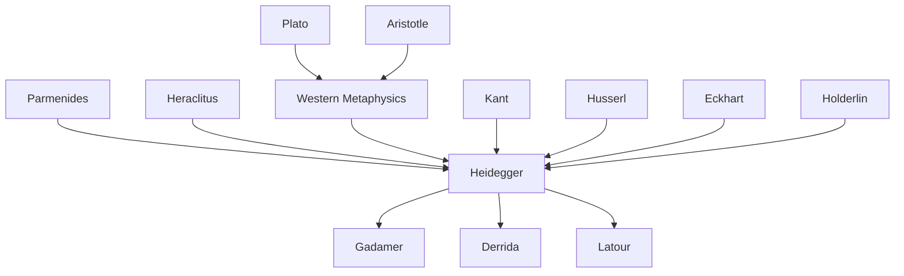

---
cssclasses:
  - Philosophy
subclasses:
  - Metaphysics
  - Phenomenology
  - Continental-Philosophy
related:
  - "[[Being]]"
  - "[[Nearness]]"
  - "[[Fourfold]]"
  - "[[Technology]]"
  - "[[World]]"
  - "[[Presence]]"
aliases:
  - the thing
  - das ding
  - fourfold heidegger
  - nearness distance
  - thing things
  - world worlding
  - mirror play
  - earth sky
  - mortals divinities
  - gestell enframing
reference:
  - Heidegger, M. (2001). Poetry language thought. Harper and Row., M. (2001). Poetry language thought. Harper and Row. (pp. 163-180)
---

#### Central Problem

What is a thing as a thing, and why has its thingness remained concealed from thinking? Heidegger argues that despite—or precisely because of—the technological conquest of all distances, genuine nearness has failed to appear. Modern technology abolishes spatial and temporal distance through airplanes, radio, television, and atomic energy, yet this frantic abolition brings no nearness. Things have been annihilated (*das Ding als Ding vernichtet*) long before the atom bomb exploded; the bomb is merely the "grossest of all gross confirmations" of the long-accomplished annihilation of the thing as thing.

The essay confronts the failure of Western metaphysics—from Plato through Kant to modern science—to think the thing as thing. Whether conceived as *eidos* (outward appearance), *res* (what concerns us), *ens* (what is present), *object* (what stands over-against representation), or physical matter (hollow filled with air), the thing's thingness has remained unthought. Science, in particular, has "already annihilated things as things long before the atom bomb exploded" by reducing them to measurable objects within its predetermined sphere.

#### Main Thesis

Heidegger argues that **the thing things** (*das Ding dingt*)—that is, the thing presences as thing by gathering the "fourfold" (*das Geviert*): earth and sky, divinities and mortals. This gathering, which Heidegger calls "thinging," is what brings nearness. The jug, taken as exemplary, is not a thing because of what it is made of (clay, sides, bottom) but because of its holding void that gathers the giving of the gift—whether drink for mortals or libation for the gods.

The argument unfolds through several key moves:

1. **The void holds**: Against physics, which sees the jug as a hollow filled with air, Heidegger shows that the jug's essential nature lies in its void—not as empty space but as what holds and pours out the gift. The potter shapes not the clay but the void.

2. **The gift gathers the fourfold**: In the pouring out (*Ausguss*, also meaning gush, sacrifice), earth and sky dwell (in the water from the spring or wine from the grape), and mortals and divinities receive the gift (as drink or libation). The gift stays the fourfold in their belonging-together.

3. **World worlds through the mirror-play**: The fourfold constitutes the world through a "mirror-play" (*Spiegel-Spiel*) in which each of the four reflects itself into the others while remaining in its own essential nature. This is the "round dance of appropriating" (*Reigen des Ereignens*).

4. **Nearness as nearing**: Nearness is not short distance but the bringing-near that preserves farness. Only by thinking the thing as thing—attending to its thinging—can we inhabit nearness and overcome the *Gestell* (the "distanceless" technological enframing).

#### Historical Context

The essay was originally delivered as a lecture in 1950 at the Bavarian Academy of Fine Arts in Munich, during the early Cold War period when nuclear anxiety was acute. Heidegger explicitly references the hydrogen bomb's capacity to "snuff out all life on earth" and sees atomic technology as symptomatic of a deeper metaphysical condition rather than its cause.

The text belongs to Heidegger's later thinking (*Spätphilosophie*) after the "turn" (*Kehre*) from the analytic of Dasein in *Being and Time* (1927) toward the question of Being itself and the history of its concealment. This period develops the critique of technology articulated in "The Question Concerning Technology" (1953) and the thinking of the fourfold that appears in "Building Dwelling Thinking" and other Bremen lectures.

Heidegger draws on the etymological resources of Old High German (where *thing/dinc* meant a gathering to deliberate on contested matters) and engages critically with the Western metaphysical tradition from Plato through medieval scholasticism to Kant. The essay also reflects his increasing interest in poetry (especially Hölderlin) and pre-Socratic thought as resources for overcoming metaphysics.

#### Philosophical Lineage

#### Key Thinkers

| Thinker | Dates | Movement | Main Work | Core Concept |
|---------|-------|----------|-----------|--------------|
| [[Plato]] | 428-348 BCE | [[Ancient Philosophy]] | *Republic* | Eidos, outward appearance |
| [[Aristotle]] | 384-322 BCE | [[Ancient Philosophy]] | *Metaphysics* | Substance, cause |
| [[Eckhart]] | 1260-1328 | [[Medieval Philosophy]] | *German Sermons* | Thing as what is at all |
| [[Kant]] | 1724-1804 | [[German Idealism]] | *Critique of Pure Reason* | Thing-in-itself, object |
| [[Husserl]] | 1859-1938 | [[Phenomenology]] | *Logical Investigations* | Intentionality, phenomenon |
| [[Holderlin]] | 1770-1843 | [[German Romanticism]] | *Hymns* | Poetic dwelling, the holy |

#### Key Concepts

| Concept | Definition | Related to |
|---------|------------|------------|
| Thing (*Ding*) | What gathers the fourfold through its thinging; not object, res, or ens but self-sustaining presence | [[Heidegger]], [[Ontology]] |
| Fourfold (*Geviert*) | The gathering of earth and sky, divinities and mortals in their mutual belonging | [[Heidegger]], [[World]] |
| Nearness (*Nähe*) | Not short distance but the bringing-near that preserves farness; presences through the thinging of things | [[Heidegger]], [[Being]] |
| Thinging (*Dingen*) | The way the thing presences by gathering and staying the fourfold | [[Heidegger]], [[Phenomenology]] |
| World (*Welt*) | The mirror-play of the fourfold; worlds by worlding | [[Heidegger]], [[Being-in-the-world]] |
| Mirror-play (*Spiegel-Spiel*) | The mutual reflecting of the four into one another while each remains in its own nature | [[Heidegger]], [[Fourfold]] |
| Distancelessness (*Abstandlosigkeit*) | The technological condition where everything is equally near and far, hence without genuine nearness | [[Heidegger]], [[Technology]] |
| Gestell | Enframing; the essence of modern technology that sets upon beings as standing-reserve | [[Heidegger]], [[Technology]] |
| Void (*Leere*) | What does the holding in the vessel; not empty space but the gathering that enables the gift | [[Heidegger]], [[Metaphysics]] |
| Gift (*Geschenk*) | The pouring out that gathers the fourfold; drink for mortals, libation for divinities | [[Heidegger]], [[Phenomenology]] |

#### Authors Comparison

| Theme | [[Heidegger]] | [[Husserl]] | [[Latour]] |
|-------|---------------|-------------|------------|
| The thing | Gathers fourfold, things world | Intentional object, noema | Actant, quasi-object |
| Essence | Thinging, presencing | Eidetic intuition | Relational, networked |
| Technology | Gestell, danger and saving | Extension of lifeworld | Mediator, translation |
| Subject/Object | Overcome in fourfold | Transcendental constitution | Symmetrical treatment |
| Science | Annihilates things as things | Regional ontology | One mode among others |
| Method | Thinking, step back | Phenomenological reduction | Following the actors |

#### Influences & Connections

- **Predecessors:** [[Heidegger]] ← influenced by ← [[Husserl]], [[Aristotle]], [[Plato]], [[Kant]], [[Eckhart]], [[Holderlin]], Pre-Socratics
- **Contemporaries:** [[Heidegger]] ↔ dialogue with ↔ modern physics, technology, nihilism
- **Followers:** [[Heidegger]] → influenced → [[Gadamer]], [[Derrida]], [[Foucault]], [[Latour]], object-oriented ontology
- **Opposing views:** [[Heidegger]] ← criticized by ← analytic philosophy, Carnap, scientific realism

#### Summary Formulas

- **[[Heidegger]]:** The thing things by gathering the fourfold—earth and sky, divinities and mortals—into the simple onefold of their mutual belonging. This thinging is nearness. Technology abolishes distance but brings no nearness; it annihilates things as things.

- **On the void:** The jug's holding is done not by its sides and bottom but by the void. The potter shapes not the clay but the void. The void holds by taking and keeping, unified in the outpouring gift.

- **On the fourfold:** World worlds through the mirror-play of the fourfold. Each mirrors itself into the others while remaining in its own essence. This is the round dance of appropriating.

- **On nearness:** Nearness is not short distance. Nearness brings near—draws nigh to one another—the far and, indeed, as the far. Preserving farness, nearness presences in nearing that farness.

#### Notable Quotes

> "Man stares at what the explosion of the atom bomb could bring with it. He does not see that the atom bomb and its explosion are the mere final emission of what has long since taken place, has already happened." — [[Heidegger]]

> "The thing things. Thinging gathers. Appropriating the fourfold, it gathers the fourfold's stay, its while, into something that stays for a while: into this thing, that thing." — [[Heidegger]]

> "Earth and sky, divinities and mortals—being at one with one another of their own accord—belong together by way of the simpleness of the united fourfold." — [[Heidegger]]

---
> [!warning]-
> This annotation was normalised using a large language model and may contain inaccuracies. These texts serve as preliminary study resources rather than exhaustive references.
