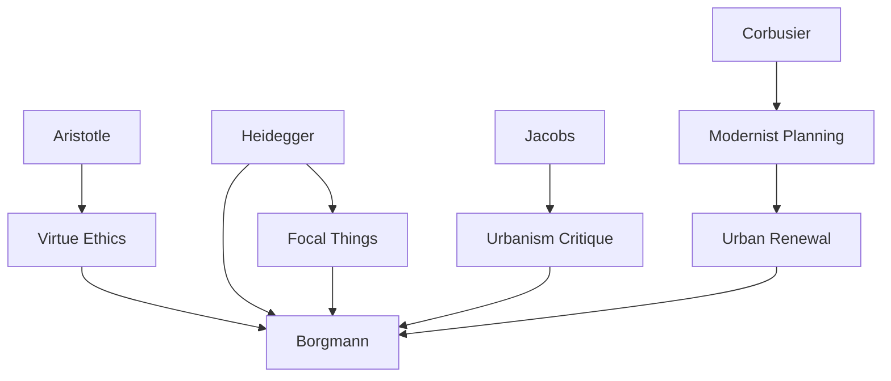

---
cssclasses:
  - Philosophy
  - Arts
subclasses:
  - Philosophy-of-Science
  - Aesthetics
  - Design-Theory
related:
  - "[[Philosophy of Technology]]"
  - "[[Material Culture]]"
  - "[[Engagement]]"
  - "[[Focal Things]]"
  - "[[Design Ethics]]"
aliases:
  - depth design
  - engagement things
  - disburdenment design
  - material culture
  - borgmann design
  - focal things
  - aesthetic design
  - engineering design
  - urban design
  - domestic design
reference:
  - "Borgmann, A. (2007). The depth of design. In R. Buchanan & V. Margolin (Eds.), Discovering design: Explorations in design studies. University of Chicago Press."
---

#### Central Problem

The paper confronts a fundamental tension in contemporary material culture: the systematic drift toward shallowness, superficiality, and disappearance of meaningful engagement with designed objects. [[Borgmann]] addresses how technological development tends toward "disburdenment"—relieving users from demands of skill and attention—while simultaneously attenuating the depth and richness of designed objects. The central question becomes: how can design recover depth and promote genuine human engagement rather than passive consumption?

#### Main Thesis

Design must recover its "depth"—the fusion of aesthetic and engineering dimensions that once characterized meaningful artifacts—in order to promote human engagement rather than mere disburdenment. [[Borgmann]] argues that the split between aesthetic design (relegated to surfaces and interfaces) and engineering design (controlling underlying structures) has impoverished both practices and diminished human experience of the material world.

The thesis distinguishes between two fundamental orientations: engagement (where humans develop skills and relationships through interaction with demanding artifacts) and disburdenment (where technology relieves humans of effort while reducing artifacts to opaque, commodified surfaces). Genuine design requires reuniting what technology has split apart, creating artifacts that invite participation rather than consumption.

The argument extends to urban design, where the distinction between daily engagement (housework, errands) and festive engagement (communal celebration) provides a framework for understanding how designed environments can support meaningful human activity.

#### Historical Context

The paper emerges from [[Borgmann]]'s broader philosophy of technology, developed in works like *Technology and the Character of Contemporary Life* (1984). His concept of "focal things and practices" provides the background for understanding how certain artifacts and activities center human existence while technological devices tend to disperse attention and undermine engagement.

The mid-20th century saw increasing separation between industrial engineering and aesthetic styling, epitomized in the rise of industrial design as surface treatment for mass-produced goods. Concurrently, urban renewal projects destroyed historic urban fabric in favor of modernist planning, eliminating the "depth of history" in cities.

By the 2000s, the postmodern turn in architecture had prompted preservation movements and historicist design, but [[Borgmann]] argues these often remain superficial—history becomes "an essentially indifferent container" for contemporary consumption rather than a genuine recovery of engaged dwelling.

#### Philosophical Lineage

#### Key Thinkers

| Thinker | Dates | Movement | Main Work | Core Concept |
|---------|-------|----------|-----------|--------------|
| [[Borgmann]] | 1937- | [[Philosophy of Technology]] | *Technology and the Character of Contemporary Life* | Focal things, device paradigm |
| [[Heidegger]] | 1889-1976 | [[Phenomenology]] | "The Question Concerning Technology" | Enframing, dwelling |
| [[Jacobs]] | 1916-2006 | [[Urban Theory]] | *Death and Life of Great American Cities* | Urban vitality |
| [[Corbusier]] | 1887-1965 | [[Modernism]] | *Towards a New Architecture* | Radiant city |
| [[Howard]] | 1850-1928 | [[Urban Planning]] | *Garden Cities of To-Morrow* | Garden city |

#### Key Concepts

| Concept | Definition | Related to |
|---------|------------|------------|
| Depth of design | Fusion of aesthetic and engineering dimensions that invites skilled engagement | [[Borgmann]], [[Design Ethics]] |
| Engagement | Symmetrical relationship between human capacities and worldly realities that develops skills and meaning | [[Borgmann]], [[Focal Things]] |
| Disburdenment | Technological relief from demands of skill and attention that reduces artifacts to opaque commodities | [[Borgmann]], [[Device Paradigm]] |
| Focal things | Objects and practices that center human existence and gather people around shared activities | [[Borgmann]], [[Heidegger]] |
| Aesthetic design | Design concerned with surfaces, interfaces, and appearances (often separated from engineering) | [[Industrial Design]], [[Styling]] |
| Engineering design | Design of underlying structures and mechanisms (often concealed from users) | [[Technology]], [[Function]] |

#### Authors Comparison

| Theme | [[Borgmann]] | [[Heidegger]] | [[Jacobs]] |
|-------|--------------|---------------|-----------------|
| Central concern | Technology and engagement | Being and dwelling | Urban vitality |
| Critique | Device paradigm, disburdenment | Enframing, technology | Urban renewal, planning |
| Solution | Focal things and practices | Releasement, dwelling | Dense, mixed-use streets |
| Method | Phenomenological analysis | Fundamental ontology | Empirical observation |

#### Influences & Connections

- **Predecessors:** [[Borgmann]] ← influenced by ← [[Heidegger]], [[Aristotle]], [[Jacobs]]
- **Contemporaries:** [[Borgmann]] ↔ dialogue with ↔ philosophers of technology, design theorists
- **Followers:** [[Borgmann]] → influenced → design ethics, sustainable design discussions
- **Opposing views:** Technological optimism ← challenged by ← [[Borgmann]]'s critique

#### Summary Formulas

- **Engagement vs. disburdenment:** Design faces a choice—create artifacts that engage human capacities and develop skills, or create devices that disburden users while reducing experience to passive consumption.
- **Depth recovered:** Genuine design reunites aesthetic and engineering dimensions, creating artifacts whose surfaces reveal rather than conceal their workings and purposes.
- **Trusteeship and artisanship:** Designers are trustees of material culture's excellence and artisans who shape the "unfolded texture" of engaging environments.
- **Daily and festive engagement:** Design must support both the substantial dailiness of life (housework, errands) and the communal celebrations that gather people together.

#### Timeline

| Year | Event |
|------|-------|
| 1898 | [[Howard]] proposes garden city concept |
| 1925 | [[Corbusier]] proposes Plan Voisin for Paris |
| 1961 | [[Jacobs]] publishes *Death and Life of Great American Cities* |
| 1984 | [[Borgmann]] publishes *Technology and the Character of Contemporary Life* |
| 1992 | Camden Yards Ballpark opens, exemplifying depth in urban design |
| 2007 | [[Borgmann]] publishes "The Depth of Design" |

#### Notable Quotes

> "Design must recover its depth—the fusion of aesthetic and engineering dimensions that once characterized meaningful artifacts."

> "Engagement is the symmetry that links humanity and reality. Human beings have certain capacities that prefigure the things of the world; and conversely what is out there in the world has called forth human sense and sensibility."

> "Designers are professionals in that they have been entrusted by society with a valued good and are hence accountable not only to the immediate desires of society but also for the well-being of the good that is in their care."

---
> [!warning]-
> This annotation was normalised using a large language model and may contain inaccuracies. These texts serve as preliminary study resources rather than exhaustive references.
