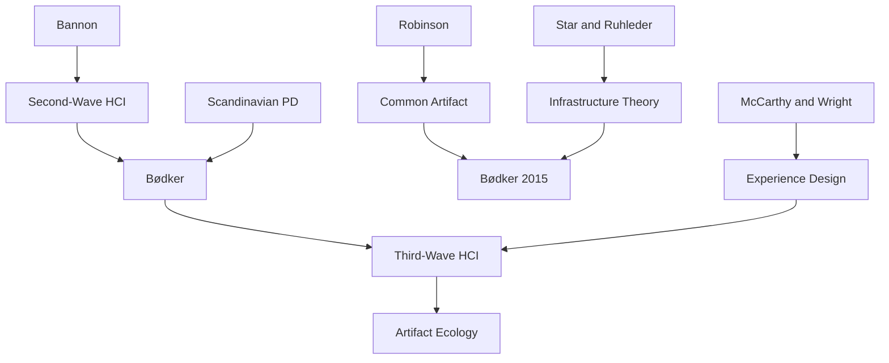

---

cssclasses:
  - Computer-Science
  - Philosophy
subclasses:
  - Human-Computer-Interaction
  - Participatory-Design
  - Design-Theory
related:
  - "[[HCI]]"
  - "[[Participatory Design]]"
  - "[[Artifact Ecology]]"
  - "[[Third-wave HCI]]"
  - "[[Common Artifacts]]"
aliases:
  - third wave
  - artifact ecology
  - common artifact
  - participatory it
  - shared interaction
  - pit research
  - collaborative design
  - hci waves
  - ubicomp hci
  - social computing
reference:
  - Bødker, S. (2015). Third-wave HCI, 10 years later—Participation and sharing. Interactions, 22(5), 24–31. https://doi.org/10.1145/2804405
tags:
  - Podcast
---

#### Podcast

<iframe allow="autoplay *; encrypted-media *; fullscreen *; clipboard-write" frameborder="0" height="150" style="width:100%;overflow:hidden;border-radius:10px;background:transparent;" sandbox="allow-forms allow-popups allow-same-origin allow-scripts allow-storage-access-by-user-activation allow-top-navigation-by-user-activation" src="https://embed.podcasts.apple.com/us/podcast/on-the-second-to-the-fourth-waves-of/id1786764068?i=1000682278075&uo=4&l=en-GB&theme=auto"></iframe>

---

#### Central Problem

Ten years after proposing the three waves of HCI, [[Bødker]] revisits the framework to assess what has changed and what challenges remain. The paper confronts the tension between third-wave HCI's focus on individual experience and meaning-making versus the second-wave emphasis on collaboration, participation, and shared practices. The central question becomes: how can HCI design support both individual experience and collective interaction around "common artifacts" in an era of ubiquitous, interconnected technologies?

#### Main Thesis

Third-wave HCI, revisited after a decade, reveals that participation and sharing have emerged as crucial themes that bridge second and third-wave concerns. The author argues that understanding "artifact ecologies"—the configurations of multiple technological artifacts that users bring together in their activities—is essential for contemporary HCI. Furthermore, the concept of the "common artifact" (drawn from CSCW traditions) provides a framework for understanding how people engage together through shared technological artifacts while maintaining individual purposes.

The thesis proposes that HCI must move beyond designing isolated artifacts toward understanding and supporting the dynamic configurations of technologies that people assemble across contexts. This requires attention to how artifacts are shared, appropriated, and reconfigured over time, involving both professional designers and everyday users.

#### Historical Context

The paper emerges from [[Bødker]]'s influential 2006 NordiCHI keynote that introduced the wave metaphor for HCI's evolution. The first wave (1980s) focused on cognitive science and human factors; the second wave (1990s) emphasized workplace collaboration, participatory design, and situated action; the third wave (2000s) broadened to everyday life, experience, and meaning-making.

The decade following 2006 saw dramatic technological changes: the rise of smartphones (iPhone launched 2007), social media platforms, ubiquitous connectivity, and the proliferation of interactive systems into all aspects of life. These developments intensified the challenges [[Bødker]] had identified: multiplicity of devices, blurring of work and leisure boundaries, and the need for technologies that support both individual and collective use.

The Center for Participatory IT (PIT) at Aarhus University, which [[Bødker]] co-directs, provides the institutional context for exploring these themes through projects like Ekkomaten, Ink, and Local Area Artwork.

#### Philosophical Lineage

#### Key Thinkers

| Thinker | Dates | Movement | Main Work | Core Concept |
|---------|-------|----------|-----------|--------------|
| [[Bødker]] | 1954- | [[HCI]], [[Participatory Design]] | "When Second Wave HCI Meets Third Wave Challenges" | HCI waves, artifact ecology |
| [[Robinson]] | - | [[CSCW]] | "Common Artifact" paper | Common artifact concept |
| [[Star]] | 1954-2010 | [[CSCW]], [[STS]] | "Steps Toward an Ecology of Infrastructure" | Infrastructuring |
| [[McCarthy]], [[Wright]] | - | [[HCI]] | *Technology as Experience* | Experience-centered design |
| [[Bannon]] | - | [[HCI]] | "From Human Factors to Human Actors" | Second-wave transition |

#### Key Concepts

| Concept | Definition | Related to |
|---------|------------|------------|
| Artifact ecology | Dynamic configurations of multiple technological artifacts that users bring together in activities | [[Bødker]], [[Ubicomp]] |
| Common artifact | Artifact that multiple users access and use for different but overlapping purposes (like a hotel keyrack) | [[Robinson]], [[CSCW]] |
| Third-wave HCI | HCI paradigm emphasizing experience, meaning-making, and everyday life contexts | [[Bødker]], [[HCI]] |
| Infrastructuring | The ongoing work of building, maintaining, and adapting technological infrastructures | [[Star]], [[STS]] |
| Appropriation | Process by which users make technologies their own through adaptation and reconfiguration | [[HCI]], [[Participatory Design]] |

#### Authors Comparison

| Theme | [[Bødker]] 2006 | [[Bødker]] 2015 | [[Robinson]] |
|-------|-----------------|-----------------|--------------|
| Central concern | HCI wave transitions | Participation and sharing | Shared artifacts in CSCW |
| Focus | Individual experience | Collective interaction | Coordination mechanisms |
| Key concept | Third-wave challenges | Artifact ecologies | Common artifact |
| Method | Theoretical analysis | Design research | Ethnographic observation |

#### Influences & Connections

- **Predecessors:** [[Bødker]] ← influenced by ← [[Bannon]], [[Star]], [[Robinson]], Scandinavian PD tradition
- **Contemporaries:** [[Bødker]] ↔ dialogue with ↔ [[McCarthy]], [[Wright]], ubicomp researchers
- **Research projects:** Ekkomaten, Ink, Local Area Artwork → exemplify → common artifact design
- **Fourth wave anticipation:** [[Bødker]] 2015 → points toward → values and politics in HCI

#### Summary Formulas

- **Artifact ecology:** Users do not interact with single artifacts but with dynamic configurations of multiple technologies that change over time as needs and contexts shift.
- **Common artifact:** Artifacts can be "held in common" without being used together simultaneously—multiple users access them for different but overlapping purposes.
- **Participation returns:** Third-wave focus on individual experience must be reconciled with second-wave insights about collaboration, participation, and shared practices.
- **Visibility and sharing:** Big, visible artifacts invite participation and orientation among strangers; small personal devices like smartphones create distance rather than co-participation.

#### Timeline

| Year | Event |
|------|-------|
| 1991 | [[Bannon]] publishes "From Human Factors to Human Actors" |
| 1992 | [[Robinson]] introduces common artifact concept |
| 1996 | [[Star]] and Ruhleder publish "Steps Toward an Ecology of Infrastructure" |
| 2004 | [[McCarthy]], [[Wright]] publish *Technology as Experience* |
| 2006 | [[Bødker]] delivers NordiCHI keynote on HCI waves |
| 2012 | [[Bødker]] and Klokmose develop artifact ecology framework |
| 2015 | [[Bødker]] revisits third-wave HCI in *Interactions* article |

#### Notable Quotes

> "When sharing becomes a matter of engaging with other users through multiple common artifacts, it is also in and through this multiplicity that people participate."

> "Artifact ecologies, more than actual sharing of artifacts, help us focus on multitudes of artifacts that users bring together when carrying out particular activities."

> "Big, visible artifacts seem to invite people in and let them rather easily orient toward others, participate, and hence collaborate."

---
> [!warning]-
> This annotation was normalised using a large language model and may contain inaccuracies. These texts serve as preliminary study resources rather than exhaustive references.
