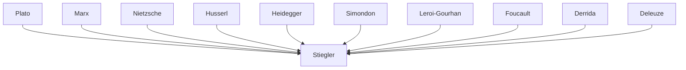

---
cssclasses:
  - Philosophy
  - Sociology
subclasses:
  - Philosophy-of-Science
  - Critical-Theory
  - 20th-Century-Philosophy
related:
  - "[[Philosophy of Technology]]"
  - "[[Proletarianization]]"
  - "[[Pharmakon]]"
  - "[[Technical Exteriorization]]"
  - "[[Stiegler]]"
  - "[[Cognitive Capitalism]]"
aliases:
  - stiegler interview
  - proletarianization knowledge
  - pharmakon technology
  - technical exteriorization
  - cognitive capitalism
  - psychopower control
  - economy contribution
  - libidinal economy
  - mnemotechnologies memory
  - deproletarianization process
reference:
  - "Lemmens, P. (2011). “This system does not produce pleasure anymore” an interview with Bernard Stiegler. Krisis: Journal for Contemporary Philosophy, 1, 33–37."
---

#### Central Problem

The central problem addressed in this interview with [[Stiegler]] concerns the fundamental nature of the relationship between humans and technology, and how contemporary capitalism exploits this relationship to produce a state of "generalized proletarianization." [[Stiegler]] challenges both technological determinism and social constructivism, arguing that the separation between humans and technics is "completely artificial" — humanity is co-extensive with technics. Human beings are marked by an "originary absence of origin" (défaut d'origine), a fundamental lack that makes them dependent on technical prostheses from the very beginning.

The deeper problem is that contemporary "cognitive capitalism" systematically destroys knowledge, know-how (savoir-faire), and knowledge-how-to-live (savoir-vivre) by industrializing human memory and cognition through digital technologies. This "psychopower" (analogous to [[Foucault]]'s biopower) captures attention and desire for consumption, destroying libido and the sublimatory capacities essential to civilization. The "conservative revolution" of Thatcher and Reagan subjected technological appropriation entirely to market logic, eliminating the role traditionally played by the state and public institutions in socializing technologies therapeutically.

#### Main Thesis

[[Stiegler]]'s main thesis is that technology is inherently pharmacological — it is always both poison and cure. Technology necessarily creates disequilibrium in society, acting first as poison, but can become curative through processes of social appropriation and the development of new modes of psychic and collective individuation. The key question is whether technical exteriorization produces autonomy or heteronomy.

The thesis unfolds through several interconnected claims:

**General Organology:** There are always three terms involved in human transformation: the psychic, the technical, and the social. These cannot be separated — you cannot have a psychic individual without society, nor society without technics. The question of technological determinism versus social determinism is therefore artificial.

**Proletarianization as Originary:** Proletarianization (the exteriorization of knowledge in technics) begins not with the Industrial Revolution but with technics itself — [[Plato]] was its first thinker. Nineteenth-century capitalism proletarianized workers by delegating knowledge to machines; twentieth-century capitalism proletarianized consumers by replacing their ways of life with standardized "lifestyles."

**The Neoliberal Catastrophe:** The "conservative revolution" destroyed the traditional role of public institutions in appropriating technologies therapeutically. By submitting everything to market logic, it produced "systemic carelessness" and "systemic stupidity," transforming capitalism into something "completely irrational."

**Pharmacological Hope:** Despite this bleak diagnosis, the same digital networks used for control could enable an "economy of contribution" based on peer-to-peer production, as prefigured by Free Software and Open Source movements.

#### Historical Context

The interview was conducted in Paris in September 2010, in the immediate aftermath of the 2008 global financial crisis that exposed the irrationality of financialized capitalism. [[Stiegler]] references the crisis of General Motors and the broader collapse of the speculative economy invented by Thatcher and Reagan, noting that establishment figures who previously dismissed his critique now sought his analysis.

The historical context spans from the 1979 "conservative revolution" — when Thatcher proclaimed the end of state-mediated technological appropriation — to the emergence of digital network technologies and the Free Software movement. [[Stiegler]] traces proletarianization back through the Industrial Revolution to [[Plato]]'s critique of writing as pharmakon, showing how each technological epoch required new institutions for therapeutic appropriation.

The interview also references the Habermas-Sloterdijk debate, [[Foucault]]'s critique of neoliberalism, and the founding of Ars Industrialis in 2005 as an "international association for the promotion of an industrial politics of spirit."

#### Philosophical Lineage

#### Key Thinkers

| Thinker | Dates | Movement | Main Work | Core Concept |
|---------|-------|----------|-----------|--------------|
| [[Stiegler]] | 1952-2020 | [[Philosophy of Technology]] | *Technics and Time* | Originary technicity, pharmakon |
| [[Simondon]] | 1924-1989 | [[Philosophy of Technology]] | *On the Mode of Existence of Technical Objects* | Pre-individual, individuation |
| [[Leroi-Gourhan]] | 1911-1986 | [[Paleoanthropology]] | *Gesture and Speech* | Technical exteriorization |
| [[Foucault]] | 1926-1984 | [[Post-Structuralism]] | *Discipline and Punish* | Biopower, technologies of self |
| [[Derrida]] | 1930-2004 | [[Deconstruction]] | *Of Grammatology* | Pharmakon, writing |
| [[Marx]] | 1818-1883 | [[Historical Materialism]] | *Capital* | Proletarianization, labor power |

#### Key Concepts

| Concept | Definition | Related to |
|---------|------------|------------|
| Proletarianization | The loss of knowledge and know-how through exteriorization in technical systems; extends from workers (savoir-faire) to consumers (savoir-vivre) | [[Stiegler]], [[Marx]] |
| Pharmakon | Technology as simultaneously poison and cure; always creates disequilibrium but can become therapeutic through social appropriation | [[Stiegler]], [[Derrida]], [[Plato]] |
| Technical exteriorization | The process by which humans externalize memory, cognition, and experience in technical artifacts, constituting a "third memory" | [[Stiegler]], [[Leroi-Gourhan]] |
| Psychopower | The control of libidinal energy through mnemotechnologies, analogous to Foucault's biopower | [[Stiegler]], [[Foucault]] |
| General organology | Framework analyzing the co-evolution of psychic, technical, and social systems as inseparable dimensions | [[Stiegler]], [[Simondon]] |
| Economy of contribution | Alternative industrial model based on peer-to-peer production rather than producer-consumer opposition | [[Stiegler]], [[Free Software]] |
| Libidinal economy | The organization of desire and sublimation that sustains civilization and produces psychic equilibrium | [[Stiegler]], [[Freud]] |

#### Authors Comparison

| Theme | [[Stiegler]] | [[Foucault]] |
|-------|--------------|--------------|
| Power over life | Psychopower (control of attention/desire) | Biopower (control of bodies/populations) |
| Technology's role | Constitutive of humanity, pharmacological | Instrumental to power/knowledge |
| The state | Necessary for therapeutic appropriation of technics | Object of critique, disciplinary apparatus |
| Resistance | Deproletarianization, economy of contribution | Technologies of self, care of self |
| Capitalism | Nihilistic, destroying its own conditions | Productive of subjectivities |

#### Influences & Connections

- **Predecessors:** [[Stiegler]] ← influenced by ← [[Heidegger]], [[Derrida]], [[Simondon]], [[Leroi-Gourhan]], [[Marx]], [[Freud]]
- **Contemporaries:** [[Stiegler]] ↔ dialogue with ↔ [[Deleuze]], [[Foucault]], [[Latour]]
- **Followers:** [[Stiegler]] → influenced → [[Ars Industrialis]], [[Digital Studies]], [[Philosophy of Technology]]
- **Opposing views:** [[Stiegler]] ← criticized by ← [[Social constructivists]], [[Neoliberals]], [[Technophiles]]

#### Summary Formulas

- **[[Stiegler]]:** Humanity is co-extensive with technics; proletarianization is the loss of knowledge through technical exteriorization, now generalized by cognitive capitalism's psychopower, but the same digital networks could enable an economy of contribution and deproletarianization if appropriated therapeutically.
- **[[Simondon]]:** The pre-individual precedes the separation of technical, psychic, and social; individuation is always a dynamic process of phases and counter-phases.

#### Notable Quotes

> "What is technics, or technology, or technicity? It is a new form of life." — [[Stiegler]]

> "The human is technics. Humanity cannot even be understood without technics." — [[Stiegler]]

> "This system does not produce pleasure anymore." — [[Stiegler]]

---
> [!warning]-
> This annotation was normalised using a large language model and may contain inaccuracies. These texts serve as preliminary study resources rather than exhaustive references.
