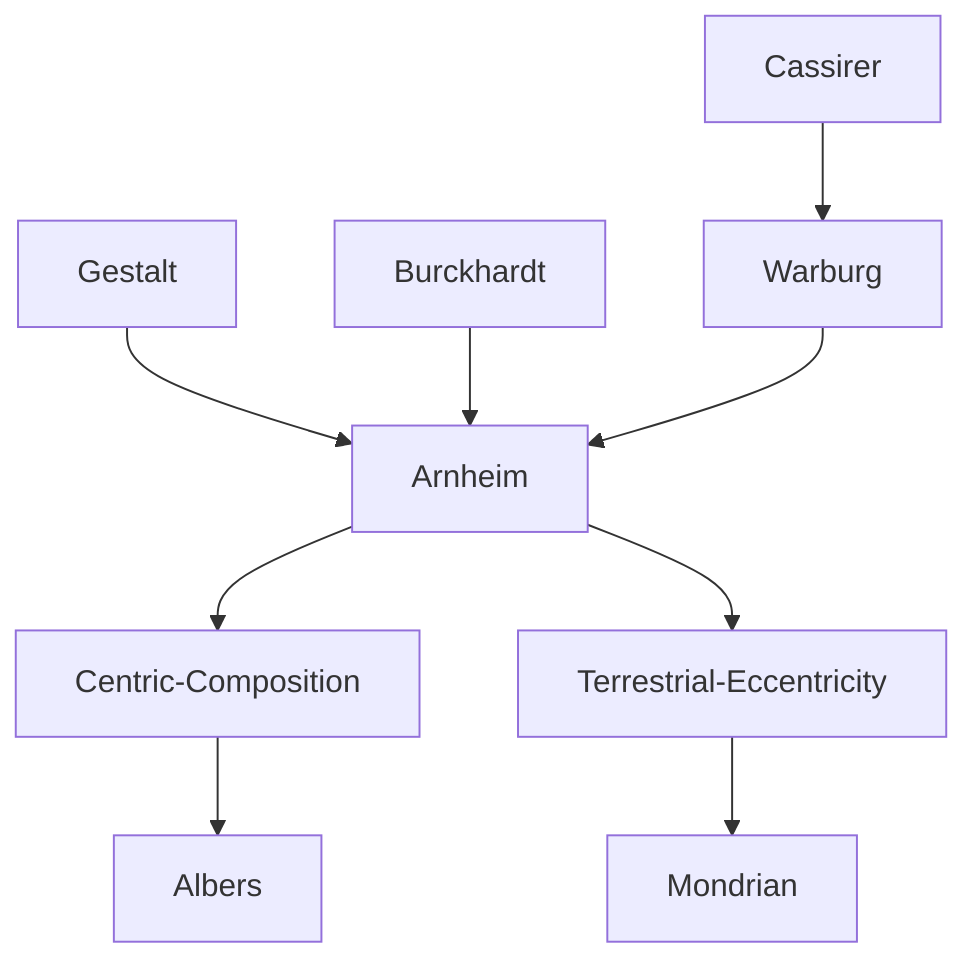

---
cssclasses:
  - Philosophy
  - Arts
  - Psychology
subclasses:
  - Aesthetics
  - Design-Theory
related:
  - "[[Arnheim]]"
  - "[[Botticelli]]"
  - "[[Michelangelo]]"
  - "[[Raffaello]]"
  - "[[Albers]]"
  - "[[Mondrian]]"
aliases:
  - visual centricity
  - circular composition
  - tondo format
  - eccentric system
  - centric system
  - square format
  - gravitational balance
  - microtema concept
  - compositional equilibrium
  - radial symmetry
reference:
  - "Arnheim, R. (1994). Il potere del centro: psicologia della composizione nelle arti visive (Nuova versione). Einaudi. (pp. 85-124)"
---

#### Central Problem

How do different compositional formats—circular, elliptical, and square—determine the visual dynamics of artworks, and what structural relationships are established between the centric and eccentric systems within each format?

#### Main Thesis

The tondo imposes absolute centricity that elevates the subject toward religious transcendence and detaches it from terrestrial gravitational coordinates; the ellipse introduces a bipolar tension between two foci; the square balances centric symmetry with the eccentric grid of verticals and horizontals, creating a state of atemporal stability. In every format, the interaction between the centric and eccentric systems generates the visual and symbolic substance of the work.

#### Historical Context

The chapter situates itself within the context of visual composition theory developed by Gestalt psychology and applied to the figurative arts. Arnheim analyzes the Florentine Renaissance tradition of the tondo (15th-16th century), the Mannerist and Baroque use of the ellipse, and the modern rediscovery of the square format in Constructivism and geometric abstraction of the 20th century. The discourse moves between medieval cosmology (T-O maps), 18th-century visionary architecture (Boullée), Christian symbolism, and contemporary painting.

#### Philosophical Lineage

#### Key Thinkers

| Thinker | Dates | Movement | Main Work | Core Concept |
|---------|-------|----------|-----------|--------------|
| [[Arnheim]] | 1904–2007 | [[Gestalt]] | *The Power of the Center* | Centricity/eccentricity interaction |
| [[Botticelli]] | 1445–1510 | [[Florentine Renaissance]] | *Madonna of the Pomegranate* | Symbolic centricity in tondo |
| [[Michelangelo]] | 1475–1564 | [[High Renaissance]] | *Pitti Tondo*, *Doni Tondo* | Compositional microtheme |
| [[Raphael]] | 1483–1520 | [[Classical Renaissance]] | *Madonna della Seggiola* | Centric/eccentric synthesis |
| [[Piero della Francesca]] | 1415–1492 | [[Early Renaissance]] | *Resurrection*, *Nativity* | Stability in square format |
| [[Albers]] | 1888–1976 | [[Geometric Abstraction]] | *Homage to the Square* | Centricity and gravitational weight |
| [[Mondrian]] | 1872–1944 | [[Neoplasticism]] | *Composition* | Weightless universe |
| [[Warburg]] | 1866–1929 | [[Iconology]] | Warburg Library | Ellipse as existential bipolarity |

#### Key Concepts

| Concept | Definition | Related to |
|---------|------------|------------|
| Centricity | Compositional system governed by a central fulcrum that confers stability and absolute predominance | [[Arnheim]], radial symmetry |
| Eccentricity | System of gravitational coordinates (vertical/horizontal) that anchors composition to terrestrial space | [[Arnheim]], spatial grid |
| Microtheme | Small concentrated version of the main subject placed at the center of the work | [[Arnheim]], condensed symbolism |
| Spatial anisotropy | Perceptual asymmetry that causes overestimation of vertical distances compared to horizontal ones | [[Arnheim]], visual weight |
| Internal tondo | Circular form within the composition that functions as an autonomous center with its own visual weight | [[Arnheim]], halo, disc |
| Ovato tondo | Approximate construction of the ellipse using two overlapping circles, typical of Renaissance workshops | [[Arnheim]], bipolarity |

#### Authors Comparison

| Theme | [[Albers]] | [[Mondrian]] |
|-------|------------|--------------|
| Format | Centric square | Decentered square |
| Dominant system | Centricity with gravitational tension | Pure eccentricity, weightless |
| Color | Full range of hues and brightness | Only three pure primaries |
| Center | Clearly indicated by square deviation | Avoided, uniformly distributed |
| Weight | Compression below, expansion above | Homogeneous, no hierarchy |
| Frame | One of the squares in the series | Forms continuing beneath the border |

#### Influences & Connections

- **Predecessors:** [[Arnheim]] ← influenced by ← [[Gestalt]], [[Burckhardt]], [[Warburg]]
- **Contemporaries:** [[Arnheim]] ↔ dialogue with ↔ [[Cassirer]] (via Warburg)
- **Applications:** [[Arnheim]] → applied to → Renaissance tondi, Baroque ellipses, Modern abstraction
- **Followers:** [[Albers]], [[Mondrian]] → exemplify → centric vs eccentric systems

#### Summary Formulas

- **[[Arnheim]] on the tondo:** The circular format imposes absolute centricity that elevates the subject toward transcendence; the border functions as a circular horizon embracing the contents.
- **[[Arnheim]] on the ellipse:** The ellipse introduces bipolar tension between two foci, representing the transition from geocentric to heliocentric cosmology.
- **[[Arnheim]] on the square:** The square balances centric symmetry with the eccentric grid, creating atemporal stability where both systems coexist without conflict.

#### Notable Quotes

> "The circular format has an essentially ideal character, accepting only subjects of quietude and ideal beauty." — [[Burckhardt]]

> "The ellipse represented a turning point for human thought... its two poles reproposed the characteristics of the universe: they controlled the motions of the cosmos." — [[Warburg]]

> "The tondo contains, as it were, the entire philosophy of the round image, so clearly as to make it possible for every free gaze to understand what this most beautiful and most difficult format signifies for representation." — [[Burckhardt]]

---
> [!warning]-
> This annotation was normalised using a large language model and may contain inaccuracies. These texts serve as preliminary study resources rather than exhaustive references.
