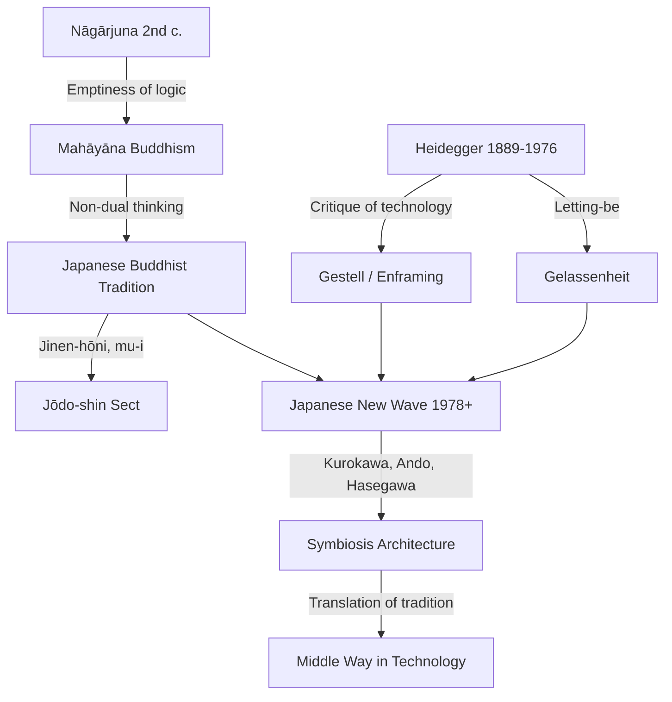

---
cssclasses:
  - Philosophy
subclasses:
  - Philosophy-of-Science
  - Aesthetics
  - 20th-Century-Philosophy
related:
  - "[[Heidegger]]"
  - "[[Kurokawa Kisho]]"
  - "[[Nāgārjuna]]"
  - "[[Japanese New Wave Architecture]]"
  - "[[Buddhism]]"
  - "[[Technology and Being]]"
aliases:
  - snodgrass 1997
  - tradition and
  - japanese new
  - heidegger and
  - lettingbe and
  - gelassenheit and
  - enframing and
  - kurokawa and
  - technology as
  - nondual thinking
reference:
  - "Snodgrass, A. (1997). Translating Tradition: Technology, Heidegger’s ‘Letting-be,’ and Japanese New Wave Architecture. Architectural Theory Review, 2(2), 83–104. https://doi.org/10.1080/13264829709478320"
---

#### Tradition and Technology

#### Central Problem

How can tradition be preserved and revitalized in an age dominated by technology? The Japanese "New Wave" architects present a paradox: they reject Western rationality and technological determinism while employing cutting-edge technology. Snodgrass argues this apparent contradiction can be understood through Heidegger's critique of technology and Buddhist non-dual thinking, both of which question the hegemony of the principle of reason and open space for "letting-be" (Gelassenheit).

#### Main Thesis

The Japanese New Wave architects (Kurokawa Kisho, Hasegawa Itsuko, Ando Tadao, etc.) use advanced technology not to reproduce traditional forms but to *translate* the spiritual heritage of Japan—Buddhist notions of Emptiness (kū), non-duality (funi), and impermanence (mujō)—into contemporary architectural language. This approach resonates with Heidegger's notion that technology's essence (Gestell) cannot be controlled through rational mastery but only through a stance of "letting-be" that opens us to other modes of Being. Both Heidegger and Mahāyāna Buddhism recognize that reason is ultimately groundless—the principle of reason is itself without reason—yet this recognition does not lead to nihilism but to a Middle Way that neither rejects nor uncritically accepts technology.

#### Historical Context and Intellectual Background

The Modern Movement in architecture rejected the past in favor of utopian progress. Post-Modernism reacted by retrieving historical forms, often ironically or nostalgically. The Japanese New Wave, however, takes a distinctive approach: they reject Western rationality's dominance over Japanese culture (citing urban chaos, cultural sterility, and rootless consumerism) while embracing high technology. This echoes the 19th-century slogan *wakon yōsai* ("Japanese spirit, Western technology") but goes deeper by drawing on:

1. **Heidegger's philosophy of technology**: Technology is not merely instrumental but an "enframing" (Gestell) that determines how Being reveals itself, excluding other modes of disclosure.
2. **Nāgārjuna's Mādhyamaka Buddhism**: All logical assertions collapse when logic is applied to itself—reason cannot ground itself.
3. **Jōdo-shin Buddhism**: The practice of *jinen-hōni* (letting things be "just as they are") through non-action (*mu-i*).

#### Philosophical Lineage

#### Key Thinkers

| Thinker | Dates | Movement | Main Work | Core Concept |
|---------|-------|----------|-----------|-------------|
| [[Martin Heidegger]] | 1889-1976 | [[Phenomenology]] | *The Question Concerning Technology* | Gestell, Gelassenheit |
| [[Nāgārjuna]] | ~150-250 CE | [[Mādhyamaka Buddhism]] | *Mūlamadhyamakārikā* | Śūnyatā, logical groundlessness |
| [[Kurokawa Kisho]] | 1934-2007 | [[Japanese New Wave]] | *Japanese Space* | Symbiosis, Funi |
| [[Angelus Silesius]] | 1624-1677 | [[Christian Mysticism]] | *Cherubinischer Wandersmann* | Rose without why |
| [[D.T. Suzuki]] | 1870-1966 | [[Zen Buddhism]] | *Shin Buddhism* | Jinen-hōni |

#### Key Concepts

| Concept | Definition | Related to |
|---------|------------|------------|
| Gestell (Enframing) | The essence of technology as a way of revealing Being that orders everything as "standing reserve" | [[Heidegger]], [[Philosophy of Technology]] |
| Principle of Reason | The demand that nothing exists unless a reason can be given for its existence | [[Leibniz]], [[Heidegger]] |
| Gelassenheit (Letting-Be) | Non-willing openness that allows Being to disclose itself without demanding reasons | [[Heidegger]], [[Phenomenology]] |
| Śūnyatā (Emptiness) | Buddhist concept that all phenomena lack inherent existence | [[Nāgārjuna]], [[Mahāyāna Buddhism]] |
| Funi (Non-Duality) | Buddhist principle dissolving subject/object, inside/outside distinctions | [[Japanese Buddhism]], [[Kurokawa]] |
| Standing Reserve (Bestand) | Everything reduced to resources waiting to be exploited | [[Heidegger]], [[Gestell]] |
| Cybernetic System | Self-regulating, self-expanding technology operating through feedback loops | [[Heidegger]], [[Philosophy of Technology]] |

#### Authors Comparison

| Theme | Heidegger | Nāgārjuna | Kurokawa |
|-------|-----------|-----------|----------|
| **On Reason** | Principle of reason is groundless | Logic collapses when applied to itself | Western rationality caused urban chaos |
| **Response** | Gelassenheit (letting-be) | Recognition of Emptiness | Symbiosis through non-dual design |
| **On Technology** | Essence is Gestell, a mission of Being | N/A (pre-technological context) | Push technology until it reveals its human face |
| **Practical Stance** | Use technology while remaining free of it | All assertions are expedient means | Translate tradition via hi-tech means |
| **Nihilism?** | Groundlessness ≠ nihilism; opens to Mystery | Emptiness ≠ nothingness; enables compassion | Rejection of utopian progress ≠ rejection of technology |

#### Influences & Connections

#### Predecessors
- **[[Leibniz]]**: Formulated the principle of sufficient reason (*nihil existere nisi cujus reddi potest ratio*)
- **[[Meister Eckhart]]**: German mystic whose notions of detachment resonate with Gelassenheit
- **[[Theravāda Buddhism]]**: Concept of non-grasping developed into Mahāyāna letting-be

#### Contemporaries
- **[[Ando Tadao]]**: New Wave architect using concrete to evoke silence and emptiness
- **[[Hasegawa Itsuko]]**: Architecture as "second nature" responding to natural processes
- **[[Michael Zimmerman]]**: Scholar on Heidegger's confrontation with modernity

#### Successors
- **[[Post-Phenomenological Philosophy of Technology]]**: Don Ihde's development of Heidegger's technological hermeneutics
- **[[Kyoto School]]**: Japanese philosophy bridging Heidegger and Buddhism

#### Summary Formulas

1. **Technology as System**: Technology is no longer instrumental (means to ends) but a self-regulating cybernetic system that humans belong to rather than control.

2. **The Groundlessness Paradox**: The principle of reason, which demands reasons for everything, is itself without reason—revealing the foundationlessness of technological rationality.

3. **Letting-Be as Response**: Since technology's essence (Gestell) is a mission of Being beyond human willing, the authentic response is Gelassenheit—using technology while remaining inwardly free of its truth claims.

4. **Buddhist Parallel**: Nāgārjuna's demonstration that logic collapses when applied to itself anticipates Heidegger by 1800 years; Mahāyāna's recognition of Emptiness enables engagement without attachment.

5. **The Middle Way**: Neither rejection nor uncritical acceptance of technology, but translation of spiritual tradition through technological means while maintaining critical distance from technological rationality.

#### Timeline

| Year | Event |
|------|-------|
| ~150 CE | [[Nāgārjuna]] composes *Mūlamadhyamakakārikā*, demonstrating the self-contradiction of logic |
| 1889 | Birth of [[Martin Heidegger]] |
| 1927 | Heidegger publishes *Being and Time* |
| 1954 | Heidegger delivers "The Question Concerning Technology" |
| 1959 | Heidegger publishes *Discourse on Thinking* (Gelassenheit) |
| 1976 | Death of Heidegger |
| 1978 | "A New Wave of Japanese Architecture" exhibition tours US |
| 1988 | Kurokawa publishes *Japanese Space* |
| 1991 | Kurokawa publishes *Intercultural Architecture: The Philosophy of Symbiosis* |
| 1997 | Snodgrass publishes "Tradition and Technology" |

#### Notable Quotes

> "The rose is without why; it blooms because it blooms / It cares not for itself; asks not if it's seen." — [[Angelus Silesius]], cited by Heidegger

> "We are able to use objects and yet with suitable use keep ourselves so free of them that we are able to let go of them at any time." — [[Martin Heidegger]], *Discourse on Thinking*

> "I will push technology so far that it reveals its human face." — [[Kurokawa Kisho]], *Japanese Space*
