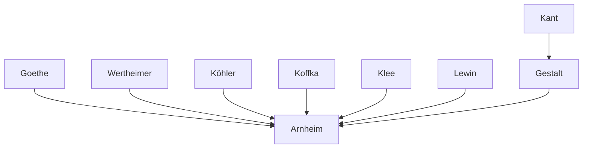

---

cssclasses:
  - Philosophy
  - Arts
  - Psychology
subclasses:
  - Aesthetics
  - Philosophy-of-Mind
  - Design-Theory
related:
  - "[[Two space systems & The centres and their rivals (1 of 6)]]"
  - "[[Observer as centre & Limits and frames (2 of 6)]]"
  - "[[Round and square (3 of 6)]]"
  - "[[Centres as pivots & Centres as dividing elements (4 of 6)]]"
  - "[[Volumes and nodes & Space in depth (5 of 6)]]"
  - "[[Centres and grids in buildings & More (6 of 6)]]"
aliases:
  - visual composition
  - centric systems
  - eccentric systems
  - visual forces
  - dynamic vectors
  - visual weight
  - gravitational attraction
  - gestalt perception
  - compositional balance
  - artistic expression
reference:
  - "Arnheim, R. (1994). Il potere del centro: psicologia della composizione nelle arti visive (Nuova versione). Einaudi. (pp. 3-41)"
tags:
  - Podcast
---

#### Podcast

<iframe allow="autoplay *; encrypted-media *; fullscreen *; clipboard-write" frameborder="0" height="150" style="width:100%;overflow:hidden;border-radius:10px;background:transparent;" sandbox="allow-forms allow-popups allow-same-origin allow-scripts allow-storage-access-by-user-activation allow-top-navigation-by-user-activation" src="https://embed.podcasts.apple.com/us/podcast/the-power-of-the-center-a-study-of-composition/id1786764068?i=1000683397772&uo=4&l=en-GB&theme=auto"></iframe>

> [!tip] This episode is part of a series — click "See More" for all the episodes.

---

#### Central Problem

How can visual composition in art be understood as a universal structure common to all works of visual art across time and cultures? [[Arnheim]] confronts the challenge of moving beyond diagrammatic analyses of particular works or styles to identify fundamental compositional principles rooted in human nature and the structure of the nervous system.

The central tension lies between two motivational tendencies that characterize human experience: the **centric** tendency (autocentric attitude where the self is seen as center of the world) and the **eccentric** tendency (recognition that one's centrality is merely one among others, directed toward external goals). This psychological duality must find symbolic expression in art through corresponding spatial systems. The problem is how static forms—physically immobile and "adynamic"—can represent the motivated strivings and tensions that constitute human experience.

#### Main Thesis

[[Arnheim]] argues that visual composition operates through the interaction of two spatial systems—**centric** and **eccentric**—which symbolize the fundamental tension between self-centered motivation and outward-directed engagement with external forces.

**Core claims:**

1. **Two Compositional Systems:** The centric system (radial, "solar emission" pattern emanating from a center) and the eccentric system (parallel vectors directed toward or from external targets) interact in virtually all practical compositional cases.

2. **Dynamic Vision:** Although retinal images share the static rigidity of physical objects, their neural counterparts have the nature of processes in becoming. In fully developed vision necessary for artistic expression, all forms are configurations of forces—vectors emanating from centers of energy.

3. **Vectors, Not Forms:** The elements of compositional structure are not things or forms but vectors—forces emitted from a center of energy in a particular direction. The "solar emission" schema (fig. 1) is the prototype of centric composition.

4. **Gravitational Asymmetry:** The dominant gravitational attraction makes our lived space anisotropic—up differs fundamentally from down. This eccentric force constantly interacts with centric organization, creating the dynamic tension essential to artistic expression.

5. **Visual Weight:** Weight increases attraction; distance increases visual weight when perception is anchored to a center of attraction; distance decreases attraction when perception is anchored to the attracted object. These complex relations explain how elements that would physically overbalance a composition can visually elevate it.

6. **Neither Alone Suffices:** Neither total autocentricity nor total surrender to external powers can provide an acceptable image of human motivation. The tension between antagonistic tendencies seeking equilibrium is the true seasoning of human experience.

#### Historical Context

The text emerges from the Gestalt psychology tradition that [[Arnheim]] helped develop at the Berlin school in the 1920s-30s before emigrating to America. His work synthesizes perceptual psychology with art theory, extending insights from Wertheimer, Köhler, and Koffka into aesthetic domains.

The chapter draws on examples spanning millennia: Japanese Buddhist mandalas (c. 1000 CE), Byzantine mosaics at San Vitale in Ravenna (6th century), Roman temples, Renaissance and Baroque sculpture (Michelangelo, Canova, Bernini), and modern art (Matisse, Barnett Newman, Reg Butler, Marino Marini). This historical breadth supports the claim to universality.

The context also includes 20th-century physics—the replacement of the mass/energy distinction with unified conceptions of energy fields—which [[Arnheim]] sees as analogous to the shift from perceiving static objects to perceiving configurations of forces.

#### Philosophical Lineage

#### Key Thinkers

| Thinker | Dates | Movement | Main Work | Core Concept |
|---------|-------|----------|-----------|--------------|
| [[Arnheim]] | 1904-2007 | [[Gestalt Psychology]] | *Art and Visual Perception* | Visual thinking, dynamic forces |
| [[Klee]] | 1879-1940 | [[Modernism]] | *Pedagogical Sketchbook* | Cosmic diagrams, visual forces |
| [[Lewin]] | 1890-1947 | [[Gestalt Psychology]] | *Dynamic Theory of Personality* | Psychological vectors, field theory |
| [[Goethe]] | 1749-1832 | [[German Idealism]] | *Theory of Colours* | Morphology, natural forms |
| [[Michelangelo]] | 1475-1564 | [[Renaissance]] | *Pietà* | Dynamic counterpoint in sculpture |
| [[Matisse]] | 1869-1954 | [[Fauvism]] | *Zucche* | Color and compositional weight |

#### Key Concepts

| Concept | Definition | Related to |
|---------|------------|------------|
| Centric tendency | Autocentric attitude seeing self as center of world; psychologically primary; compositionally expressed as radial "solar emission" pattern | [[Arnheim]], [[Gestalt Psychology]] |
| Eccentric tendency | Recognition of external centers; directed toward goals outside the self; compositionally expressed as parallel vectors toward/from targets | [[Arnheim]], [[Motivation]] |
| Vector | Force emitted from a center of energy in a particular direction; the fundamental element of compositional structure | [[Arnheim]], [[Lewin]] |
| Visual weight | Property of forms affecting attraction and balance; increases with distance from center of attraction when anchored to that center | [[Arnheim]], [[Visual Perception]] |
| Anisotropy | Asymmetry of space where up differs from down due to gravitational field; fundamental to vertical composition | [[Arnheim]], [[Physics]] |
| Dynamic center | Fulcrum of energy from which vectors radiate; established intuitively through perceptual equilibrium | [[Arnheim]], [[Gestalt Psychology]] |
| Geometric center | Point determined by measurement alone; serves spatial order but lacks dynamic properties | [[Arnheim]], [[Geometry]] |
| Retinal presence | Quality of explicitly marked center versus center merely suggested by perceptual induction | [[Arnheim]], [[Visual Perception]] |
| Solar emission schema | Prototype of centric composition where vectors radiate equally in all directions from common center | [[Arnheim]], [[Composition]] |
| Elastic effect | Metaphor for increased visual weight at distance from center of attraction; like stretching elastic band | [[Arnheim]], [[Visual Perception]] |

#### Authors Comparison

| Theme | [[Arnheim]] | [[Klee]] | [[Lewin]] |
|-------|-------------|----------|-----------|
| Central concept | Visual forces in composition | Cosmic/natural forces in art | Psychological force fields |
| Domain | Art perception and theory | Artistic practice and pedagogy | Personality and motivation |
| Vector source | Perceptual dynamics | Natural growth patterns | Psychological needs |
| Spatial model | Centric + eccentric systems | Earth-centered gravity diagrams | Life space topology |
| Universality claim | All visual art, all cultures | Nature's formative principles | All motivated behavior |
| Empirical basis | Gestalt perception experiments | Artistic intuition, nature study | Social psychology experiments |

#### Influences & Connections

- **Predecessors:** [[Arnheim]] ← influenced by ← [[Wertheimer]], [[Köhler]], [[Koffka]], [[Goethe]]
- **Contemporaries:** [[Arnheim]] ↔ dialogue with ↔ [[Klee]] (diagrams), [[Lewin]] (vectors)
- **Disciplines:** [[Arnheim]] ← draws on ← [[Physics]] (energy fields), [[Gestalt Psychology]], [[Art History]]
- **Applications:** [[Arnheim]] → applied to → [[Architecture]], [[Sculpture]], [[Painting]], [[Dance]]

#### Summary Formulas

- **[[Arnheim]]:** Visual composition universally operates through the interaction of centric and eccentric spatial systems, symbolizing the fundamental human tension between self-centered motivation and engagement with external forces—all forms are configurations of directed vectors seeking equilibrium.
- **[[Klee]]:** Natural forms reveal cosmic principles of centricity (gravity converging to earth's center) and growth (vectors radiating outward), providing diagrammatic models for artistic composition.
- **[[Lewin]]:** Human behavior occurs within psychological force fields where vectors represent motivated strivings toward or away from goals—a dynamic topology of the life space.

#### Timeline

| Year | Event |
|------|-------|
| 1904 | [[Arnheim]] born in Berlin |
| 1928 | [[Arnheim]] publishes first writings on film at Berlin Gestalt school |
| 1933 | [[Arnheim]] emigrates from Nazi Germany |
| 1954 | [[Arnheim]] publishes *Art and Visual Perception* (first edition) |
| 1974 | [[Arnheim]] publishes revised *Art and Visual Perception* |
| 1977 | [[Arnheim]] publishes *The Dynamics of Architectural Form* |
| 1988 | [[Arnheim]] publishes *The Power of the Center* (source of this chapter) |

#### Notable Quotes

> "The tension between two antagonistic tendencies seeking to reach an equilibrium is the true seasoning of human experience, and any artistic reasoning that fails to meet this challenge will seem insufficient to us." — [[Arnheim]]

> "In fully developed vision, which is necessary for artistic expression, all forms are configurations of forces." — [[Arnheim]]

> "Anything that incarnates with a certain freedom seeks the rounded form." — [[Goethe]]

---
> [!warning]-
> This annotation was normalised using a large language model and may contain inaccuracies. These texts serve as preliminary study resources rather than exhaustive references.
