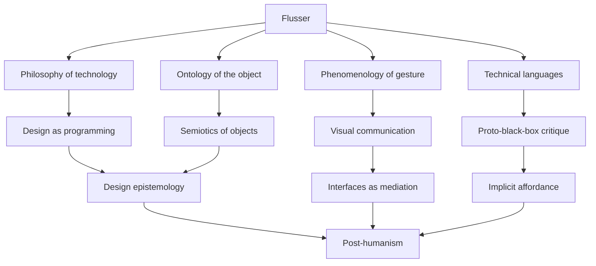

---
cssclasses:
  - Arts
  - Philosophy
subclasses:
  - Design-Theory
  - Interaction-Design
related:
  - "[[Peirce's Semiotic Theory and Logical Systems]]"
  - "[[Design as Epistemic Practice]]"
  - "[[Art as Metaphor for Epistemology]]"
aliases:
  - design trickery
  - technical object
  - gesture analysis
  - programmed device
  - semiotic design
  - user interpretation
  - meaning co-creation
  - proto-media theory
reference:
  - "Flusser, V. (1993). *Filosofia del design*. Mondadori."
  - "Flusser, V. (1999). *Towards a Philosophy of Photography*. Reaktion Books."
  - "Flusser, V. (2002). *Gestures*. University of Minnesota Press."
  - "Borsò, V. (2006). Flusser: An Introduction. *Parallax*, 12(2), 12–23."
  - "Pape, T. (2016). Design as Program: Flusser's Contribution to Design Theory. *Design Issues*, 32(1), 24–35."
---
Flusser is often underestimated or confined to an overly narrow reading. In reality, his work traverses multiple territories, from existentialism to proto-media theory and even to the philosophy of design.

Take his "[[Philosophy of Design]]" (1993), where Flusser explores the notion of design as trickery, as a deliberate deception aimed at guiding behaviours and decisions. His analysis of gesture, technical objects, and visual communication makes him one of the forerunners of semiotic reflection applied to design. The concept of "programming" as an implicit constraint in technical devices, for example, anticipates many current reflections on socio-technical systems and black boxes.

Furthermore, his emphasis on the role of the user as interpreter and co-creator of meaning opens a semiotic dimension that fits perfectly into contemporary reflections on affordances and interfaces.

