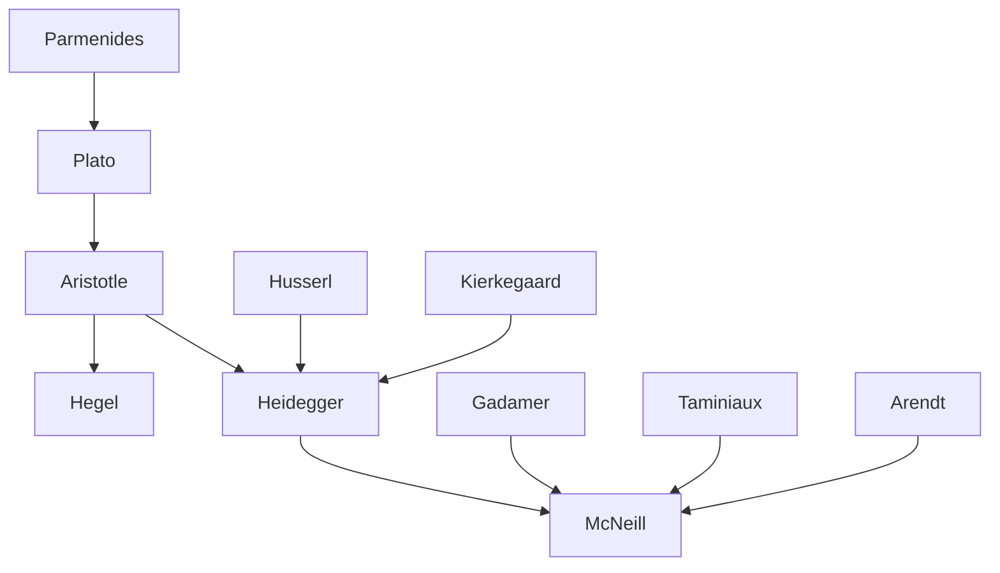

---

cssclasses:
  - Philosophy
subclasses:
  - Phenomenology
  - Ancient-Greek-and-Roman-Philosophy
  - Continental-Philosophy
related:
  - "[[Heidegger]]"
  - "[[Aristotle]]"
  - "[[Being and Time]]"
  - "[[Nicomachean Ethics]]"
  - "[[Phronesis]]"
  - "[[Theoria]]"
aliases:
  - glance eye
  - theoria praxis
  - practical wisdom
  - heidegger aristotle
  - sophia phronesis
  - authentic existence
  - dasein temporality
  - augenblick moment
  - contemplative life
  - being presence
reference:
  - "McNeill, W. (1999). The glance of the eye: Heidegger, Aristotle, and the ends of theory. State University of New York Press. (pp. 17-54)"
tags:
  - Podcast
---

#### Podcast

<iframe allow="autoplay *; encrypted-media *; fullscreen *; clipboard-write" frameborder="0" height="150" style="width:100%;overflow:hidden;border-radius:10px;background:transparent;" sandbox="allow-forms allow-popups allow-same-origin allow-scripts allow-storage-access-by-user-activation allow-top-navigation-by-user-activation" src="https://embed.podcasts.apple.com/us/podcast/heideggers-reading-of-aristotle-vision-in-theory/id1786764068?i=1000684813748&uo=4&l=en-GB&theme=auto"></iframe>

---

#### Central Problem

William McNeill investigates one of the most fundamental tensions in Western philosophy: the relationship between theoretical and practical knowledge, specifically as it unfolds in Heidegger's 1924/25 reading of Aristotle's *Nicomachean Ethics* and *Metaphysics*. The central question concerns the relative priority of *sophia* (theoretical wisdom) versus *phronesis* (practical wisdom) as modes of ontological disclosure.

The problem is not merely historical or exegetical. At stake is the very understanding of human existence (*Dasein*) and its "authentic" being. The traditional reading of *Being and Time* as repeating the Platonic-Aristotelian privilege of contemplative, theoretical life over practical existence is challenged by McNeill's analysis. He traces how Heidegger's early engagement with Aristotle—particularly in the 1924/25 *Sophist* lectures—reveals a more complex and critical relationship to the Greek foundations of ontology.

The fundamental issue is whether the "desire to see" (*tou eidenai oregontai*) that Aristotle identifies as essential to human nature necessarily culminates in pure *theorein*, or whether it points toward another horizon of knowledge entirely. This question has profound implications for understanding not only Heidegger's project but the entire trajectory of Western metaphysics from Parmenides to Hegel.

#### Main Thesis

McNeill argues that Heidegger's reading of Aristotle reveals a constitutive tension between two modes of *nous* (apprehension): the *nous* of *sophia* that contemplates what "always is" (*aei*), and the *nous* of *phronesis* that discloses the singular, unrepeatable moment of action—the *Augenblick* (moment of vision, glance of the eye).

**The Structural Parallel:** Both *sophia* and *phronesis* share the same fundamental structure: they are both *aletheuein aneu logou*—disclosures of truth that occur "without logos," that is, in a direct apprehension (noetic insight) that exceeds discursive reasoning. Yet they represent opposite poles: *nous* in its "most extreme concretion" (phronesis) versus *nous* in its "most universal universality" (sophia).

**The Priority of Theoria:** According to Heidegger's reading of Aristotle, *sophia* gains priority over *phronesis* because it alone "accomplishes" (*poiein*) *eudaimonia* (wellbeing) through its very activity. The *theorein* of *sophia* dwells alongside what is constant and unchanging, thereby enabling a kind of *athanatizein*—a striving toward immortality through contemplation of the eternal.

**The Critical Distance:** However, McNeill shows that Heidegger simultaneously prepares a critique of this prioritization. The understanding of being as "absolute presence" (*Gegenwart*, *Anwesendsein*) that emerges from this privilege of *theoria* will become problematic in *Being and Time*. The authentic being of *Dasein* is relocated from eternal contemplation to the finite *Augenblick* of mortal existence facing death.

**The Eschatological Structure:** The practical *aisthesis* (perception) of *phronesis* is "eschatological"—it reaches an *eschaton* (ultimate limit) where logos comes to an end and action "breaks forth." This moment marks the limit of deliberation and the beginning of action proper.

#### Historical Context

The text emerges from McNeill's analysis of Heidegger's unpublished lecture courses from the early 1920s, particularly the 1924/25 *Sophist* course (GA 19) and the 1925 *Prolegomena to the History of the Concept of Time* (GA 20), which would be reworked into *Being and Time* (1927).

This period represents Heidegger's intensive engagement with Aristotle as part of his project of "destruction" (*Destruktion*) of the history of ontology. The German philosophical context is marked by the completion of philosophy in German Idealism (especially Hegel), which Heidegger sees as maintaining the primacy of the contemplative model of knowing inherited from the Greeks.

The Greek philosophical context spans from Parmenides' identification of being and thinking through Plato and Aristotle. McNeill traces Aristotle's hierarchical account of knowledge in *Metaphysics* Book I: from *aisthesis* (sense perception) through *empeiria* (experience), *techne* (art/skill), *episteme* (scientific knowledge), to *sophia* (wisdom)—understood as the natural genesis of theoretical comportment.

The broader intellectual context includes debates about the relationship between theory and practice, the possibility of philosophical grounding for ethics and politics, and the question of whether *Being and Time* repeats or overcomes the traditional privilege accorded to the vita contemplativa.

#### Philosophical Lineage

#### Key Thinkers

| Thinker | Dates | Movement | Main Work | Core Concept |
|---------|-------|----------|-----------|--------------|
| [[Aristotle]] | 384–322 BCE | Ancient Philosophy | *Nicomachean Ethics*, *Metaphysics* | Sophia, phronesis, theoria |
| [[Heidegger]] | 1889–1976 | Phenomenology | *Being and Time*, GA 19 | Dasein, Destruktion, Augenblick |
| [[Gadamer]] | 1900–2002 | Hermeneutics | *Truth and Method* | Rehabilitation of phronesis |
| [[Arendt]] | 1906–1975 | Political Philosophy | *The Life of the Mind* | Vita activa, athanatizein |
| [[Taminiaux]] | 1928–2019 | Phenomenology | *Lectures de l'ontologie fondamentale* | Critique of Heidegger's Platonism |
| [[Hegel]] | 1770–1831 | German Idealism | *Science of Logic* | Completion of ancient philosophy |

#### Key Concepts

| Concept | Definition | Related to |
|---------|------------|------------|
| Phronesis | Practical wisdom; a disclosive disposition occurring through logos, concerned with action in relation to human good; sees the singular situation | [[Aristotle]], [[Ethics]] |
| Sophia | Theoretical wisdom; combination of nous and episteme; knowledge of first principles and causes; contemplation of what always is | [[Aristotle]], [[Metaphysics]] |
| Theoria | Pure contemplation; activity of nous directed toward unchanging being; accomplishes eudaimonia in its very exercise | [[Aristotle]], [[Heidegger]] |
| Augenblick | Moment of vision; glance of the eye; the kairotic instant of practical insight where deliberation ends and action engages | [[Heidegger]], [[Kierkegaard]] |
| Nous | Direct apprehension; grasps ultimates (archai) that logos cannot reach; present in both sophia and phronesis | [[Aristotle]], [[Phenomenology]] |
| Eudaimonia | Wellbeing; authentic being of human Dasein; activity of soul in accordance with highest virtue (nous) | [[Aristotle]], [[Ethics]] |
| Athanatizein | Striving for immortality; the tendency to measure human existence against the permanence of the world | [[Aristotle]], [[Heidegger]] |
| Destruktion | Critical reinterrogation and interpretive transformation of philosophical tradition; recovery of originary sources | [[Heidegger]], [[Phenomenology]] |
| Kairos | Opportune moment; temporal moment of decision at which action engages; that around which everything turns | [[Aristotle]], [[Temporality]] |
| Praxis | Human action as end in itself; distinguished from poiesis (making) which aims at a product external to itself | [[Aristotle]], [[Political Philosophy]] |

#### Authors Comparison

| Theme | [[Heidegger]] (1924/25) | [[Aristotle]] |
|-------|-------------------------|---------------|
| Priority | Traces priority of sophia over phronesis | Sophia as highest form of knowledge |
| Temporality | Augenblick as finite moment | Aei (always) as measure of being |
| Authenticity | Later: relocated to mortal finitude | Theoria as authentic human existence |
| Being | Being as presence (to be critiqued) | Ousia as parousia (presence) |
| Practical wisdom | Phronesis as coconstitutive of action | Phronesis subordinate to sophia |
| Death | Being-toward-death as ownmost possibility | Athanatizein as striving beyond mortality |
| Logos | Limit of logos in practical nous | Logos as path to truth |

#### Influences & Connections

- **Predecessors:** [[Heidegger]] ← reads critically ← [[Aristotle]], [[Plato]], [[Parmenides]]
- **Contemporaries:** [[Heidegger]] ↔ dialogue with ↔ [[Husserl]], [[Gadamer]], [[Jaspers]]
- **Followers:** [[Heidegger]] → influenced → [[Arendt]], [[Gadamer]], [[Derrida]]
- **Interpreters:** [[McNeill]] ← engages with ← [[Taminiaux]], [[Bernasconi]], [[Villa]]
- **Opposing views:** [[Taminiaux]] ← argues ← *Being and Time* repeats Platonic bias; [[McNeill]] ← responds ← this reading is "problematically one-sided"

#### Summary Formulas

- **[[McNeill]]:** Heidegger's reading of Aristotle reveals the structural identity of sophia and phronesis as *aletheuein aneu logou*, while simultaneously preparing a critique of the priority accorded to *theoria* and its understanding of being as absolute presence.
- **[[Heidegger]] (on Aristotle):** The *Augenblick* of phronesis discloses the eschaton—the ultimate limit where logos ends and action breaks forth—while sophia accomplishes eudaimonia by dwelling alongside what always is.
- **[[Aristotle]] (as read by Heidegger):** The "desire to see" essential to human nature culminates in the pure *theorein* of *sophia*, which strives toward *athanatizein*—immortalizing contemplation of eternal presence.

#### Timeline

| Year | Event |
|------|-------|
| 1922 | [[Heidegger]] delivers lecture course on Aristotle (summer semester) |
| 1924–25 | [[Heidegger]] delivers *Sophist* lectures with extensive interpretation of Aristotle (GA 19) |
| 1925 | [[Heidegger]] delivers *Prolegomena to the History of the Concept of Time* (GA 20) |
| 1927 | [[Heidegger]] publishes *Being and Time*; also delivers *Basic Problems of Phenomenology* (GA 24) |
| 1989 | [[Taminiaux]] publishes *Lectures de l'ontologie fondamentale* |
| 1999 | [[McNeill]] publishes analysis (source text) |

#### Notable Quotes

> "Phronesis is structurally the same as sophia: it is an aletheuein aneu logou—this is what phronesis and sophia have in common. Yet in the case of phronesis, pure apprehending is to be found on the opposite side. We have here two possibilities of nous: nous in its most extreme concretion and nous in the most extreme katholou, in its most universal universality." — [[Heidegger]]

> "The nous of phronesis aims at what is most extreme in the sense of the absolute eschaton. Phronesis is a catching sight of the here-and-now, of the concrete here-and-now character of the momentary situation. As aisthesis it is the glance of the eye, the momentary glance [der Augenblick] at what is concrete in each specific case and as such can always be otherwise." — [[Heidegger]]

> "Being is that which shows itself in pure, contemplative apprehending, and by such seeing alone is being uncovered. Original and genuine truth lies in pure beholding. This thesis has remained the foundation of Western philosophy ever since." — [[Heidegger]]

---
> [!warning]-
> This annotation was normalised using a large language model and may contain inaccuracies. These texts serve as preliminary study resources rather than exhaustive references.
