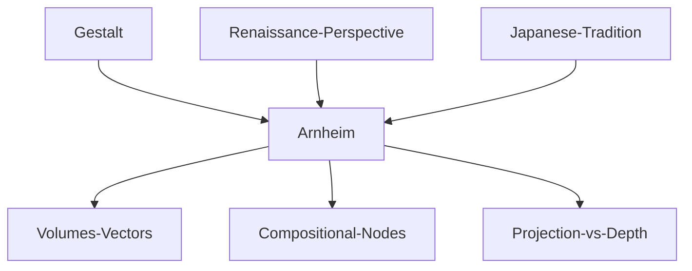

---

cssclasses:
  - Philosophy
  - Arts
  - Psychology
subclasses:
  - Aesthetics
  - Design-Theory
related:
  - "[[Two space systems & The centres and their rivals (1 of 6)]]"
  - "[[Observer as centre & Limits and frames (2 of 6)]]"
  - "[[Round and square (3 of 6)]]"
  - "[[Centres as pivots & Centres as dividing elements (4 of 6)]]"
  - "[[Volumes and nodes & Space in depth (5 of 6)]]"
  - "[[Centres and grids in buildings & More (6 of 6)]]"
aliases:
  - visual volumes
  - compositional nodes
  - spatial vectors
  - pictorial depth
  - frontal projection
  - perspective center
  - centripetal forces
  - body dynamics
  - spatial closure
  - vanishing point
reference:
  - "Arnheim, R. (1994). Il potere del centro: psicologia della composizione nelle arti visive (Nuova versione). Einaudi. (pp. 166-213)"
tags:
  - Podcast
---

#### Podcast

<iframe allow="autoplay *; encrypted-media *; fullscreen *; clipboard-write" frameborder="0" height="150" style="width:100%;overflow:hidden;border-radius:10px;background:transparent;" sandbox="allow-forms allow-popups allow-same-origin allow-scripts allow-storage-access-by-user-activation allow-top-navigation-by-user-activation" src="https://embed.podcasts.apple.com/us/podcast/the-power-of-the-center-a-study-of-composition/id1786764068?i=1000683397772&uo=4&l=en-GB&theme=auto"></iframe>

> [!tip] This episode is part of a series — click "See More" for all the episodes.

---

#### Central Problem

How do volumes (centric masses) and vectors (directed forces) interact in visual composition? And how do frontal projection and three-dimensional disposition relate in pictorial space, especially when perspective introduces a vanishing point that competes with the compositional center of equilibrium?

#### Main Thesis

Volumes and vectors are always present together in the artwork: volumes impress us through their *being* (weight, mass), vectors through their *acting* (direction, force). Nodes—centers generated by the interlacing of vectors—create centric weight through bundles of concentric rays, convergences toward a common center, crossings, overlappings, acts of grasping, and contractions. The human body, with its rich articulations (torso, limbs, face, hands), is particularly suited to create expressive nodes. In the dimension of depth, frontal projection and three-dimensional vision coexist and interact: central perspective provides a powerful center but also creates spatial ambiguity, while the frontal plane always maintains priority as the primary surface of the pictorial medium.

#### Historical Context

The text traverses art history from archaic sculpture (Easter Island monoliths) to the twentieth century (Barlach, Picasso), analyzing how different styles—classicism, baroque, cubism—manipulate the relationship between volumes and vectors. Particular attention is given to the Renaissance and the discovery of central perspective, which introduces a new centric system into pictorial space. Arnheim also discusses the Japanese tradition (ukiyo-e, Nō theater), which presents an open and subdivided space, in contrast to the closed interior typical of the West.

#### Philosophical Lineage

#### Key Thinkers

| Thinker | Dates | Movement | Main Work | Core Concept |
|---------|-------|----------|-----------|--------------|
| [[Arnheim]] | 1904–2007 | [[Gestalt]] | *The Power of the Center* | Volumes, vectors, nodes |
| [[Chardin]] | 1699–1779 | [[French Realism]] | Still lifes | Choreography of objects |
| [[Degas]] | 1834–1917 | [[Impressionism]] | Ballets, bathers | Centric closures, frame cropping |
| [[Barlach]] | 1870–1938 | [[Expressionism]] | *Singing Man* | Node of vectors in sculpture |
| [[Tintoretto]] | 1518–1594 | [[Venetian Mannerism]] | *Christ on the Sea of Galilee* | Symbolism of dimensions |
| [[Bouts]] | 1415–1475 | [[Early Netherlandish]] | *Last Supper* | Perspective and centricity |

#### Key Concepts

| Concept | Definition | Related to |
|---------|------------|------------|
| Volume | Centric mass that impresses through its being, its weight | [[Arnheim]], centric system |
| Vector | Directed force that impresses through its acting, its movement | [[Arnheim]], eccentric system |
| Node | Compositional center generated by the interlacing of vectors in complex configurations | [[Arnheim]], crossing, contraction |
| Microtheme | Small concentrated version of the main subject, often staged by the hands | [[Arnheim]], center of equilibrium |
| Centric closure | Spatial limits internal to the painting that surround and constrain the scene | [[Arnheim]], container |
| Frontal projection | View of the scene on the frontal plane, prioritized as the primary surface of the pictorial medium | [[Arnheim]], two-dimensionality |
| Vanishing point | Perspective center that oscillates between frontal plane and distant horizon | [[Arnheim]], spatial ambiguity |

#### Authors Comparison

| Theme | [[Arnheim]] | Traditional View |
|-------|-------------|------------------|
| Volumes/vectors | Always present together, inseparable | Separate categories |
| Nodes | Dynamic centers of concentrated energy | Simple static crossings |
| Frontal plane | Maintains perceptual priority | Transparent window |
| Perspective | Creates ambiguity between projection and depth | Objective representation |
| Human body | System of expressive nodes (torso, limbs, face, hands) | Static anatomy |

#### Influences & Connections

- **Predecessors:** [[Arnheim]] ← influenced by ← [[Gestalt]], [[Lynch]]
- **Art historical sources:** [[Chardin]], [[Degas]], [[Barlach]], [[Tintoretto]], [[Bouts]]
- **Cross-cultural:** [[Arnheim]] ← references ← Japanese art (fukitsuki yatai, mudra)
- **Applications:** [[Arnheim]] → applied to → painting, sculpture, architecture, dance, theater

#### Summary Formulas

- **[[Arnheim]] on volumes and vectors:** Volumes create centers through mass; vectors contribute to centers by interlacing into nodes. Each artistic style varies the relationship between massive weight and directed action.
- **[[Arnheim]] on body nodes:** The human body is a system of expressive nodes organized around two centers (head and pelvic area), with face and hands particularly suited to staging microthemes.
- **[[Arnheim]] on spatial depth:** Frontal projection and three-dimensional vision coexist; the frontal plane symbolizes the meaning of the scene while depth shows its physical configuration.

#### Notable Quotes

> "Volumes impress us first of all through their being, vectors through their acting." — [[Arnheim]]

> "Nodes create centric weight through various means: bundles of concentric rays, convergences toward a common center, crossings, overlappings, acts of grasping or surrounding, contractions." — [[Arnheim]]

> "Frontal projection always maintains its priority as the primary surface of the pictorial medium. Although compositional emphasis may shift to three-dimensional arrangement, the projection continues to symbolize the meaning of the scene." — [[Arnheim]]

---

> [!warning]-
> This annotation was normalised using a large language model and may contain inaccuracies. These texts serve as preliminary study resources rather than exhaustive references.
