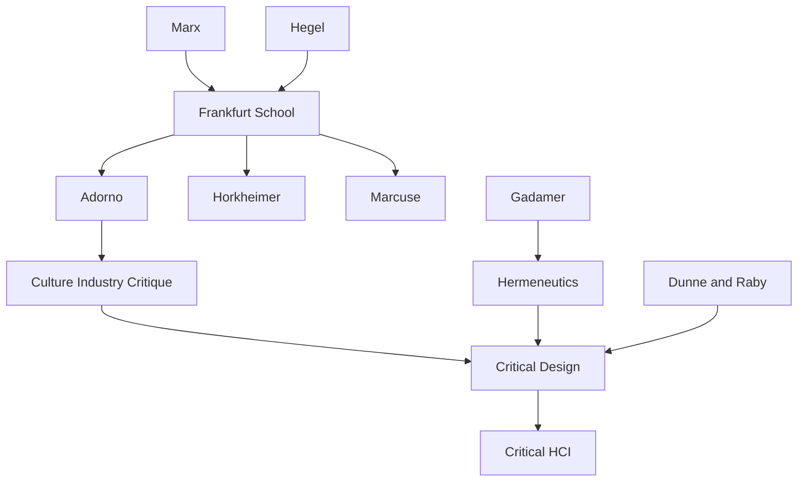

---

cssclasses:
  - Philosophy
  - Computer-Science
  - Arts
subclasses:
  - Critical-Design
  - Human-Computer-Interaction
  - Critical-Theory
related:
  - "[[Critical Design]]"
  - "[[Frankfurt School]]"
  - "[[HCI]]"
  - "[[Dunne]]"
  - "[[Raby]]"
  - "[[Reification]]"
aliases:
  - critical design
  - criticality design
  - frankfurt school
  - reification design
  - affirmative design
  - hci criticism
  - design critique
  - dunne raby
  - ideology critique
  - metacriticism design
reference:
  - Bardzell, J., & Bardzell, S. (2013). What is “critical” about critical design? Proceedings of the SIGCHI Conference on Human Factors in Computing Systems, 3297–3306. https://doi.org/10.1145/2470654.2466451
tags:
  - Podcast
---

#### Podcast

<iframe allow="autoplay *; encrypted-media *; fullscreen *; clipboard-write" frameborder="0" height="150" style="width:100%;overflow:hidden;border-radius:10px;background:transparent;" sandbox="allow-forms allow-popups allow-same-origin allow-scripts allow-storage-access-by-user-activation allow-top-navigation-by-user-activation" src="https://embed.podcasts.apple.com/us/podcast/what-is-critical-about-critical-design/id1786764068?i=1000681225391&uo=4&l=en-GB&theme=auto"></iframe>

---

#### Central Problem

What exactly makes critical design "critical"? The paper addresses the conceptual confusion surrounding critical design in HCI, where the term is used promiscuously without clear understanding of what criticality entails. Bardzell and Bardzell confront the tension between critical design's provocative aesthetic strategies and its claims to social and political critique. The central question becomes: can critical design's methods actually achieve the ideological unmasking and social transformation that critical theory demands?

#### Main Thesis

Critical design, to be genuinely critical, must be understood through the lens of Frankfurt School critical theory, particularly its analysis of reification, ideology, and the culture industry. The authors argue that criticality involves more than aesthetic defamiliarization or provocation—it requires revealing how social arrangements that appear natural are actually historical constructions serving particular interests.

The thesis distinguishes between "affirmative" design (which accepts existing social conditions and works within them) and "critical" design (which challenges those conditions and exposes their contingency). For design to achieve genuine criticality, it must combine aesthetic disruption with substantive analysis of power, ideology, and social structures. Without this theoretical grounding, critical design risks becoming merely stylistic novelty or bourgeois provocation.

#### Historical Context

Critical design emerged in the 1990s through the work of [[Dunne]], [[Raby]] at the Royal College of Art, building on earlier avant-garde traditions of using design to challenge social norms. Their concept of "design noir" and later "speculative design" proposed using fictional scenarios and provocative objects to question technological optimism and consumer culture.

The Frankfurt School, particularly [[Adorno]] and [[Horkheimer]]'s critique of the culture industry, provides the philosophical backdrop. Their analysis of how mass culture neutralizes critical potential by commodifying everything—including critique itself—poses fundamental challenges for any design practice claiming critical status.

HCI's adoption of critical design reflects the field's broader turn from purely instrumental concerns toward questions of values, experience, and social impact. Yet this adoption often strips critical design of its theoretical foundations, reducing it to aesthetic technique. Bardzell and Bardzell intervene to restore philosophical rigor.

#### Philosophical Lineage

#### Key Thinkers

| Thinker | Dates | Movement | Main Work | Core Concept |
|---------|-------|----------|-----------|--------------|
| [[Adorno]] | 1903-1969 | [[Frankfurt School]] | *Dialectic of Enlightenment* | Culture industry, negative dialectics |
| [[Horkheimer]] | 1895-1973 | [[Frankfurt School]] | *Critical Theory* | Traditional vs. critical theory |
| [[Marcuse]] | 1898-1979 | [[Frankfurt School]] | *One-Dimensional Man* | Repressive desublimation |
| [[Dunne]], [[Raby]] | 1960s- | [[Critical Design]] | *Speculative Everything* | Design noir, speculative design |
| [[Gadamer]] | 1900-2002 | [[Hermeneutics]] | *Truth and Method* | Historically effected consciousness |
| [[Barthes]] | 1915-1980 | [[Semiotics]] | *Mythologies* | Ideology as naturalization |

#### Key Concepts

| Concept | Definition | Related to |
|---------|------------|------------|
| Reification | Process by which social relations appear as thing-like, natural, and unchangeable | [[Marx]], [[Lukács]], [[Frankfurt School]] |
| Affirmative design | Design that accepts existing social conditions and works within them | [[Critical Design]], [[Marcuse]] |
| Critical design | Design that challenges social conditions and exposes their contingency | [[Dunne]], [[Raby]], [[Frankfurt School]] |
| Culture industry | Mass cultural production that neutralizes critique by commodifying it | [[Adorno]], [[Horkheimer]] |
| Ideology | Systems of belief that naturalize particular interests as universal truth | [[Marx]], [[Critical Theory]] |
| Metacriticism | Reflection on the conditions of possibility and limits of critique itself | [[Bardzell]], [[Critical Theory]] |

#### Authors Comparison

| Theme | [[Adorno]] | [[Dunne]], [[Raby]] | [[Bardzell]] |
|-------|------------|-------------------|--------------|
| Central concern | Culture industry, administered life | Consumer design, technological optimism | Criticality in HCI |
| Method | Negative dialectics | Speculative objects | Philosophical analysis |
| View of design | Complicit with domination | Potential site of critique | Ambiguous potential |
| Political stance | Pessimistic Marxism | Post-political provocation | Critical pragmatism |

#### Influences & Connections

- **Predecessors:** [[Bardzell]] ← influenced by ← [[Adorno]], [[Horkheimer]], [[Gadamer]], [[Dunne]], [[Raby]]
- **Contemporaries:** [[Bardzell]] ↔ dialogue with ↔ HCI community, [[Critical Design]] practitioners
- **Followers:** [[Bardzell]] → influenced → HCI researchers adopting critical approaches
- **Opposing views:** Instrumental HCI ← challenged by ← [[Critical HCI]]

#### Summary Formulas

- **Criticality defined:** Genuine criticality reveals how apparently natural social arrangements are historically contingent constructions serving particular interests.
- **Affirmative vs. critical:** Affirmative design works within existing conditions; critical design challenges and exposes their contingency.
- **Frankfurt School foundation:** Critical design's theoretical legitimacy requires grounding in critical theory's analysis of reification, ideology, and the culture industry.
- **Metacritical reflection:** Critical design must reflect on its own conditions of possibility and the limits of critique within capitalist culture.

#### Timeline

| Year | Event |
|------|-------|
| 1944 | [[Adorno]] and [[Horkheimer]] publish *Dialectic of Enlightenment* |
| 1964 | [[Marcuse]] publishes *One-Dimensional Man* |
| 1999 | [[Dunne]], [[Raby]] publish *Design Noir* |
| 2001 | [[Dunne]], [[Raby]] establish "critical design" as term |
| 2009 | Critical design gains prominence in HCI |
| 2013 | [[Bardzell]] publish "What is Critical About Critical Design?" |

#### Notable Quotes

> "Critical design is not merely provocative or defamiliarizing; it must reveal how apparently natural social arrangements are historically contingent constructions."

> "The Frankfurt School's analysis of the culture industry poses a fundamental challenge: can any design practice escape commodification and achieve genuine critique?"

> "Affirmative design accepts the world as it is; critical design challenges the givenness of that world and exposes its contingency."

---
> [!warning]-
> This annotation was normalised using a large language model and may contain inaccuracies. These texts serve as preliminary study resources rather than exhaustive references.
