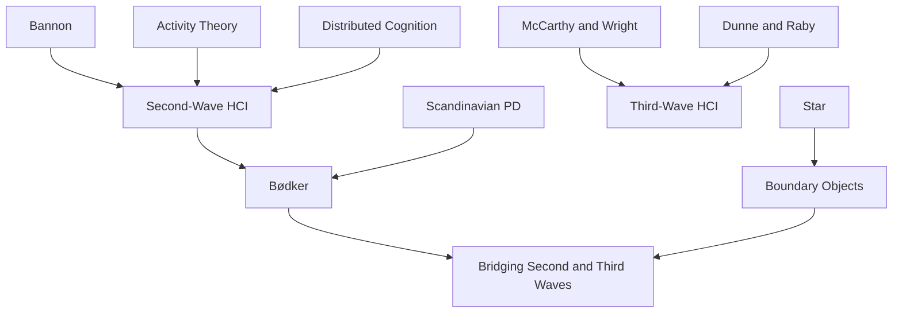

---
cssclasses:
  - Computer-Science
  - Philosophy
subclasses:
  - Human-Computer-Interaction
  - Participatory-Design
  - Design-Theory
related:
  - "[[HCI]]"
  - "[[Second-wave HCI]]"
  - "[[Third-wave HCI]]"
  - "[[Activity Theory]]"
  - "[[Participatory Design]]"
  - "[[Third-wave HCI, 10 years later]]"
  - "[[Fourth-Wave HCI Meets the 21st Century Manifesto]]"
aliases:
  - second wave
  - third wave
  - hci waves
  - multiplicity context
  - context hci
  - experience design
  - webs technology
  - boundary work
  - tailorability systems
  - human actors
reference:
  - Bødker, S. (2006). When second wave HCI meets third wave challenges. Proceedings of the 4th Nordic Conference on Human-Computer Interaction Changing Roles - NordiCHI ’06, 1–8. https://doi.org/10.1145/1182475.1182476
---

#### Central Problem

The paper addresses how second-generation HCI theory can meet the challenges posed by the emerging third wave. As technology spreads from the workplace into homes, leisure, and all aspects of everyday life, HCI faces new questions about context, multiplicity, experience, and participation. The central tension lies between second-wave methods developed for work settings and third-wave concerns with non-work, non-purposeful, emotional, and cultural dimensions of interaction.

#### Main Thesis

Second-wave HCI should not be abandoned but rather transcended and integrated with third-wave insights. [[Bødker]] argues that the second wave's emphasis on context, multiplicity, experience, and participation remains valuable but must be extended beyond workplace settings to embrace "people's whole lives." The thesis challenges the dichotomy between work/rationality (second wave) and leisure/emotion (third wave), proposing that HCI must address how technologies cross these boundaries.

The paper develops several key themes: multiplicity of interaction (users engage with configurations of mediators, not single devices); context and changing use contexts (mobile technology requires rethinking place-based assumptions); experience and reflexivity (drawing on [[McCarthy]], [[Wright]]'s pragmatist approach); and participation revisited (extending participatory design beyond workplace into everyday life).

#### Historical Context

The paper emerges as a keynote address at NordiCHI 2006, marking a moment of reflection on HCI's trajectory. The first wave (1980s) drew on cognitive science and human factors, treating users as subjects for systematic testing. The second wave (1990s) shifted focus to groups, workplaces, and situated practice, drawing on activity theory, distributed cognition, and ethnomethodology.

By 2006, the third wave was emerging through work on domestic technologies, ubiquitous computing, and experience design. Researchers like [[Dunne]], [[Raby]] challenged HCI's instrumental focus, while [[McCarthy]], [[Wright]] developed experience-centered frameworks. The proliferation of mobile devices, home computing, and internet technologies made clear that HCI could no longer focus solely on workplace interaction.

The Scandinavian tradition of participatory design, which [[Bødker]] helped develop, provides important background—its democratic commitments and user involvement methods needed updating for consumer technology contexts.

#### Philosophical Lineage

#### Key Thinkers

| Thinker | Dates | Movement | Main Work | Core Concept |
|---------|-------|----------|-----------|--------------|
| [[Bødker]] | 1954- | [[HCI]], [[Participatory Design]] | "When Second Wave HCI Meets Third Wave Challenges" | HCI waves framework |
| [[Bannon]] | - | [[HCI]] | "From Human Factors to Human Actors" | Human actors paradigm |
| [[McCarthy]], [[Wright]] | - | [[HCI]] | *Technology as Experience* | Felt experience, pragmatist HCI |
| [[Star]] | 1954-2010 | [[CSCW]], [[STS]] | Boundary objects concept | Boundary objects |
| [[Dunne]], [[Raby]] | 1960s- | [[Critical Design]] | *Design Noir* | Design provocation |

#### Key Concepts

| Concept | Definition | Related to |
|---------|------------|------------|
| Second-wave HCI | HCI paradigm focused on workplace groups, situated action, and participatory design | [[Bannon]], [[Activity Theory]] |
| Third-wave HCI | HCI paradigm focused on everyday life, experience, emotion, and meaning | [[McCarthy]], [[Wright]], [[Experience Design]] |
| Multiplicity of interaction | Users engage with configurations of multiple mediators, not single isolated devices | [[Bødker]], [[Activity Theory]] |
| Webs-of-technology | Networks of technological artifacts that must be understood relationally | [[Bødker]], [[Ubicomp]] |
| Boundary resources | Elements that exist at boundaries between contexts and enable crossing them | [[Star]], [[CSCW]] |

#### Authors Comparison

| Theme | First Wave | Second Wave | Third Wave |
|-------|------------|-------------|------------|
| Time period | 1980s | 1990s | 2000s |
| Focus | Individual cognition | Workplace groups | Everyday life |
| Theory | Cognitive science | Activity theory, ethnomethodology | Experience, aesthetics |
| Method | Controlled testing | Participatory design, ethnography | Cultural probes, design research |
| Values | Efficiency | Collaboration, democracy | Experience, meaning |

#### Influences & Connections

- **Predecessors:** [[Bødker]] ← influenced by ← [[Bannon]], [[Engeström]], Scandinavian PD tradition
- **Contemporaries:** [[Bødker]] ↔ dialogue with ↔ [[McCarthy]], [[Wright]], [[Dunne]], [[Raby]], [[Star]]
- **Followers:** [[Bødker]] → influenced → third-wave HCI researchers, experience design practitioners
- **Opposing views:** First-wave cognitivism ← challenged by ← second and third-wave approaches

#### Summary Formulas

- **Wave framework:** HCI evolves through waves—from human factors (first) to workplace collaboration (second) to everyday experience (third)—but each wave incorporates rather than replaces earlier insights.
- **Multiplicity:** Users never interact with single devices but with configurations of mediators that must be designed together.
- **Context transcended:** Context is not a fixed container but dynamic, and technologies increasingly cross boundaries between work, home, and leisure.
- **Experience and reflexivity:** Third-wave attention to experience must include reflection and learning, not just immediate sensation.
- **Participation extended:** Participatory design must move beyond factory gates into consumer technology and everyday life.

#### Timeline

| Year | Event |
|------|-------|
| 1986 | [[Bannon]] publishes "From Human Factors to Human Actors" |
| 1991 | [[Bødker]] publishes *Through the Interface* |
| 1994 | [[Star]] introduces boundary objects concept |
| 2001 | [[Dunne]], [[Raby]] publish *Design Noir* |
| 2004 | [[McCarthy]], [[Wright]] publish *Technology as Experience* |
| 2006 | [[Bødker]] delivers NordiCHI keynote on HCI waves |

#### Notable Quotes

> "The second and the third wave seem to be stuck on either side of the divide between work on the one hand and leisure, arts, and home on the other; between rationality on the one hand and emotion on the other."

> "I don't believe that we get there until we embrace people's whole lives and transcend the dichotomies between work, rationality, etc. and their negations."

> "We are still stuck with the idea that new design should replace existing mediators, rather than exist together with them."

---
> [!warning]-
> This annotation was normalised using a large language model and may contain inaccuracies. These texts serve as preliminary study resources rather than exhaustive references.
