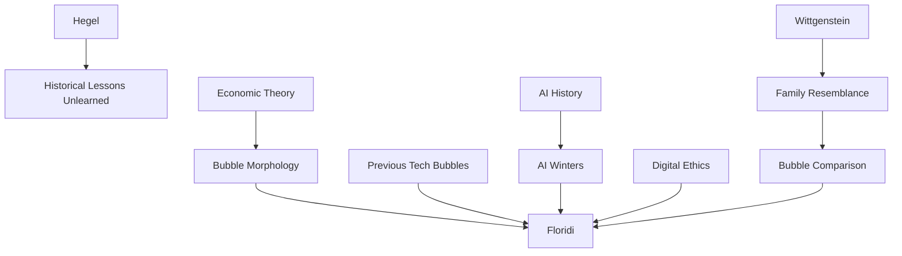

---

cssclasses:
  - Computer-Science
  - Economics
  - Philosophy
subclasses:
  - Artificial-Intelligence
  - Philosophy-of-Science
  - Applied-Ethics
related:
  - "[[AI]]"
  - "[[Tech Bubble]]"
  - "[[AI Winter]]"
  - "[[Speculation]]"
  - "[[Digital Ethics]]"
aliases:
  - ai bubble
  - tech bubble
  - ai hype
  - ai winter
  - dot com
  - cryptocurrency bubble
  - speculation bubble
  - fomo investing
  - valuation bubble
  - regulation ai
reference:
  - Floridi, L. (2024). Why the AI Hype is Another Tech Bubble. Philosophy & Technology, 37(4). https://doi.org/10.1007/s13347-024-00817-w
tags:
  - Podcast
---

#### Podcast

<iframe allow="autoplay *; encrypted-media *; fullscreen *; clipboard-write" frameborder="0" height="150" style="width:100%;overflow:hidden;border-radius:10px;background:transparent;" sandbox="allow-forms allow-popups allow-same-origin allow-scripts allow-storage-access-by-user-activation allow-top-navigation-by-user-activation" src="https://embed.podcasts.apple.com/us/podcast/why-the-ai-hype-is-another-tech-bubble/id1786764068?i=1000681316051&uo=4&l=en-GB&theme=auto"></iframe>

---

#### Central Problem

The paper confronts whether the current Artificial Intelligence hype constitutes another tech bubble—and if so, what this means for the technology's future and society's response. [[Floridi]] addresses the pattern of boom-and-bust cycles in technology sectors, examining whether AI exhibits the characteristic features of previous bubbles (Dot-Com, Telecom, Cryptocurrency, etc.) and warning that the bubble's eventual burst could trigger a new AI Winter with significant consequences for research, investment, and adoption.

#### Main Thesis

The current AI hype cycle exhibits all the defining characteristics of a tech bubble: enormous price increases disconnected from fundamentals, new and flawed valuation paradigms, retail investor FOMO, regulatory gaps, and widespread media hype. [[Floridi]] argues that this bubble, centered on generative AI and large language models since ChatGPT's release in November 2022, will likely follow the same trajectory as previous tech bubbles—culminating in a market correction that risks overcorrection and potential AI Winter.

The thesis draws on comparative analysis of five previous tech bubbles to extract invariant features and lessons. Despite these historical precedents, the technology industry appears to have learned nothing from past bubbles—the same patterns of speculation, inflated valuations, and unsustainable business models recur. The challenge is not to prevent the bubble's burst but to minimize its destructive impact.

#### Historical Context

The paper appears in late 2024, approximately two years after ChatGPT's public release catalyzed an unprecedented surge of AI investment, media attention, and speculative activity. This period saw AI companies achieve extraordinary valuations despite limited profitability—OpenAI, for example, was valued at over $100 billion while reportedly losing $5 billion annually.

[[Floridi]] situates AI hype within the longer history of tech bubbles: the Dot-Com Bubble (1995-2000), the Telecom Bubble (1996-2002), the Chinese Tech Bubble (2014-2015), the Cryptocurrency Bubble (2011-present), and the COVID-era Tech Stock Bubble (2020-2021). Each followed similar patterns and should have taught similar lessons—but these lessons remain unlearned.

The essay also notes AI's own history of cycles—previous "AI Summers" followed by "AI Winters" when expectations outpaced capabilities. The current hype risks triggering another such winter, damaging legitimate AI research and beneficial applications.

#### Philosophical Lineage

#### Key Thinkers

| Thinker | Dates | Movement | Main Work | Core Concept |
|---------|-------|----------|-----------|--------------|
| [[Floridi]] | 1964- | [[Digital Ethics]] | *The Ethics of Artificial Intelligence* | Information philosophy, digital ethics |
| [[Hegel]] | 1770-1831 | [[German Idealism]] | *Philosophy of History* | Learning from history |
| [[Wittgenstein]] | 1889-1951 | [[Analytic Philosophy]] | *Philosophical Investigations* | Family resemblance |

#### Key Concepts

| Concept | Definition | Related to |
|---------|------------|------------|
| Tech bubble | Market phenomenon with rapid, unsustainable growth in tech valuations driven by speculation rather than fundamentals | [[Economics]], [[Finance]] |
| AI Winter | Period of reduced funding, interest, and research activity in AI following deflated expectations | [[AI History]], [[Research Policy]] |
| FOMO | Fear of missing out; psychological driver of speculative investment in emerging technologies | [[Behavioral Economics]], [[Bubbles]] |
| Regulatory gap | Situation where regulatory frameworks are absent or lag behind market developments | [[Policy]], [[Governance]] |
| Greater fool theory | Speculation that overvalued assets can be sold at higher prices to subsequent buyers | [[Economics]], [[Speculation]] |

#### Authors Comparison

| Theme | Dot-Com Bubble | Crypto Bubble | AI Bubble |
|-------|----------------|---------------|-----------|
| Core technology | Internet/Web | Blockchain | Generative AI/LLMs |
| New metrics | Eyeballs, page views | Total value locked | Model parameters, benchmarks |
| Regulatory status | Emerging | Largely absent | Lagging (EU AI Act) |
| Retail participation | Significant | Dominant | Growing |
| Duration | ~5 years | ~13+ years (cycles) | ~2 years (ongoing) |

#### Influences & Connections

- **Historical precedents:** [[Floridi]] ← learns from ← Dot-Com, Telecom, Chinese Tech, Crypto, COVID Tech bubbles
- **Philosophical framework:** [[Wittgenstein]]'s family resemblance → applied to → bubble comparison
- **Warning:** [[Hegel]]'s dictum about learning from history → confirmed by → repeated bubble patterns
- **Policy implications:** Bubble analysis → informs → regulatory recommendations

#### Summary Formulas

- **Bubble morphology:** Tech bubbles share five features: disruptive technology at core, speculation outpacing reality, new valuation paradigms, retail investor FOMO, regulatory gaps and lag.
- **Nothing learned:** "The only thing we learn from the history of tech bubbles is that we learn nothing from it" (paraphrasing [[Hegel]]).
- **AI-specific risks:** AI hype compounds general bubble risks with AI-specific dangers including AI washing, talent war inflation, and potential new AI Winter.
- **Mitigation strategy:** Focus on sustainable business models, maintain critical perspective, prioritize longer-term thinking, support appropriate regulation.

#### Timeline

| Year | Event |
|------|-------|
| 1995-2000 | Dot-Com Bubble inflates |
| 2000-2002 | Dot-Com and Telecom Bubbles burst |
| 2015 | Chinese Tech Bubble correction |
| 2017-2018 | First major Cryptocurrency bubble cycle |
| 2020-2021 | COVID-era Tech Stock Bubble |
| 2022 | ChatGPT released, AI hype accelerates |
| 2024 | [[Floridi]] publishes bubble analysis |

#### Notable Quotes

> "The only thing we learn from the history of tech bubbles is that we learn nothing from it."

> "This time is not different. The AI bubble will probably follow the same pattern as the other five analysed in this article."

> "I do not hope that what I have argued in this article will make any significant difference. It is written not with hope—which would be epistemically unreasonable—but for hope—which may be morally commendable."
> This annotation was normalised using a large language model and may contain inaccuracies. These texts serve as preliminary study resources rather than exhaustive references.
---
> [!warning]-
> This annotation was normalised using a large language model and may contain inaccuracies. These texts serve as preliminary study resources rather than exhaustive references.