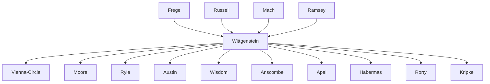

---
cssclasses:
  - Philosophy
subclasses:
  - Philosophy-of-Language
  - Analytic-Philosophy
  - 20th-Century-Philosophy
aliases:
  - wittgenstein
  - tractatus
  - language games
  - picture theory
  - logical atomism
  - tautology
  - ordinary language
  - linguistic turn
  - saying showing
  - nonsense
  - philosophy therapy
  - family resemblance
contributions:
  - Conceptual
authors:
  - "[[Wittgenstein]]"
  - "[[Russell]]"
  - "[[Frege]]"
  - "[[Moore]]"
  - "[[Ramsey]]"
reference: "[[06 The search for thought - Unit 13 Chapter 1.pdf]]"
---

#### Central Problem

The central problem addressed by Wittgenstein's philosophy is the relationship between language, thought, and reality. What are the limits of what can meaningfully be said? How does language connect to the world it describes? And what is the proper role of philosophy in clarifying or dissolving conceptual confusions?

In his early work, the *Tractatus Logico-Philosophicus* (1921), Wittgenstein sought to determine the logical structure that language must possess in order to represent reality. The key insight is that there is no intermediate sphere of "thought" or "knowledge" mediating between world and language — thought simply *is* language, and language is the logical picture of reality. This leads to a radical delimitation: whatever cannot be expressed in meaningful propositions must be passed over in silence, including ethics, aesthetics, metaphysics, and the very conditions that make language possible.

In his later work, the *[[Wittgenstein on Language and Thought|Philosophical Investigations]]* (published posthumously 1953), Wittgenstein abandons the idea of a single logical structure underlying all language. Instead, he recognizes language as a multiplicity of "language games" — different rule-governed practices serving different purposes. The question shifts from "What is the essence of language?" to "How is language actually used?" Philosophy's task becomes therapeutic: dissolving pseudo-problems that arise from misunderstanding how language works.

#### Main Thesis

**Early Wittgenstein (Tractatus):**

The *Tractatus* advances a **picture theory of language**: propositions are logical pictures of facts. The world consists of facts (states of affairs), not things; facts are combinations of simple objects. Propositions mirror the logical structure of facts — they share a common "logical form" with what they represent.

Key claims include:
- **Thought = Language**: "The logical picture of facts is the thought" (prop. 3). There is no separate mental realm; thinking is the manipulation of propositions.
- **Atomic propositions** represent atomic facts; complex propositions are truth-functions of atomic ones.
- **Tautologies** (like "It is raining or not raining") are necessarily true but say nothing about the world; they show logical structure.
- **Contradictions** are necessarily false and equally non-informative.
- **Meaningful propositions** describe possible states of affairs; their truth depends on whether those states obtain.
- **Nonsense** results from violating logical syntax — attempting to say what can only be *shown*.

The limits of language are the limits of the world: "What we cannot speak about we must pass over in silence" (prop. 7). Ethics, aesthetics, the meaning of life, and the "mystical" cannot be stated, only shown.

**Later Wittgenstein (Philosophical Investigations):**

The later work rejects the idea of one ideal logical language. Instead:
- **Meaning is use**: "If we had to name anything which is the life of the sign, we should have to say that it was its use."
- **Language games**: Language consists of diverse, rule-governed practices — describing, commanding, questioning, thanking, cursing, praying, etc. Each game has its own rules; there is no single essence.
- **Family resemblances**: Different language games are related like members of a family — overlapping similarities without a common core.
- **Philosophy as therapy**: Philosophical problems arise when "language goes on holiday" — when words are torn from their everyday use. Philosophy's role is to return words to their ordinary use, dissolving rather than solving problems.
- **Against private language**: Meaning is public and social; a purely private language is impossible because there would be no criterion for correct use.

#### Historical Context

Wittgenstein was born in Vienna in 1889 into one of Europe's wealthiest families (steel magnates). Initially trained as an engineer in Berlin and Manchester, his interest shifted to the foundations of mathematics. The decisive encounter came in 1911 when he met [[Frege]] in Jena, who directed him to Cambridge to study with [[Russell]].

At Cambridge (1912-1913), Wittgenstein engaged intensively with Russell, who was publishing the *Principia Mathematica*. Their relationship became one of mutual influence — Russell credited Wittgenstein with key insights about the tautological nature of logic.

In 1913 Wittgenstein retreated to Norway in solitude. When World War I broke out, he enlisted in the Austrian army and was captured by Italians in 1918. While imprisoned near Cassino, he completed the *Tractatus*. The work appeared in German in 1921 and in English (with Russell's introduction) in 1922.

After the war, believing he had solved the essential problems of philosophy, Wittgenstein abandoned academic life. He gave away his inheritance, worked as an elementary school teacher in rural Austria (1920-1926), then as a gardener and architect (designing his sister's house in Vienna with architect Paul Engelmann — a building that embodied the Tractatus's principles of logical clarity and absence of ornament).

In 1929, encouraged by his friends and the Vienna Circle philosophers who had adopted the *Tractatus* as foundational, Wittgenstein returned to Cambridge. He became professor in 1939 (succeeding Moore) and obtained British citizenship after Austria's annexation by Nazi Germany. During World War II he worked as a hospital orderly.

From the early 1930s, Wittgenstein began radically revising his earlier views, influenced by discussions with Ramsey, Brouwer, and members of the Vienna Circle. The *[[Wittgenstein on Language and Thought|Philosophical Investigations]]*, composed between 1935-1949, was published posthumously in 1953. Wittgenstein died of prostate cancer in 1951.

#### Philosophical Lineage

#### Key Thinkers

| Thinker | Dates | Movement | Main Work | Core Concept |
|---------|-------|----------|-----------|--------------|
| [[Wittgenstein]] | 1889-1951 | [[Analytic Philosophy]] | *Tractatus Logico-Philosophicus* / *Philosophical Investigations* | Picture theory; Language games |
| [[Frege]] | 1848-1925 | [[Logicism]] | *Begriffsschrift* | Sense and reference; Logical notation |
| [[Russell]] | 1872-1970 | [[Logical Atomism]] | *Principia Mathematica* | Logical analysis; Theory of descriptions |
| [[Ramsey]] | 1903-1930 | [[Analytic Philosophy]] | *Foundations of Mathematics* | Pragmatic theory of belief |
| [[Moore]] | 1873-1958 | [[Analytic Philosophy]] | *Principia Ethica* | Common sense philosophy |
| [[Austin]] | 1911-1960 | [[Ordinary Language Philosophy]] | *How to Do Things with Words* | Speech act theory |
| [[Ryle]] | 1900-1976 | [[Ordinary Language Philosophy]] | *The Concept of Mind* | Category mistakes |

#### Key Concepts

| Concept | Definition | Related to |
|---------|------------|------------|
| Picture Theory | Language represents reality by sharing logical form with facts; propositions are logical pictures | [[Wittgenstein]], Tractatus |
| Atomic Fact (Sachverhalt) | The simplest, indecomposable facts constituting reality; combinations of simple objects | [[Wittgenstein]], [[Russell]] |
| Tautology | Propositions true under all possible truth conditions, revealing logical form but saying nothing about the world | [[Wittgenstein]], Logic |
| Saying/Showing | Meaningful propositions say facts; logical form can only be shown, not said | [[Wittgenstein]], Tractatus |
| The Mystical | What cannot be expressed in language but "shows itself" — ethics, aesthetics, the meaning of life | [[Wittgenstein]], Tractatus |
| Language Game | Rule-governed linguistic practices; meaning arises from use within specific contexts | [[Wittgenstein]], Investigations |
| Family Resemblance | Relations between concepts/games based on overlapping similarities, not a shared essence | [[Wittgenstein]], Investigations |
| Form of Life | The broader cultural and practical context in which language games are embedded | [[Wittgenstein]], Investigations |
| Philosophy as Therapy | Philosophy dissolves pseudo-problems by returning words from metaphysical to ordinary use | [[Wittgenstein]], Investigations |
| Private Language Argument | A purely private language is impossible; meaning requires public criteria for correct use | [[Wittgenstein]], Investigations |

#### Authors Comparison

| Theme | [[Wittgenstein]] (Early) | [[Wittgenstein]] (Later) | [[Russell]] |
|-------|--------------------------|--------------------------|-------------|
| Nature of language | Logical picture of reality | Multiplicity of language games | Logical analysis of ordinary language |
| Meaning | Correspondence to facts | Use in context | Reference to objects |
| Ideal language | One perfect logical language | No ideal; ordinary language is fine | Logically perfect language needed |
| Philosophy's task | Delimiting the sayable | Therapeutic dissolution of confusion | Logical analysis and construction |
| Logic | Shows structure, is tautological | One game among many | Foundation of mathematics |
| Metaphysics | Nonsense; must be shown, not said | Arises from language "going on holiday" | Possible through logical analysis |

#### Influences & Connections

- **Predecessors:** [[Wittgenstein]] ← influenced by ← [[Frege]], [[Russell]], [[Mach]], [[Schopenhauer]]
- **Contemporaries:** [[Wittgenstein]] ↔ dialogue with ↔ [[Ramsey]], [[Vienna Circle]], [[Moore]]
- **Followers:** [[Wittgenstein]] → influenced → [[Ryle]], [[Austin]], [[Anscombe]], [[Wisdom]], [[Kripke]]
- **Followers:** [[Wittgenstein]] → influenced → [[Apel]], [[Habermas]], [[Rorty]]
- **Opposing views:** [[Wittgenstein]] ← criticized by ← [[Popper]] (meaningfulness of metaphysics)

#### Summary Formulas

- **[[Wittgenstein]] (Tractatus):** Language is the logical picture of reality; what can be said can be said clearly, and what cannot be spoken of must be passed over in silence — philosophy's task is to delimit the thinkable by clarifying the limits of language.

- **[[Wittgenstein]] (Investigations):** Meaning is use within language games; philosophy's role is therapeutic — dissolving pseudo-problems that arise when language goes on holiday, returning words from metaphysical abstraction to their ordinary employment.

- **[[Russell]]:** Logical analysis can reveal the true logical form hidden beneath the misleading grammatical surface of ordinary language, enabling the construction of a philosophically perspicuous notation.

#### Timeline

| Year | Event |
|------|-------|
| 1889 | [[Wittgenstein]] born in Vienna |
| 1911 | [[Wittgenstein]] meets [[Frege]] in Jena; directed to Cambridge |
| 1912-1913 | [[Wittgenstein]] studies with [[Russell]] at Cambridge |
| 1918 | [[Wittgenstein]] captured by Italian forces; completes Tractatus in prison |
| 1921 | *Tractatus Logico-Philosophicus* published in German |
| 1922 | *Tractatus* published in English with [[Russell]]'s introduction |
| 1920-1926 | [[Wittgenstein]] works as elementary school teacher in Austria |
| 1926-1928 | [[Wittgenstein]] designs his sister's house in Vienna |
| 1929 | [[Wittgenstein]] returns to Cambridge; begins revising his views |
| 1933-1934 | *Blue Book* dictated at Cambridge |
| 1939 | [[Wittgenstein]] becomes professor at Cambridge |
| 1951 | [[Wittgenstein]] dies in Cambridge |
| 1953 | *Philosophical Investigations* published posthumously |

#### Notable Quotes

> "The limits of my language mean the limits of my world." — [[Wittgenstein]]

> "What we cannot speak about we must pass over in silence." — [[Wittgenstein]]

> "Philosophy is a battle against the bewitchment of our intelligence by means of language." — [[Wittgenstein]]

#### See Also

- [[Analytic Philosophy]]
- [[Logical Positivism]]
- [[Ordinary Language Philosophy]]
- [[Vienna Circle]]
- [[Philosophy of Language]]
- [[Tractatus Logico-Philosophicus]]
- [[Philosophical Investigations]]
- [[Logical Atomism]]
- [[Speech Act Theory]]
- [[Private Language Argument]]

> [!NOTE]
> *This summary has been created to present the key points from the source text, which was automatically extracted using LLM. Please note that the summary may contain errors. It serves as an essential starting point for study and reference purposes.*
