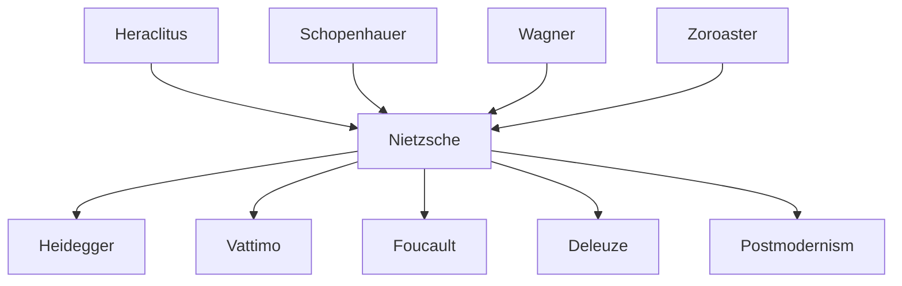

---
cssclasses:
  - Philosophy
subclasses:
  - 19th-Century-Philosophy
  - Continental-Philosophy
  - Ethics
related:
  - "[[Death of God]]"
  - "[[Zarathustra]]"
  - "[[Dionysian]]"
  - "[[Genealogy of Morals]]"
  - "[[Amor Fati]]"
  - "[[Master-Slave Morality]]"
  - "[[Anti-Christ]]"
  - "[[Postmodernism]]"
  - "[[Existentialism]]"
  - "[[Vitalism]]"
aliases:
  - eternal return
  - genealogy morality
  - master morality
  - slave morality
reference:
  - Abbagnano, N., & Fornero, G. (2012). La ricerca del pensiero. Vol. 3A. Da Schopenhauer a Freud. Paravia.
tags:
  - Podcast
---

#### Podcast

<iframe src="https://archive.org/embed/ssp-s05-e13" width="100%" height="30" frameborder="0" webkitallowfullscreen="true" mozallowfullscreen="true" allowfullscreen></iframe>

---

#### Central Problem

This chapter addresses [[Nietzsche]]'s mature philosophical project: having announced the death of God and the collapse of metaphysical certainties, how should humanity respond? Two fundamental paths emerge: the "last man" who retreats into comfortable mediocrity, or the "overman" (Übermensch) who affirms life fully and creates new values. The chapter explores [[Nietzsche]]'s constructive philosophy through three interconnected doctrines: the overman as a new human ideal, the eternal return as the supreme test of life-affirmation, and the will to power as the fundamental character of existence.

The central tension lies between life-denying forces (traditional morality, Christianity, metaphysics) that have dominated Western civilization and life-affirming forces that [[Nietzsche]] champions. The chapter also confronts the problem of nihilism: once all "supreme values" have been devalued, how does humanity avoid falling into meaninglessness? [[Nietzsche]] must show that rejecting transcendent values does not mean rejecting meaning altogether, but rather liberating humanity to create its own values.

#### Main Thesis

Nietzsche's constructive philosophy centers on three interrelated doctrines that together constitute his "philosophy of noon" — the moment of fullest light when the distinction between "true world" and "apparent world" dissolves.

**The Overman (Übermensch):** The overman is not a biological superman but a philosophical concept expressing a new mode of being. The overman is one who: accepts the tragic-Dionysian dimension of existence, says "yes" to life, endures the death of God without seeking substitutes, embraces eternal return, emancipates from traditional morality, exercises will to power creatively, and overcomes nihilism. The overman is "faithful to the earth," rejecting otherworldly hopes and affirming bodily existence. [[Nietzsche]] presents three metamorphoses of spirit: the camel (bearing tradition's burdens under "thou shalt"), the lion (destroying old values with "I will"), and the child (creating new values with innocent playfulness). Crucially, the overman is not an ideal for all humanity but for an elite — [[Nietzsche]]'s philosophy is explicitly aristocratic and anti-egalitarian.

**Eternal Return of the Same:** This doctrine holds that all events in the cosmos recur identically infinite times. Whether understood cosmologically, ethically (as a new categorical imperative), or metaphorically, eternal return serves as a test: can you affirm life so completely that you would will its eternal repetition? The "last man" recoils in horror; the overman responds with enthusiastic acceptance. Eternal return overcomes the "Oedipal structure of time" where each moment devours and is devoured, instead granting each instant intrinsic meaning. It represents "the supreme formula of affirmation."

**Will to Power:** This is the "innermost essence of being" — life itself understood as expansive, self-overcoming force. Will to power manifests as creativity, value-creation, and interpretation. Every living being expresses will to power; the overman represents its highest expression. However, will to power also has "cruder" dimensions involving domination and hierarchy that cannot be ignored.

**Critique of Morality and Christianity:** Through genealogical analysis, [[Nietzsche]] unmasks morality's psychological origins. Originally, "master morality" expressed aristocratic-warrior values (strength, health, pride). "Slave morality" arose through priestly ressentiment, inverting values: weakness became virtue, strength became evil. Christianity represents this slave revolt's triumph — "the most subterranean conspiracy against health, beauty, against life itself." [[Nietzsche]] calls for a "transvaluation of all values" — not mere reversal but a new relationship to values as human creations rather than metaphysical absolutes.

**Nihilism and Its Overcoming:** Nihilism — the devaluation of supreme values — results from discovering that metaphysical fictions (unity, truth, goodness) projected onto being don't exist. [[Nietzsche]] distinguishes incomplete nihilism (replacing old absolutes with new ones), passive nihilism (wallowing in meaninglessness), and active/extreme nihilism (clearing ground for new creation). The "classical" nihilist recognizes that meaning is not given but must be invented through will to power.

**Perspectivism:** There are no facts, only interpretations from particular standpoints. Even the subject is an interpretive construction. Science, logic, and categories are "inventions" for managing chaotic experience. [[Nietzsche]]'s anti-positivism holds that scientific objects exist only within theoretical frameworks that "create" them.

#### Historical Context

*Thus Spoke Zarathustra* (1883-1885) marks the opening of [[Nietzsche]]'s third and decisive philosophical phase, following the "illuministic" period. This "philosophy of noon" emerges when consciousness recognizes that eliminating the "true world" also eliminates the "apparent world" — all dualistic divisions of reality dissolve.

The figure of [[Zarathustra]] (Zoroaster), the ancient Persian prophet (c. 1000-600 BCE) traditionally credited with founding Zoroastrianism, is deliberately chosen. In *Ecce Homo*, [[Nietzsche]] explains: [[Zarathustra]], having first translated morality into metaphysical terms, must be first to recognize morality's error. "Morality overcoming itself through truthfulness" — this is what [[Zarathustra]]'s name means.

*Zarathustra* represents a stylistic revolution: neither essay nor aphorism collection, but "thinking poetry" and "poetic thinking" — a prose poem with prophetic tone and abundant parables. The narrative follows [[Zarathustra]] at thirty (Jesus's age when beginning his ministry) retreating to mountain solitude for ten years, then descending to teach humanity. His message falls on deaf ears; he returns to disciples but hesitates to announce his deepest thought (eternal return); finally he overcomes even the "higher men" — those nihilists whose ideal heaven has collapsed.

The later works (*Beyond Good and Evil*, *On the Genealogy of Morals*, *Twilight of the Idols*, *The Antichrist*, *Ecce Homo*) develop the critique of morality and Christianity with increasing polemical intensity. [[Nietzsche]], "more untimely than ever," philosophizes "with a hammer," destroying dominant beliefs to prepare for the overman's advent. The posthumous fragments, parallel to the never-completed *Will to Power* project, elaborate themes of will to power, nihilism, and perspectivism.

#### Philosophical Lineage

#### Key Thinkers

| Thinker | Dates | Movement | Main Work | Core Concept |
|---------|-------|----------|-----------|--------------|
| [[Nietzsche]] | 1844-1900 | [[Nihilism]] | *Thus Spoke Zarathustra* | Overman, eternal return, will to power |
| [[Schopenhauer]] | 1788-1860 | [[Pessimism]] | *The World as Will and Representation* | Will to live (contrasted with will to power) |
| [[Bergson]] | 1859-1941 | [[Vitalism]] | *Matter and Memory* | Duration, memory as life |
| [[Heidegger]] | 1889-1976 | [[Phenomenology]] | *Nietzsche* (lectures) | Interpretation of nihilism and will to power |
| [[Vattimo]] | 1936-2023 | [[Hermeneutics]] | *The Subject and the Mask* | "Oltreuomo" translation, weak thought |

#### Key Concepts

| Concept | Definition | Related to |
|---------|------------|------------|
| Übermensch (Overman) | New human type who affirms life totally, creates values, accepts eternal return; "the sense of the earth" | [[Nietzsche]], [[Zarathustra]] |
| Eternal Return | Doctrine that all events recur identically infinite times; test of supreme life-affirmation | [[Nietzsche]], [[Cosmology]] |
| Will to Power | Innermost essence of being; life as self-overcoming, expansive, creative force | [[Nietzsche]], [[Schopenhauer]] |
| Transvaluation of Values | Radical revaluation creating new relationship to values as human projections, not metaphysical entities | [[Nietzsche]], [[Ethics]] |
| Master Morality | Original aristocratic-warrior ethics based on strength, health, pride, joy | [[Nietzsche]], [[Genealogy]] |
| Slave Morality | Ethics of the weak based on ressentiment; inverts master values; culminates in Christianity | [[Nietzsche]], [[Christianity]] |
| Ressentiment | Secret envy and desire for revenge by the weak against the strong; source of slave morality | [[Nietzsche]], [[Psychology]] |
| Nihilism | Devaluation of supreme values; recognition that metaphysical fictions don't exist | [[Nietzsche]], [[Heidegger]] |
| Perspectivism | No facts, only interpretations from particular viewpoints; even the subject is interpretive construction | [[Nietzsche]], [[Epistemology]] |
| Three Metamorphoses | Camel (bears tradition), lion (destroys values), child (creates values) — stages toward overman | [[Nietzsche]], [[Zarathustra]] |

#### Authors Comparison

| Theme | [[Nietzsche]] | [[Schopenhauer]] | [[Bergson]] |
|-------|---------------|------------------|-------------|
| Fundamental force | Will to power (affirmation) | Will to live (blind striving) | Élan vital (creative impulse) |
| Attitude to life | Total affirmation | Denial through noluntas | Affirmation through duration |
| Memory/forgetting | Active forgetting liberates life | Memory perpetuates suffering | Memory constitutes life itself |
| Time | Eternal return; circular | Linear suffering | Duration; accumulative |
| Ethics | Beyond good and evil; create values | Compassion; denial of will | Creative evolution |
| View of history | Critical history; active forgetting | History as repetition of suffering | Progress through memory |

#### Influences & Connections

- **Predecessors:** [[Nietzsche]] ← influenced by ← [[Schopenhauer]] (will concept, transformed), [[Heraclitus]] (becoming), [[Pre-Socratics]]
- **Contemporaries:** [[Nietzsche]] ↔ dialogue with ↔ [[Wagner]] (break), [[Burckhardt]]
- **Followers:** [[Nietzsche]] → influenced → [[Heidegger]], [[Vattimo]], [[Foucault]], [[Deleuze]], [[Derrida]]
- **Opposing views:** [[Nietzsche]] ← criticized by ← [[Christianity]], [[Democracy]], [[Socialism]], [[Lukács]] (irrationalism)

#### Summary Formulas

- **[[Nietzsche]] on Overman:** The overman is one who accepts the Dionysian dimension of existence, endures the death of God, embraces eternal return, and exercises creative will to power as "the sense of the earth."
- **[[Nietzsche]] on Eternal Return:** Believing in eternal return means recognizing that being's meaning lies within being itself, and living each moment as coincidence of existence and meaning — "the supreme formula of affirmation."
- **[[Nietzsche]] on Will to Power:** Will to power is the innermost essence of being, life as continuous self-overcoming; its highest expression is the overman's creative projection of values onto chaotic existence.
- **[[Nietzsche]] on Nihilism:** Nihilism results from discovering that metaphysical projections (unity, truth, goodness) don't exist; its overcoming requires recognizing that meaning is not given but must be humanly invented.
- **[[Nietzsche]] on Morality:** What we call "morality" originates in priestly ressentiment against aristocratic strength; Christianity represents slave morality's triumph — a "conspiracy against life itself."

#### Timeline

| Year | Event |
|------|-------|
| 1881 | [[Nietzsche]] experiences revelation of eternal return at Sils Maria |
| 1882 | [[Nietzsche]] publishes *The Gay Science* (first formulation of eternal return) |
| 1883-1885 | [[Nietzsche]] publishes *Thus Spoke Zarathustra* |
| 1886 | [[Nietzsche]] publishes *Beyond Good and Evil* |
| 1887 | [[Nietzsche]] publishes *On the Genealogy of Morals* |
| 1888 | [[Nietzsche]] writes *Twilight of the Idols*, *The Antichrist*, *Ecce Homo* |
| 1889 | [[Nietzsche]] suffers mental collapse in Turin |
| 1901 | *The Will to Power* compiled posthumously by Elisabeth Förster-Nietzsche |

#### Notable Quotes

> "I teach you the overman. Man is something that shall be overcome. What have you done to overcome him?" — [[Nietzsche]]

> "What if a demon crept after you one day and said: 'This life, as you live it now and have lived it, you will have to live again and again, times without number' — would you not throw yourself down and curse the demon? Or have you experienced a tremendous moment in which you would answer: 'You are a god and never did I hear anything more divine'?" — [[Nietzsche]]

> "Against positivism, which halts at phenomena — 'there are only facts' — I would say: no, facts are precisely what there are not, only interpretations." — [[Nietzsche]]

---
> [!warning]-
> This annotation was normalised using a large language model and may contain inaccuracies. These texts serve as preliminary study resources rather than exhaustive references.
